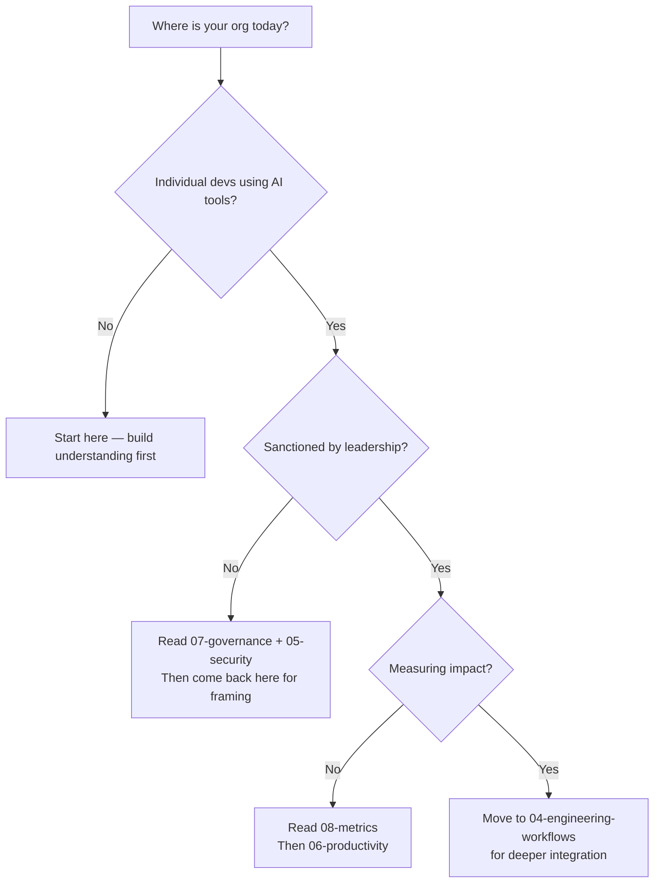

# 01 — Foundations

> Mental models, landscape overview, and organizational readiness for AI adoption in engineering.

## Why Start Here

Before making tool or process decisions, leaders need a shared vocabulary and mental framework. This section builds that foundation — enough to have informed conversations without getting lost in the hype.

## In This Section

| Page | What you'll learn |
|------|-------------------|
| [AI Landscape for Leaders](./ai-landscape.md) | Taxonomy of AI in engineering — what exists, what matters |
| [Mental Models](./mental-models.md) | Frameworks for thinking about AI adoption decisions |
| [Organizational Readiness](./org-readiness.md) | Assessing where your org is and what's needed to start |
| [The Business Case](./business-case.md) | Framing AI investment for executive audiences |

## The POC-to-Production Gap

A recurring theme in this playbook: **what works for one developer experimenting on a weekend is not the same as what works for 200 developers on production code.**

| | POC / Exploration | Production / At Scale |
|---|---|---|
| **Cost** | 🆓 Free tier or personal API key | 🏢 Enterprise license, token budgets |
| **Security** | Acceptable to use cloud with non-sensitive code | Data residency, DLP, audit trails required |
| **Governance** | None needed | Policy enforcement, approved tool list |
| **Support** | Community/self-serve | Vendor SLA, dedicated support |
| **Evaluation criteria** | "Does this feel useful?" | Measurable impact on velocity/quality |

> This playbook uses 🆓 💰 🏢 labels throughout to signal cost context. See the [top-level README](../README.md#cost-context) for the full legend.

## Quick Orientation

## Status

🟢 Active — content being written and refined.
