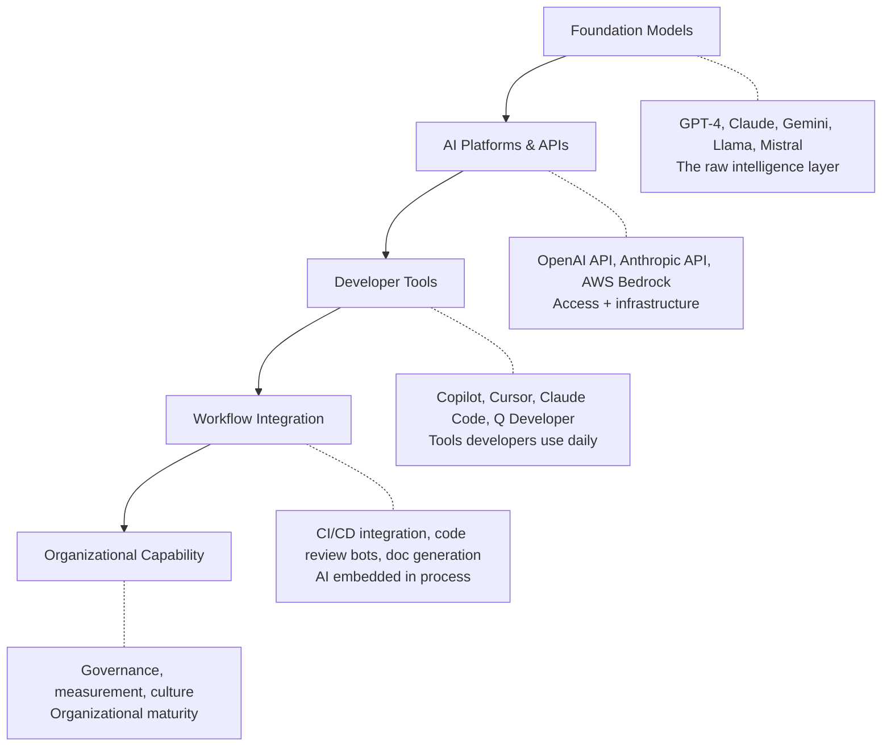
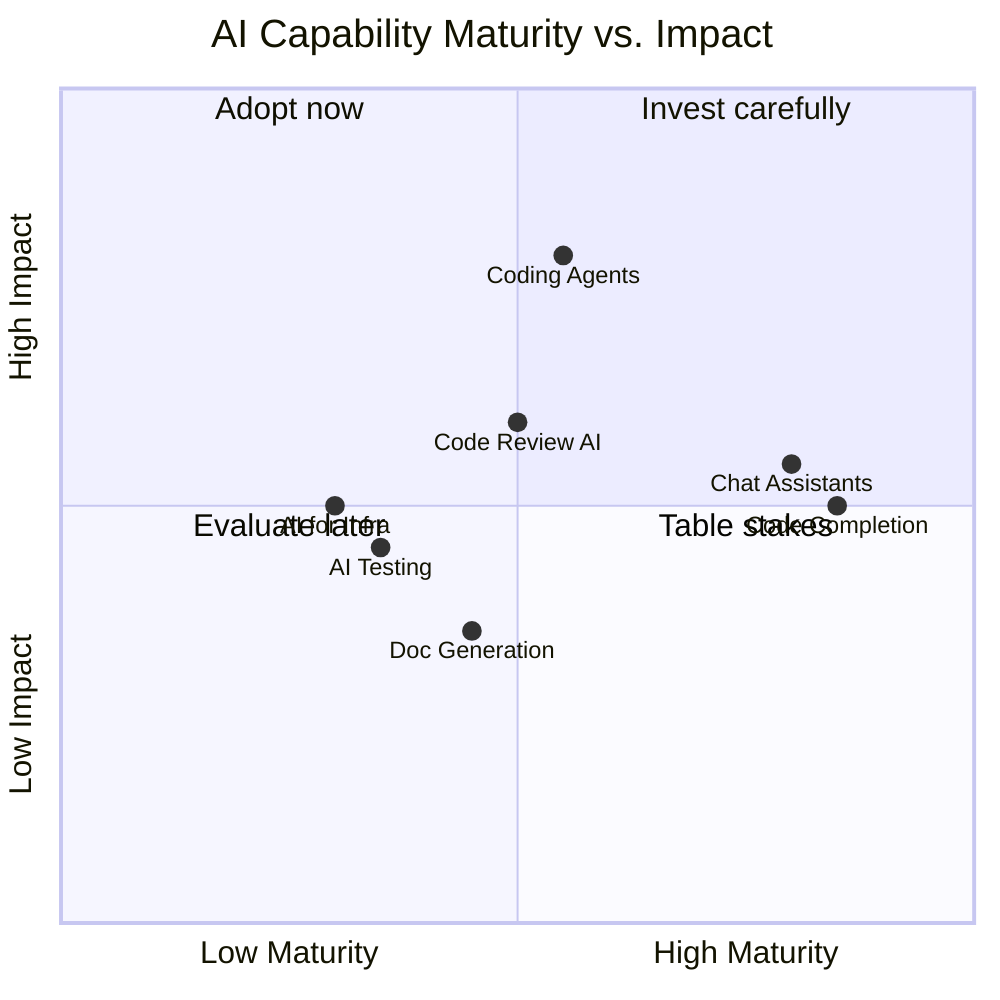

# AI Landscape for Engineering Leaders

> A taxonomy of AI capabilities relevant to software engineering — what exists, what's hype, and what matters for your decisions.

## Why You Need This Mental Map

The AI space is noisy. Vendors blur categories, marketing conflates capabilities, and the technology moves quarterly. As a leader, you don't need to understand transformer architectures — you need to understand the capability categories, their maturity levels, and where they fit in your organization.

---

## The Layers

**Where leaders typically focus:** Layers 3–5. You're choosing tools, integrating into workflows, and building organizational capability. You don't need to pick foundation models — your tooling vendors make that choice (or give you options).

---

## Capability Categories

### 1. Code Completion (Autocomplete)

**What it is:** Predicts and suggests the next tokens as you type. Inline, fast, low-friction.

**Maturity:** High. Mature technology, widely deployed, well-understood value.

**Examples:** GitHub Copilot (inline), Amazon Q (inline), Cursor (tab completion)

**Impact:** 10–30% reduction in keystrokes for routine code. Biggest impact on boilerplate and repetitive patterns.

**Cost:** 🆓 to 💰 ($10–20/user/month in seat-based tools)

---

### 2. Chat Assistants

**What it is:** Conversational AI integrated into the IDE or available as a standalone interface. Ask questions, generate code snippets, explain code.

**Maturity:** High. Every major tool offers this.

**Examples:** Copilot Chat, Amazon Q Chat, ChatGPT, Claude.ai

**Impact:** Reduces context switching (no more tab to StackOverflow). Accelerates understanding unfamiliar code. Good for exploration.

**Cost:** 🆓 (most have free tiers) to 💰 ($20/month for full access)

---

### 3. AI Coding Agents

**What it is:** Autonomous tools that plan, execute multi-step tasks, run commands, and iterate. See [03 — AI Coding Agents](../03-ai-coding-agents/) for deep dive.

**Maturity:** Medium. Rapidly improving but still requires human oversight. Quality varies by task type.

**Examples:** Claude Code, Copilot Agent Mode, Cursor Agent, Kiro

**Impact:** Step-change for suitable tasks (refactoring, migrations, test generation). Not appropriate for all work.

**Cost:** 💰 to 🏢 ($10–50/user/month seat + variable token costs)

---

### 4. Code Review AI

**What it is:** Automated code review — PR summaries, bug detection, security scanning, style enforcement.

**Maturity:** Medium. Good at catching patterns, less good at understanding intent.

**Examples:** CodeRabbit, GitHub Copilot PR review, Amazon CodeGuru, Sourcery

**Impact:** Faster review turnaround, consistent baseline quality checks. Doesn't replace human review for design and intent.

**Cost:** 🆓 (basic) to 💰 ($15–30/user/month)

---

### 5. AI-Powered Testing

**What it is:** Test generation, coverage expansion, mutation testing, property-based test discovery.

**Maturity:** Medium-Low. Generates plausible tests but quality varies. Best for coverage expansion rather than replacing thoughtful test design.

**Examples:** Copilot test generation, Diffblue (Java), CodiumAI

**Impact:** Increases coverage for undertested codebases. Quality of generated tests needs human curation.

**Cost:** 🆓 (built into coding tools) to 💰 (specialized tools)

---

### 6. Documentation Generation

**What it is:** Auto-generating docs from code, maintaining API documentation, creating README files.

**Maturity:** Medium. Good for structured docs (API reference). Weaker for conceptual/architectural docs.

**Examples:** Built into coding agents, Mintlify, Swimm

**Impact:** Reduces the "docs are always stale" problem if integrated into CI.

**Cost:** 🆓 (built into coding tools) to 💰 (dedicated documentation tools)

---

### 7. AI for Infrastructure & DevOps

**What it is:** IaC generation, deployment configuration, incident analysis, log interpretation.

**Maturity:** Medium-Low. Good for scaffolding, less reliable for complex infrastructure decisions.

**Examples:** Amazon Q (CloudFormation/CDK), Pulumi AI, AI-assisted Terraform

**Impact:** Accelerates infrastructure work but requires experienced review (misconfigured infra has high blast radius).

**Cost:** 🆓 (built into cloud consoles) to 💰 (specialized tools)

---

## Maturity Assessment

**Interpretation:**
- **Adopt now (high maturity, high impact):** Code completion and chat are table stakes. If your org isn't using them, you're leaving easy wins on the table.
- **Invest carefully (lower maturity, high impact):** Coding agents have the highest ceiling but require governance and selective application.
- **Evaluate (lower maturity, lower impact):** Testing and documentation tools are worth piloting but aren't transformative yet.

---

## What's NOT Covered Here

This playbook focuses on AI tools for engineering teams specifically. Related but out of scope:

- **AI/ML product development** (building AI features for your customers)
- **Data science and ML engineering** (model training, feature stores, MLOps)
- **AI for non-engineering functions** (sales, marketing, customer support)
- **AGI speculation** (interesting but not actionable for today's decisions)

---

## Key Takeaway

> The AI landscape for engineering is best understood as a **spectrum of autonomy** — from passive suggestions (autocomplete) to active execution (agents). Your job as a leader is to match the autonomy level to the task risk and your governance readiness.

## Next

- Ready for frameworks to make decisions? → [Mental Models](./mental-models.md)
- Want to assess your org's readiness? → [Organizational Readiness](./org-readiness.md)
