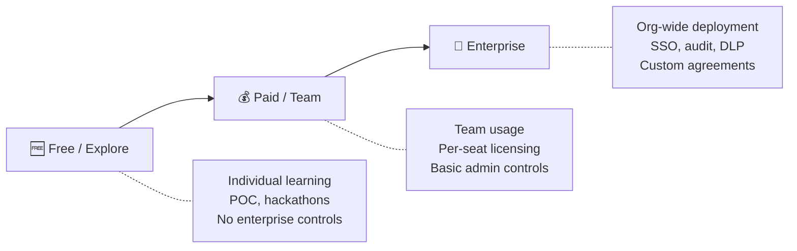

# 02 — AI Tools

> Evaluating, comparing, and choosing AI developer tools for your organization.

## Why This Section Matters

The AI developer tooling market is crowded, fast-moving, and heavily marketed. Every tool claims to "10x developer productivity." Leaders need frameworks for evaluation, not just feature lists — because the best tool depends entirely on your constraints.

## In This Section

| Page | What you'll learn |
|------|-------------------|
| [Tool Categories](./tool-categories.md) | Taxonomy of AI developer tools beyond coding agents |
| [Evaluation Framework](./evaluation-framework.md) | Structured approach to comparing and selecting tools |
| [Build vs. Buy](./build-vs-buy.md) | When to use off-the-shelf vs. custom-build vs. API integration |

## Key Decision

> **The question isn't "which tool is best?" — it's "which tool is best for our constraints?"**
>
> Constraints include: compliance requirements, existing IDE ecosystem, budget, language stack, security posture, and team preferences.

## Cost Tiers: Know What You're Signing Up For

- **For POC/exploration:** Use free tiers. Don't request budget yet. Build evidence.
- **For team pilots:** Budget $10–50/user/month. This unlocks controls you need to evaluate properly.
- **For production rollout:** Expect enterprise agreements with volume pricing.

## Quick Navigation

- Looking specifically for coding agents? → [03 — AI Coding Agents](../03-ai-coding-agents/)
- Need security evaluation criteria? → [05 — Security](../05-security/)
- Want to measure tool effectiveness? → [08 — Metrics](../08-metrics/)

## Status

🟢 Active — content being written and refined.
