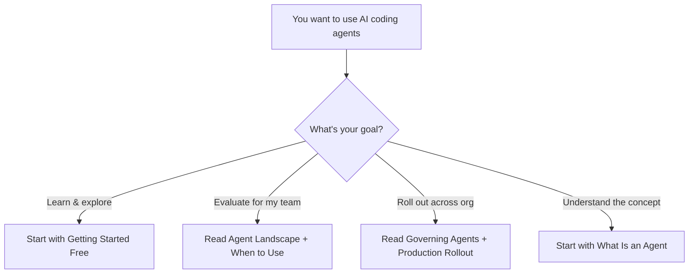

# 03 — AI Coding Agents

> Understanding, evaluating, and deploying AI agents that write and modify code autonomously.

## Why This Section Matters

AI coding agents represent the biggest shift in developer tooling since the IDE. Unlike autocomplete or chat assistants, agents can plan multi-step tasks, execute commands, modify multiple files, and iterate on their own output. They're already changing how code gets written — the question for leaders isn't "if" but "how, when, and with what guardrails."

## In This Section

| Page | What you'll learn |
|------|-------------------|
| [What Is an Agent?](./what-is-an-agent.md) | The progression from autocomplete → chat → agents, and why it matters |
| [Agent Landscape](./agent-landscape.md) | Detailed comparison of current tools with cost labels |
| [When to Use Agents](./when-to-use-agents.md) | Use cases, anti-patterns, and decision frameworks |
| [Governing Agent Usage](./governing-agents.md) | Audit, permissions, cost controls, human-in-the-loop |
| [Getting Started Free](./getting-started-free.md) | Zero-cost exploration guide for hands-on learning |
| [Production Rollout](./production-rollout.md) | Scaling agents across teams with enterprise considerations |

## Quick Decision Framework

## Key Principles for This Section

1. **Agents are tools, not replacements** — They amplify skilled developers; they don't eliminate the need for engineering judgment.
2. **Autonomy is a spectrum** — From "suggest and wait" to "plan and execute." Match the autonomy level to the risk level.
3. **Cost scales with usage** — A single developer's API bill looks nothing like 50 developers using agents daily. Plan for this.
4. **Governance before scale** — Get your guardrails right with a small group before rolling out broadly.

## Status

🟢 Active — content being written and refined.
