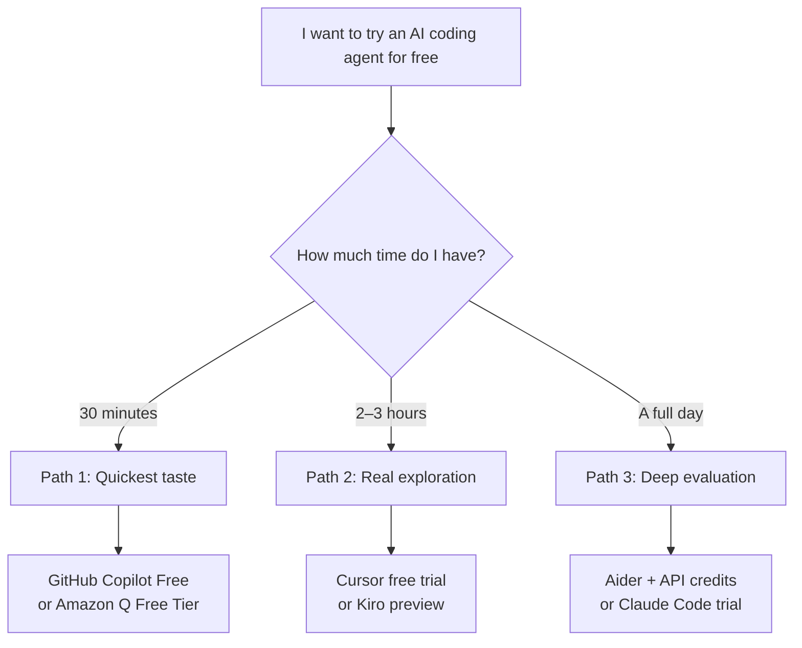
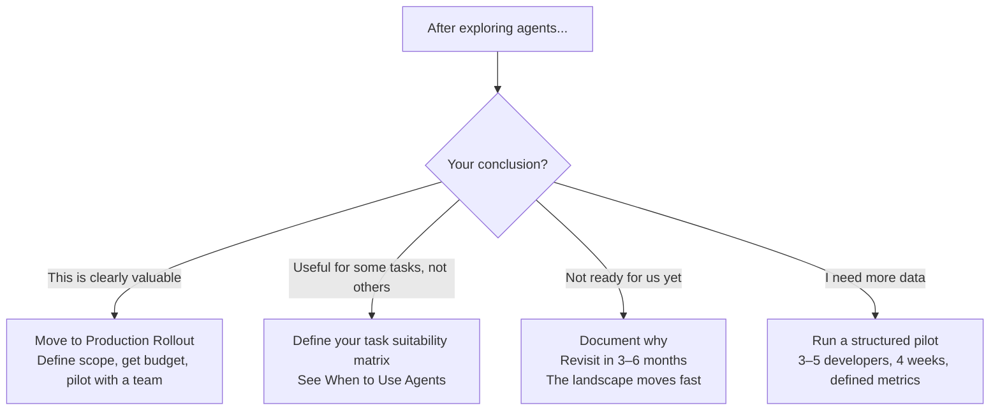

# Getting Started Free

> Zero-cost paths to hands-on experience with AI coding agents — for individual exploration, team evaluation, and building intuition before committing budget.

## Why Start Free?

Before requesting budget, before writing a policy doc, before running an evaluation — you need hands-on experience. You can't make informed decisions about AI agents without using them yourself. The good news: you can get meaningful experience without spending anything.

> **This page is for decision-makers who want to get their hands dirty.** Not to evaluate enterprise features (you need paid tiers for that), but to understand what agents can actually do, build intuition about where they help, and have informed conversations with your teams.

---

## Quick Start: Choose Your Path

---

## Path 1: Quickest Taste (30 minutes)

**Goal:** Understand what "agent mode" feels like. Get one meaningful task done.

### Option A: GitHub Copilot Free

🆓 **Cost:** $0 (limited to 50 chat messages/month and 2000 completions)

**Setup:**
1. Install VS Code (if you don't have it)
2. Install the GitHub Copilot extension
3. Sign in with your GitHub account (free accounts work)
4. Open agent mode: `Ctrl+Shift+I` / `Cmd+Shift+I` → switch to Agent

**Try this task:**
> "Look at this project and add input validation to the user registration endpoint. Include appropriate error messages and update the tests."

**What you'll observe:** The agent reads files, proposes multi-file changes, and can run tests. This is fundamentally different from autocomplete.

**Limitations on free tier:** 50 chat messages/month total. Use them wisely — this is for taste, not daily work.

---

### Option B: Amazon Q Developer Free Tier

🆓 **Cost:** $0 (generous limits — code suggestions, chat, security scans, agent capabilities)

**Setup:**
1. Install VS Code or JetBrains IDE
2. Install the Amazon Q extension
3. Sign up with AWS Builder ID (free, no credit card)
4. Start using — no configuration needed

**Try this task:**
> "Analyze this codebase and suggest improvements to error handling. Then implement the improvements."

**What you'll observe:** Strong free tier with real agent capabilities. Good codebase understanding, especially for AWS-related work.

**Why this is the most generous free option:** Amazon Q's free tier includes meaningful agent capabilities without hard per-message limits.

---

## Path 2: Real Exploration (2–3 hours)

**Goal:** Use an agent on a real task in your own codebase. Build enough experience to have an opinion.

### Option A: Cursor Free Trial

🆓 **Cost:** $0 for 2 weeks (full Pro experience), then limited free tier

**Setup:**
1. Download Cursor from cursor.com
2. Sign up (email, free)
3. Open your project
4. Let it index your codebase (takes a few minutes)
5. Open Composer (`Cmd+I`) → Agent mode

**Try these tasks (in order):**

**Task 1 — Warm up:**
> "Add comprehensive error handling to [specific file]. Include proper error types, logging, and user-friendly messages."

**Task 2 — Multi-file:**
> "Refactor the [module name] to use the repository pattern. Create the interface, implement it, and update all callers."

**Task 3 — The real test:**
> "We need to add [feature X]. Here's what it should do: [describe]. Implement it following the patterns established in [similar feature]."

**What you'll observe:** The agent reads your codebase, follows existing patterns, and generates coherent multi-file changes. The 2-week trial gives you enough time to form a real opinion.

**After the trial:** Free tier gives limited completions. Enough to stay familiar, not enough for daily agent use.

---

### Option B: Kiro (Preview)

🆓 **Cost:** $0 (full access during preview period)

**Setup:**
1. Download Kiro from kiro.dev
2. Sign in
3. Open your project
4. Try both Vibe mode (conversational) and Spec mode (structured)

**Try these tasks:**

**Task 1 — Vibe mode (conversational):**
> "Add pagination to the /users endpoint. Update the handler, data layer, and tests."

**Task 2 — Spec mode (structured requirements → implementation):**
> Start a spec session for a new feature. Let Kiro guide you through requirements → design → tasks, then execute the tasks.

**What you'll observe:** Spec mode is distinctly different from other agents — it enforces structure before implementation. This is valuable for teams that want repeatability and auditability.

**Why this is interesting for leaders:** The spec-driven workflow is closer to how engineering should work (requirements → design → implementation) vs. the "just do it" approach of other agents.

---

## Path 3: Deep Evaluation (Full Day)

**Goal:** Stress-test an agent on varied tasks. Understand limitations, failure modes, and real-world effectiveness.

### Option A: Aider (Fully Open Source)

🆓 **Cost:** $0 for the tool. API costs optional (can use free credits or local models).

**Setup (zero-cost with local model):**
1. Install: `pip install aider-chat`
2. Install Ollama: `brew install ollama` (macOS) or from ollama.com
3. Pull a capable model: `ollama pull deepseek-coder-v2` or `ollama pull codellama:34b`
4. Run: `aider --model ollama/deepseek-coder-v2`

**Setup (with free API credits):**
1. Install: `pip install aider-chat`
2. Get free API credits from Anthropic ($5 starting credit) or OpenAI ($5 starting credit)
3. Run: `aider --model claude-3-5-sonnet-20241022` or `aider --model gpt-4o`

**Try these tasks:**

**Task 1 — Simple (build confidence):**
> "Add unit tests for the [module] file. Aim for 80% coverage including edge cases."

**Task 2 — Multi-file refactoring:**
> "Rename the concept 'User' to 'Account' across the entire codebase — models, services, routes, tests, and docs."

**Task 3 — Bug hunting:**
> "The function [X] returns incorrect results when [condition]. Investigate and fix."

**Task 4 — Migration:**
> "Migrate all callback-based async code in [directory] to async/await."

**Task 5 — The failure test (important!):**
> Give it a task that's too vague, too architectural, or too large. See how it fails. This teaches you more than success.

**What you'll observe:**
- With local models: Free but noticeably less capable than top-tier cloud models. Good for learning the workflow, not for evaluating agent quality.
- With API credits: Real quality, limited budget. $5 of credits goes further than you think for focused tasks.
- You'll see the raw agent loop — plan, code, test, iterate. No IDE polish. Just the mechanics.

**Why this path is valuable for leaders:** You'll experience the full spectrum — from "this is incredible" to "this is completely wrong." Both experiences are necessary for setting realistic expectations.

---

### Option B: Claude Code (with API Credits)

💰 **Cost:** ~$5 starting credits from Anthropic (sign-up bonus, check availability)

**Setup:**
1. Sign up at anthropic.com, get API key
2. Install: `npm install -g @anthropic-ai/claude-code`
3. Run: `claude` in your project directory
4. Start with: `/init` to let it understand your project

**Try these tasks:**

**Task 1 — Understand your codebase:**
> "Explain the architecture of this project. What are the main components and how do they interact?"

**Task 2 — Complex implementation:**
> "Add rate limiting to all API endpoints. Use a sliding window approach, configure limits per endpoint, and add tests."

**Task 3 — Multi-step with verification:**
> "The /search endpoint is slow. Profile it, identify the bottleneck, implement a fix, and verify with a benchmark."

**What you'll observe:** Deep reasoning, multi-step execution, self-correction. This is the "premium agent experience" — useful for understanding what's possible at the top end.

**Cost awareness:** Watch your token usage. A complex task can burn through $5 quickly. Start small.

---

## What to Evaluate During Your Exploration

Use this scorecard to structure your experience. Rate each dimension 1–5 after trying the tool:

| Dimension | What to observe | Your rating |
|-----------|----------------|-------------|
| **Task understanding** | Does it understand what you actually want? | /5 |
| **Code quality** | Is the generated code good enough to ship? | /5 |
| **Pattern following** | Does it match your existing codebase style? | /5 |
| **Error handling** | How does it recover when something goes wrong? | /5 |
| **Scope discipline** | Does it stay within the task boundaries? | /5 |
| **Speed** | How long does a typical task take? | /5 |
| **Effort to use** | How much prompting and correction is needed? | /5 |
| **Failure transparency** | Does it tell you when it can't do something? | /5 |

---

## From Exploration to Decision

After trying agents, you'll likely fall into one of these positions:

---

## Things Free Tiers Won't Tell You

Be aware of what you *cannot* evaluate on free tiers:

| You can evaluate for free | You cannot evaluate for free |
|--------------------------|------------------------------|
| Code generation quality | Enterprise SSO/SAML integration |
| Agent reasoning capability | Audit logging and compliance features |
| Task suitability | Admin dashboards and usage analytics |
| Developer experience/UX | Content exclusion policies |
| Speed and responsiveness | IP indemnification terms |
| Failure modes and limits | Data residency guarantees |
| Personal productivity gain | Team-wide adoption patterns |

> **The gap:** Free tiers are optimized to show you the *capability*. They don't show you the *governance*. Don't make an enterprise purchasing decision based only on how the tool feels to use individually. The governance features (covered in [Governing Agents](./governing-agents.md)) require paid tier evaluation.

---

## The 5-Day Challenge (For Engineering Leaders)

If you want a structured exploration experience, try this:

| Day | Task | Tool | Goal |
|-----|------|------|------|
| **Monday** | Generate tests for an untested module | Any free option | Understand basic agent interaction |
| **Tuesday** | Refactor a real file in your codebase | Same tool | See how it handles your code |
| **Wednesday** | Try a multi-file feature implementation | Cursor or Kiro | Experience agent mode at full power |
| **Thursday** | Give it a task that's too hard | Same tool | Understand failure modes |
| **Friday** | Write up your findings | — | Document insights for your team |

After this week, you'll have enough experience to:
- Set realistic expectations with your team
- Know which tasks are agent-suitable in your codebase
- Have an informed opinion on which tool fits your context
- Make a credible budget request (if warranted)

---

## Next Steps

- Ready to scale beyond personal use? → [Production Rollout](./production-rollout.md)
- Want to understand governance before scaling? → [Governing Agent Usage](./governing-agents.md)
- Need to know which tasks are appropriate? → [When to Use Agents](./when-to-use-agents.md)
