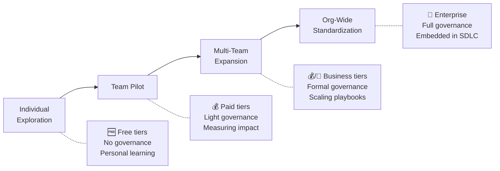
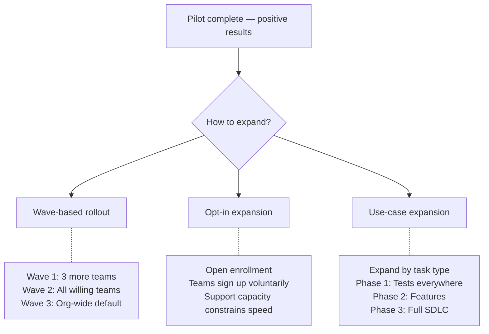
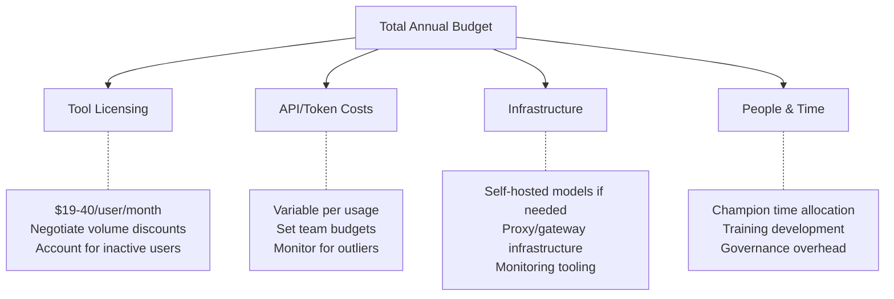
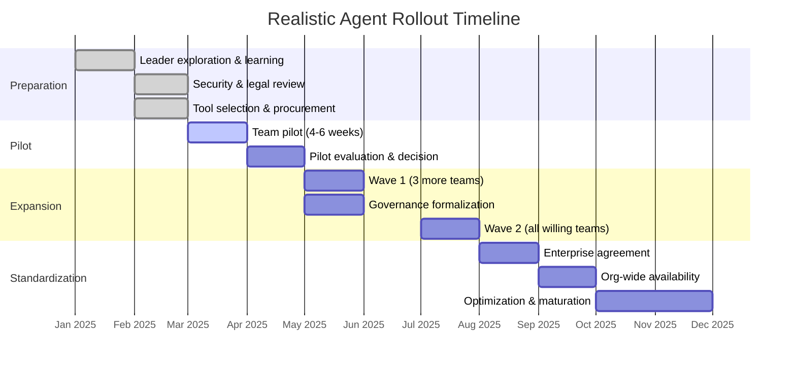

# Production Rollout

> Scaling AI coding agents from individual exploration to team-wide and org-wide adoption — with enterprise considerations at every step.

## The Rollout Reality

Moving from "I tried it and it's great" to "200 developers use this daily" is not a linear path. It requires different decisions at each stage, and the problems shift from technical to organizational.

> **Key insight:** Each stage has different failure modes. Individuals fail on cost surprise. Pilots fail on unclear success criteria. Expansion fails on governance gaps. Org-wide fails on cultural resistance. Plan for the failure mode of your current stage, not the last one.

---

## Stage 1: Team Pilot

### Prerequisites

Before starting a pilot, you should have:

- [ ] At least one leader with hands-on agent experience (see [Getting Started Free](./getting-started-free.md))
- [ ] A clear hypothesis to test ("We believe agents will reduce X by Y%")
- [ ] Budget approval for paid tier (typically $19–40/user/month)
- [ ] Security review of the chosen tool (at minimum: data handling terms reviewed)
- [ ] Agreement on success criteria with your manager/sponsor

### Selecting the Pilot Team

| Characteristic | Why it matters |
|---------------|---------------|
| **Willing, not forced** | Forced adoption breeds resentment. Pick volunteers. |
| **Not your most senior engineers** | Seniors often have strong muscle memory and are skeptical. Start with those open to workflow change. |
| **Not your most junior either** | Juniors lack the judgment to review agent output. You need developers who can critically evaluate generated code. |
| **Working on suitable tasks** | A team doing mostly architectural design won't see value. Pick a team with refactoring, feature, or test work. |
| **Representative, not exceptional** | Results from your best team won't generalize. Pick a team that's "normal." |
| **5–8 developers** | Large enough for meaningful data. Small enough to support closely. |

### Pilot Structure

**Duration:** 4–6 weeks (shorter is fine for a taste, but you need 4+ weeks for habit formation)

**Week 1: Setup and Onboarding**
- Tool installation and configuration
- 30-minute team session: "Here's what agents can do, here's how we'll use them"
- Share task suitability guide (from [When to Use Agents](./when-to-use-agents.md))
- Set expectations: "This is an experiment. Track what works and what doesn't."

**Weeks 2–4: Usage and Observation**
- Developers use agents on their regular work
- Weekly 15-minute check-in: what's working, what's frustrating, what's surprising
- Track metrics (see below)
- No mandate on usage frequency — let natural patterns emerge

**Weeks 5–6: Evaluation**
- Gather quantitative metrics
- Run developer experience survey
- Document patterns: what tasks worked, what didn't
- Make recommendation: expand, adjust, or stop

### Pilot Metrics

Track these, but don't optimize for them prematurely:

| Metric | How to measure | What it tells you |
|--------|---------------|-------------------|
| **Adoption rate** | Active users / pilot members | Are developers choosing to use it? |
| **Task types** | What tasks are developers using agents for? | Where do agents provide value in your context? |
| **PR cycle time** | Time from PR open to merge (pilot vs. control) | Velocity impact |
| **PR size** | Avg lines changed per PR | Agents may enable larger, coherent changes |
| **Code review feedback** | Comments and change requests on agent-assisted PRs | Quality signal |
| **Developer sentiment** | Survey (1–5 scale on usefulness, frustration, trust) | Sustainability signal |
| **Cost per developer** | Total spend / active users | Budget planning for expansion |
| **Rejection rate** | How often is agent output discarded vs. used? | Effectiveness signal |

### Pilot Anti-Patterns

| Anti-pattern | Why it fails | Instead |
|-------------|-------------|---------|
| Mandating daily agent usage | Creates resentment, artificial metrics | Let developers use it when it fits naturally |
| No success criteria defined upfront | Pilot ends with "it was interesting" and no decision | Define "expand if X, stop if Y" before starting |
| Choosing a team working on legacy with no tests | Agent struggles, team blames tool | Pick a codebase with CI, tests, clear patterns |
| Running pilot with no check-ins | Issues fester, developers give up quietly | Weekly 15-min touchpoint minimum |
| Comparing pilot to unrealistic baseline | "We're not 10x faster, it failed" | Compare to realistic expectations (10–30% improvement is significant) |

---

## Stage 2: Multi-Team Expansion

### When to Expand

Expand from pilot to multiple teams when:

- [ ] Pilot developers report sustained value (not just initial excitement)
- [ ] You have documented patterns: which tasks work, which don't
- [ ] Developer sentiment remains positive after the novelty wears off (week 4+)
- [ ] You understand the cost model at scale (not just per-individual)
- [ ] Governance foundations are in place (see [Governing Agents](./governing-agents.md))

### Expansion Approach

**Our recommendation:** Opt-in with support capacity as the bottleneck. This ensures every new team gets adequate onboarding without overwhelming your platform/enablement capacity.

### What Changes at Scale

| Aspect | Pilot (5–8 devs) | Multi-team (20–80 devs) | What to do |
|--------|-------------------|------------------------|------------|
| **Configuration** | Manual, per-developer | Needs standardization | Create team-wide config templates |
| **Onboarding** | 1:1 support from a champion | Can't hand-hold everyone | Build self-serve onboarding materials |
| **Cost** | One manager approves | Budget across multiple teams | Centralized budget tracking, team-level allocation |
| **Governance** | Verbal norms | Written policy needed | Formalize the governance doc (see template in [Governing Agents](./governing-agents.md)) |
| **Support** | Pilot champion answers questions | Need a channel/community | Slack channel, internal wiki, office hours |
| **Tooling variance** | One tool in pilot | Teams want different tools | Decide: standardize on one, or approve a shortlist |
| **Metrics** | Manual tracking feasible | Needs automated collection | Dashboard with automated feeds |

### Building an Internal Community

At scale, peer support is more effective (and sustainable) than top-down training:

- **Slack/Teams channel** — #ai-coding-agents or equivalent. Mix tips, questions, wins, failures.
- **Weekly tips** — Short post: "This week's useful pattern" from a rotating author.
- **Office hours** — 30 min/week. One experienced user available for questions.
- **Champions network** — 1 enthusiast per team who stays current and supports peers.
- **Show & tell** — Monthly: "Here's something cool I did with an agent" (5 min demos).

### The Standardization Decision

At some point you'll face: **one tool for everyone, or let teams choose?**

| Approach | Advantages | Disadvantages |
|----------|-----------|---------------|
| **Single tool** | Simpler governance, bulk pricing, shared knowledge | Some teams feel constrained, one vendor dependency |
| **Approved shortlist (2–3)** | Flexibility, teams match tool to needs | More governance overhead, split community knowledge |
| **No restriction** | Maximum developer autonomy | Governance nightmare, no bulk pricing, fragmented support |

**Our recommendation:** Approved shortlist of 2–3 tools. Typically one IDE-integrated (Copilot or Cursor) and one CLI/API-based (Claude Code or Aider). This covers most developer preferences without governance explosion.

---

## Stage 3: Org-Wide Standardization

### What "Org-Wide" Actually Means

Org-wide doesn't mean mandated for every developer. It means:

- AI coding agents are an **officially supported tool** in your engineering stack
- There's **clear policy** on approved tools and acceptable use
- **Budget is allocated** at the org level (not hidden in team budgets)
- **Governance and security** are formally addressed
- **Training and support** are available to all engineers
- **Metrics and reporting** are standardized

### Enterprise Procurement Checklist

When moving from team-level subscriptions to enterprise agreements:

**Security & Compliance**
- [ ] Data Processing Agreement (DPA) reviewed by legal
- [ ] Data residency requirements satisfied
- [ ] SOC 2 / ISO 27001 compliance confirmed
- [ ] Penetration test results reviewed (or requested)
- [ ] No training on customer code (confirmed contractually)
- [ ] Content exclusion capabilities (can exclude sensitive repos)
- [ ] Incident response process documented by vendor

**Identity & Access**
- [ ] SSO/SAML integration available
- [ ] SCIM provisioning for user management
- [ ] Group-based policy assignment
- [ ] Automated de-provisioning on employee offboarding

**Administration**
- [ ] Admin dashboard with usage analytics
- [ ] Policy controls (who can use which features)
- [ ] Spend management and budget alerts
- [ ] Audit logging exportable to your SIEM

**Legal & Financial**
- [ ] IP indemnification terms understood
- [ ] License terms reviewed for generated code ownership
- [ ] Volume pricing negotiated (typically 15–30% off list at 100+ seats)
- [ ] Contract term aligned with evaluation cadence (avoid 3-year lock-in on a tool you've used for 6 months)

### Org-Wide Rollout Communication

**To engineering leadership (VP+):**
- Here's our strategy, here's the cost, here's the expected ROI
- Governance is in place, security reviewed, legal approved
- Phased rollout plan with checkpoints

**To engineering managers:**
- Here's what's available to your teams
- Here's how to onboard your team (self-serve + support channel)
- Here's what we expect (not mandated, but encouraged for suitable tasks)
- Here's how to report issues or concerns

**To developers:**
- Here's the approved tool(s) and how to get access
- Here's the policy on what's OK and what's not
- Here's where to get help (channel, office hours, docs)
- Here's what's expected of you (review agent output, follow policy)
- Your feedback is welcome — this is evolving

### What NOT to Do at Org-Wide Scale

| Don't | Why | Instead |
|-------|-----|---------|
| Mandate usage metrics per developer | Creates gaming and resentment | Track team-level outcomes, not individual usage |
| Roll out to everyone simultaneously | Support overwhelm, poor experience | Phased rollout with support capacity matching |
| Announce without support infrastructure | Teams flounder, blame tool | Have channel, docs, and office hours ready on day one |
| Ignore skeptics | They have legitimate concerns and influence others | Engage directly, address concerns, give them space |
| Set it and forget it | Landscape changes every quarter | Quarterly review of tools, policy, and effectiveness |
| Tie agent usage to performance reviews | Poisons adoption, creates perverse incentives | Adoption should be driven by value, not pressure |

---

## Cost Planning at Scale

### Budget Model

### Cost Projections by Org Size

| Org size | Tool licensing (annual) | API/token (annual) | Infrastructure | People cost | Total estimate |
|----------|------------------------|-------------------|----------------|-------------|---------------|
| 50 devs | $12K–24K | $5K–30K | $0–5K | $10K (10% of 1 FTE) | $27K–69K |
| 200 devs | $45K–96K | $20K–100K | $5K–20K | $40K (25% of 1 FTE) | $110K–256K |
| 500 devs | $110K–240K | $50K–250K | $20K–50K | $80K (50% of 1 FTE) | $260K–620K |

> **Reality check:** At 200+ developers, this is comparable to other tool investments (CI/CD, observability, IDE licenses). Frame it that way in budget discussions — not as a "new AI experiment" but as "developer tooling investment with measurable productivity ROI."

### ROI Framing for Budget Approval

Don't frame as: "AI is the future, we need to invest."
Frame as: "Based on our pilot, agents save X hours/developer/week on Y tasks. At Z developers, that's $[amount] in productivity value annually, against $[amount] in total cost."

**Conservative model:**
- 30 minutes saved per developer per day (conservative based on industry data)
- At $150K average fully-loaded developer cost → ~$1.10/minute
- 30 min × 220 working days × $1.10 = ~$7,260 value per developer per year
- Tool cost: $2,400–5,000 per developer per year
- **Net positive even at conservative estimates, before accounting for quality improvements**

---

## Measuring Success at Scale

### Dashboard Template

| Category | Metric | Target | Source |
|----------|--------|--------|--------|
| **Adoption** | % of developers actively using (weekly) | >70% after 6 months | Tool analytics |
| **Adoption** | Sessions per developer per week | 5+ (not mandated, just tracking) | Tool analytics |
| **Velocity** | PR cycle time (median) | 15–25% reduction vs. baseline | Git analytics |
| **Quality** | Bug introduction rate | No increase vs. baseline | Bug tracker |
| **Quality** | Code review turnaround time | Reduction | Git analytics |
| **Cost** | Spend per developer per month | Within budget ± 10% | Finance |
| **Satisfaction** | Developer NPS for AI tools | >30 (quarterly survey) | Survey |
| **Coverage** | % of eligible tasks using agents | Trending upward | Self-reported |

### Success Signals (You're on the Right Track)

- Developers voluntarily increase usage after initial onboarding
- Teams request agent-suitable tasks in sprint planning
- New hires ask about AI tool access on day one
- PR sizes increase without quality decrease (coherent larger changes)
- Developers develop sophisticated prompting techniques and share them

### Warning Signals (Intervention Needed)

- Usage flatlines or declines after initial spike (novelty wore off, value unclear)
- Quality metrics regress (bugs up, review comments up)
- Developer sentiment drops (frustration with tool, or feeling pressured)
- Cost overruns without corresponding productivity gains
- Shadow IT — developers using unapproved tools because approved ones don't fit

---

## Timeline: Realistic Expectations

**Total timeline:** 9–12 months from "leader starts exploring" to "org-wide standardized usage." This is not slow — it's responsible. Rushing skips governance and security steps that create risk at scale.

---

## Common Rollout Mistakes

| Stage | Mistake | Consequence | Prevention |
|-------|---------|-------------|-----------|
| Pilot | No baseline metrics before starting | Can't prove impact | Measure PR cycle time, deployment frequency for 4 weeks before pilot |
| Pilot | Pilot team too enthusiastic | Results don't generalize | Include some skeptics or neutral developers |
| Expansion | Expanding before governance is ready | Security incident or cost overrun | Governance checklist must pass before expanding |
| Expansion | No support infrastructure | Teams flounder alone | Channel + docs + office hours minimum |
| Org-wide | Mandating usage | Resentment, gaming metrics | Make it available, not required |
| Org-wide | Ignoring the 20% who don't adopt | Misses their valid concerns | Understand why, address if possible, accept if personal preference |
| All stages | Moving to next stage before current stage is stable | Compounding problems | Each stage should feel "boring" before you advance |

---

## Checklist: Are You Ready for the Next Stage?

### Ready for Pilot?
- [ ] At least one leader has hands-on experience
- [ ] Budget approved for 6–8 seats on paid tier
- [ ] Security reviewed the tool (not full enterprise, but data handling understood)
- [ ] Success criteria defined and agreed with sponsor
- [ ] Pilot team identified and willing

### Ready for Expansion?
- [ ] Pilot ran for 4+ weeks with positive results
- [ ] Task suitability patterns documented
- [ ] Basic governance in place (policy draft, approved use cases)
- [ ] Cost model understood and budgeted for scale
- [ ] Support infrastructure ready (channel, docs, champion identified)
- [ ] Developer sentiment positive and sustained

### Ready for Org-Wide?
- [ ] Multiple teams using successfully for 8+ weeks
- [ ] Enterprise security review complete
- [ ] Legal review complete (DPA, IP terms, contract)
- [ ] Formal governance policy published
- [ ] Enterprise agreement signed (volume pricing)
- [ ] Admin infrastructure ready (SSO, provisioning, dashboards)
- [ ] Communication plan ready for all audiences
- [ ] Support capacity scaled (can handle org-wide questions)
- [ ] Metrics dashboard automated and live

---

## Next Steps

- Need to establish governance first? → [Governing Agent Usage](./governing-agents.md)
- Want to understand tool options in detail? → [Agent Landscape](./agent-landscape.md)
- Looking for org-wide adoption strategies beyond tooling? → [09 — Team Adoption](../09-team-adoption/)
- Need to define metrics for your rollout? → [08 — Metrics](../08-metrics/)
