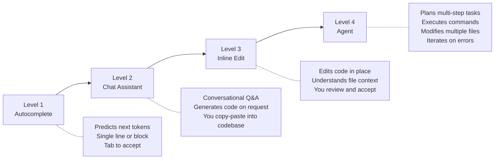
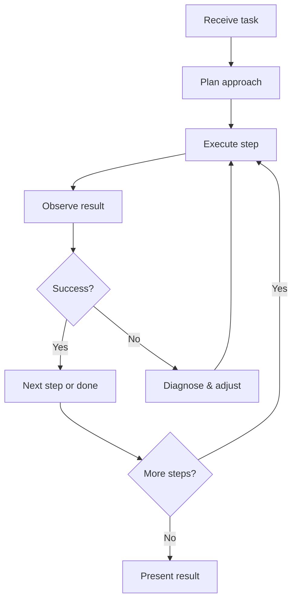
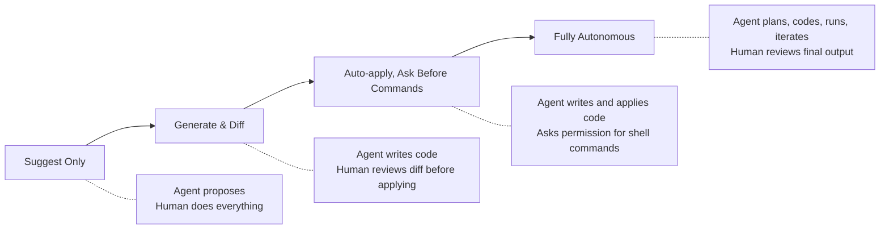

# What Is an AI Coding Agent?

> From autocomplete to autonomous execution — understanding the progression and why it matters for engineering leaders.

## The Progression

AI coding tools didn't arrive fully-formed. They evolved through distinct capability levels, each changing the developer's relationship with the tool:

## What Each Level Looks Like in Practice

### Level 1: Autocomplete

**What it does:** Predicts what you'll type next. Completes lines, function bodies, boilerplate.

**Developer experience:** You're driving. The tool suggests. You accept or ignore.

**Example:** You type `function validateEmail(` and it completes the implementation.

**Limitations:** No awareness of your broader task. No multi-file understanding. Can't ask it to do something — it only reacts to what you're typing.

---

### Level 2: Chat Assistant

**What it does:** Answers questions, generates code snippets, explains code. Conversational interface, usually in a sidebar.

**Developer experience:** You ask, it answers. You decide what to do with the output. Copy-paste is the integration model.

**Example:** "Write me a retry wrapper with exponential backoff in TypeScript" → it generates the code → you paste it into your file.

**Limitations:** Doesn't know your codebase deeply. Output is disconnected from your files — you're the integration layer. Can't execute anything.

---

### Level 3: Inline Edit / Generate

**What it does:** Edits code directly in your files based on natural language instructions. Understands file context and can make targeted changes.

**Developer experience:** You select code or describe a change, it modifies your file in place. You review a diff and accept or reject.

**Example:** Select a function → "Add error handling and input validation" → it rewrites the function in place.

**Limitations:** Typically single-file scoped. Can't run tests, check if the change compiles, or make coordinated changes across files.

---

### Level 4: Agent

**What it does:** Plans a multi-step approach, executes it across files, runs commands (tests, builds, linters), reads output, and iterates until the task is done.

**Developer experience:** You describe the goal. The agent works. You review the result (or supervise along the way).

**Example:** "Add pagination to the /users API endpoint, update the tests, and make sure the build passes" → the agent reads your codebase, modifies the route handler, updates the data layer, writes tests, runs them, fixes failures, and presents the final diff.

**Limitations:** Can make mistakes at scale. Needs guardrails for security-sensitive work. Token costs add up. Context windows have limits.

---

## The Agent Loop

What makes agents fundamentally different is the **feedback loop**. They don't just generate — they act, observe the result, and iterate.

This loop is what makes agents powerful — and what makes governance essential. A chat assistant that generates bad code is harmless until you paste it. An agent that generates bad code and commits it is a different story.

## Why This Matters for Leaders

### The Capability Shift

| Aspect | Chat (Level 2) | Agent (Level 4) |
|--------|----------------|-----------------|
| **Who drives?** | Developer | Agent (developer supervises) |
| **Scope** | One question at a time | Multi-step, multi-file tasks |
| **Execution** | None — output is text | Runs commands, modifies files |
| **Error handling** | Developer fixes | Agent can self-correct |
| **Risk surface** | Low (just suggestions) | Higher (autonomous changes) |
| **Productivity ceiling** | Incremental improvement | Step-change for suitable tasks |

### What This Means for Your Organization

1. **Skill requirements shift** — Developers need to learn to prompt, supervise, and review agent output rather than write every line. This is a different skill than "writing code."

2. **Review processes change** — When an agent generates a 500-line PR, reviewing it requires different attention than reviewing a human's 500-line PR. The error patterns are different.

3. **Cost model is new** — Agents consume tokens proportional to task complexity. A complex refactoring task might cost $5–20 in API calls. At scale, this is a meaningful line item.

4. **Security posture expands** — Agents that can execute commands have a larger blast radius than tools that only suggest text. Sandboxing and permissions matter.

5. **Governance becomes essential** — When a tool can autonomously modify your codebase, you need policies about what it's allowed to do, where, and with what oversight.

## Autonomy Levels: A Practical Spectrum

Not all agents work the same way. Most offer configurable autonomy:

**Our recommendation:**

- **Start with lower autonomy.** Let developers build trust and understanding before increasing agent independence.
- **Match autonomy to risk.** Internal tools can tolerate higher autonomy. Security-critical paths need human checkpoints.
- **Never go fully autonomous on production-affecting changes** without CI/CD gates downstream.

## Common Misconceptions

| Misconception | Reality |
|---------------|---------|
| "Agents write entire applications" | They're best at well-scoped tasks within existing codebases. Greenfield scaffolding works; sustaining a coherent architecture across thousands of lines does not (yet). |
| "Agents replace junior developers" | They shift what juniors do — more review, integration, and prompting. Less boilerplate. The skill floor rises, it doesn't disappear. |
| "Agents are just faster autocomplete" | Fundamentally different — they reason, plan, execute, and iterate. The feedback loop is the key differentiator. |
| "All agents are the same" | They differ significantly in reasoning quality, tool integration, cost model, and enterprise controls. Evaluation matters. |

## Next Steps

- Ready to see what's available? → [Agent Landscape](./agent-landscape.md)
- Want to know when agents are the right tool? → [When to Use Agents](./when-to-use-agents.md)
- Want to try one for free right now? → [Getting Started Free](./getting-started-free.md)
