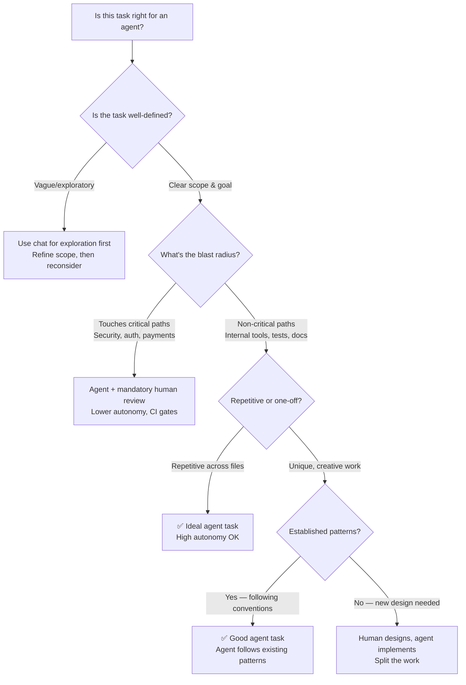
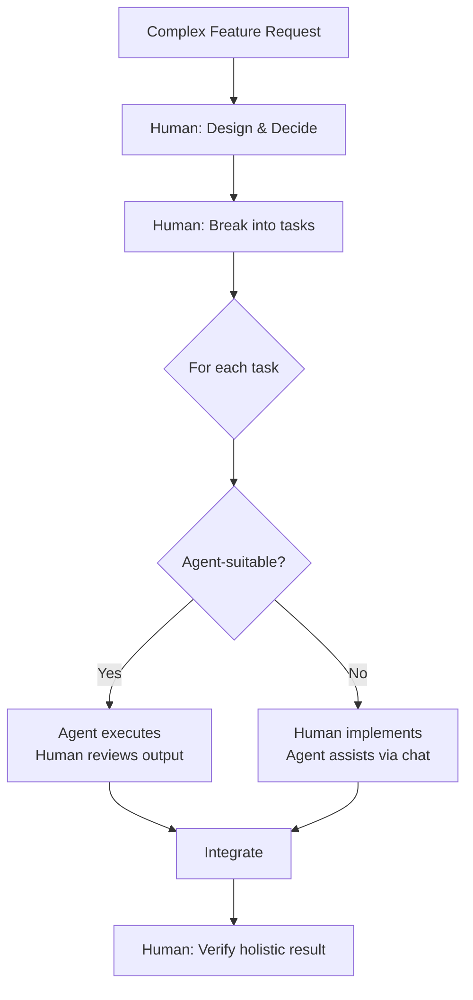

# When to Use AI Coding Agents

> Use cases where agents shine, anti-patterns where they don't, and decision frameworks for making the call.

## The Core Question

Agents are powerful but not universally appropriate. The decision isn't "should we use agents?" — it's "for which tasks, with what oversight, and at what autonomy level?"

---

## Where Agents Excel

### 1. Multi-File Refactoring

**Why agents are great here:** Renaming a concept across 40 files, updating an interface and all its implementations, migrating from one pattern to another — these are tedious for humans and ideal for agents.

**Examples:**
- Rename a domain concept across models, services, tests, and docs
- Migrate from callbacks to async/await across a codebase
- Update an API version: change types, update all callers, fix tests
- Replace a deprecated library with its successor across all usages

**Autonomy recommendation:** High. The task is mechanical, patterns are clear, and CI will catch errors.

---

### 2. Test Generation and Coverage Expansion

**Why agents are great here:** Writing unit tests for existing code is well-scoped, has clear inputs (the code) and outputs (passing tests), and benefits from the agent's ability to run tests and iterate.

**Examples:**
- Generate unit tests for an untested module
- Add edge case coverage based on code analysis
- Create integration test scaffolding for API endpoints
- Generate property-based tests from type signatures

**Autonomy recommendation:** High for unit tests. Medium for integration tests (they may need infrastructure context the agent lacks).

**Cost context:** 🆓 This is one of the best tasks to try on free tiers — scope is small, output is immediately verifiable.

---

### 3. Boilerplate and Scaffolding

**Why agents are great here:** "Create a new service with the same structure as UserService but for Orders" is exactly the kind of pattern-following task agents handle well.

**Examples:**
- Scaffold a new microservice following existing conventions
- Generate CRUD endpoints from a data model
- Create boilerplate for a new React component with tests and stories
- Set up CI/CD configuration for a new project

**Autonomy recommendation:** High when following established patterns. Medium for greenfield where there's no existing convention to follow.

---

### 4. Bug Investigation and Fix

**Why agents are great here:** Agents can read error messages, trace through code, hypothesize about causes, make a fix, and verify it passes tests — all in one loop.

**Examples:**
- "This test is failing with error X — investigate and fix"
- "Users report timeout on the /search endpoint — find and resolve"
- "This function returns wrong results for input Y — diagnose"

**Autonomy recommendation:** Medium. Let the agent investigate and propose, but review the fix before accepting — especially if the bug is in complex business logic.

---

### 5. Migration Tasks

**Why agents are great here:** Framework upgrades, language version migrations, and API deprecation handling are systematic tasks with clear rules — exactly what agents do well at scale.

**Examples:**
- Upgrade React class components to functional components with hooks
- Migrate from Express to Fastify across all route handlers
- Update from Python 3.8 to 3.12 patterns (walrus operator, match statements)
- Replace a REST API client with a new SDK version

**Autonomy recommendation:** High for mechanical changes. Medium when migration involves design decisions (e.g., the old pattern maps to multiple valid new patterns).

**Cost context:** 💰 Large migrations consume significant tokens. Budget $10–50 per large migration task. Worth it compared to days of manual developer time.

---

### 6. Documentation Generation

**Why agents are great here:** Agents can read code and generate accurate documentation, README files, API docs, and inline comments. They can cross-reference the implementation to stay accurate.

**Examples:**
- Generate API documentation from route handlers
- Create README files for internal libraries
- Add JSDoc/docstring comments to undocumented functions
- Write architecture decision records from implementation context

**Autonomy recommendation:** High. Documentation errors are low-risk and easy to review.

---

## Where Agents Struggle

### 1. Architectural Decisions

**Why agents aren't great here:** Architecture requires understanding business context, team capabilities, organizational constraints, and long-term evolution. Agents lack this context and will produce plausible-sounding but potentially wrong architecture.

**The pattern to follow instead:**
- Human makes the architectural decision and documents it
- Agent implements the decided architecture
- Human reviews the implementation for alignment

**Anti-pattern:** "Design me a microservices architecture for our e-commerce platform" — the agent will happily produce one, but it won't account for your team size, operational maturity, or business constraints.

---

### 2. Security-Critical Code

**Why agents aren't great here:** Auth flows, cryptography, access control, and input validation are areas where subtle bugs have outsized impact. Agents produce code that looks correct but may miss edge cases that matter for security.

**The pattern to follow instead:**
- Human designs the security approach
- Agent may implement with explicit constraints and patterns to follow
- Mandatory human review by someone with security expertise
- Automated security scanning in CI
- Never deploy security-critical agent-generated code without the above

**Anti-pattern:** "Implement our OAuth2 flow with PKCE" → agent generates something that compiles and seems to work, but has a subtle token handling flaw. This is worse than a visible error.

---

### 3. Performance-Critical Hot Paths

**Why agents aren't great here:** Agents optimize for correctness and readability. They don't inherently understand your performance requirements, data volumes, or system constraints. They may introduce allocations, extra iterations, or patterns that are fine for 99% of code but fatal in your hot path.

**The pattern to follow instead:**
- Agent can write the first pass
- Human profiles and optimizes the critical path
- Performance tests validate the final implementation

---

### 4. Complex Business Logic with Edge Cases

**Why agents aren't great here:** Business rules often have undocumented exceptions, historical decisions, and edge cases that live in tribal knowledge rather than code. Agents can only work with what they can see.

**The pattern to follow instead:**
- Document the business rules explicitly (agent can help with this)
- Agent implements from the documented rules
- Human verifies edge cases against domain knowledge
- Tests encode the edge cases for regression protection

---

### 5. Cross-System Integration with Undocumented APIs

**Why agents aren't great here:** If the external system has poor documentation, undocumented behavior, or requires specific sequencing that isn't obvious from the API surface, agents will hallucinate the integration details.

**The pattern to follow instead:**
- Human explores and documents the external system's actual behavior
- Agent implements the integration from the documentation
- Integration tests verify the actual behavior

---

## The Suitability Matrix

| Task Characteristic | Agent Suitability | Recommended Autonomy |
|--------------------|--------------------|---------------------|
| Clear inputs and outputs | ✅ High | High |
| Repetitive across files | ✅ High | High |
| Following established patterns | ✅ High | High |
| Verifiable by tests | ✅ High | High |
| Requires domain knowledge | ⚠️ Medium | Medium (human reviews) |
| Security implications | ⚠️ Medium | Low (human checkpoints) |
| Novel design decisions | ❌ Low | Suggest only |
| Undocumented external dependencies | ❌ Low | Human leads |
| Ambiguous requirements | ❌ Low | Use chat to clarify first |

---

## Task Decomposition: The Key Skill

The most effective pattern for complex work isn't "give the agent everything" or "do it all yourself." It's **decomposition**: splitting work into agent-suitable and human-suitable parts.

**Example:** "Add multi-tenancy to our application"
- ❌ Don't: "Agent, add multi-tenancy to everything"
- ✅ Do:
  1. Human decides: row-level isolation, tenant ID on all queries, middleware for context
  2. Agent: Add tenantId column to all models, update migrations
  3. Agent: Create tenant middleware and apply to routes
  4. Agent: Update all repository queries to filter by tenant
  5. Agent: Generate tests for tenant isolation
  6. Human: Review the entire change for security gaps
  7. Human: Verify no cross-tenant data leakage in edge cases

---

## Signals It's Time to Stop the Agent

Not every agent run succeeds. Know when to intervene:

| Signal | What's happening | What to do |
|--------|-----------------|------------|
| Looping on the same error | Agent can't resolve an issue it keeps hitting | Intervene — provide context or fix manually |
| Making increasingly creative "fixes" | Agent is trying wild approaches | Stop — the task needs human understanding |
| Token cost climbing rapidly | Complex task is consuming excessive context | Stop, break into smaller tasks |
| Tests passing but solution is wrong | Agent satisfies tests but misses the point | Improve test specificity, then retry |
| Modifying files outside scope | Agent is "fixing" unrelated things | Constrain scope or reduce autonomy |

---

## By Role: How to Apply This

### Engineering Managers
- Define which categories of work are agent-approved vs. require human implementation
- Set team norms: "Agents can autonomously generate tests, but architecture PRs need human authors"
- Use the suitability matrix to set expectations during sprint planning

### Principal Engineers
- Lead the task decomposition — define what's agent-suitable in your codebase
- Establish patterns and conventions that make more code agent-friendly
- Review agent-generated PRs differently than human PRs (check for coherence, not style)

### CTOs / VPs
- Set policy at the category level, not the tool level
- Fund time for teams to learn effective decomposition
- Track metrics on agent effectiveness by task type, not just overall

---

## Next Steps

- Need governance and controls? → [Governing Agent Usage](./governing-agents.md)
- Ready to try for free? → [Getting Started Free](./getting-started-free.md)
- Planning a team rollout? → [Production Rollout](./production-rollout.md)
