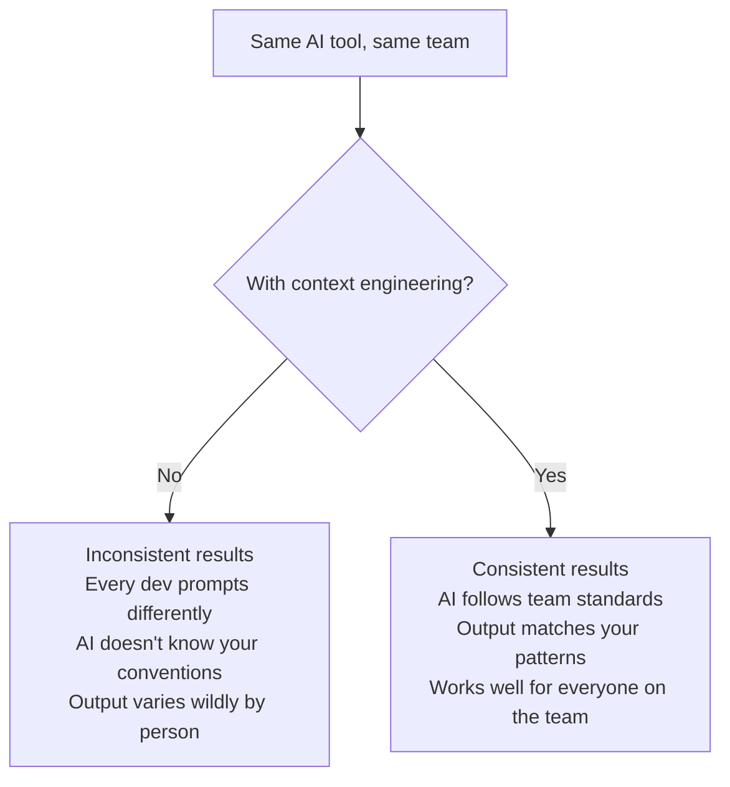
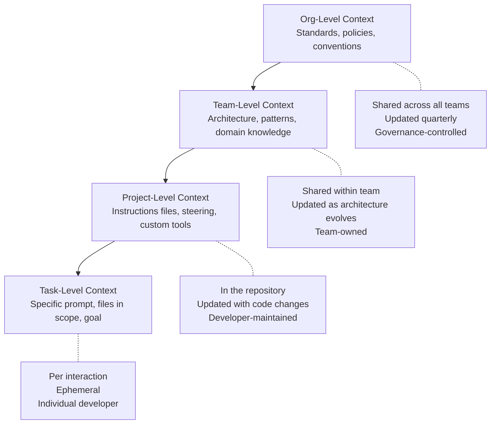

# 04 — Context Engineering

> How do we make AI consistently useful across an engineering organization?

## Why This Section Exists

An AI tool without context is a generic autocomplete engine. An AI tool *with* context — your conventions, your architecture, your standards, your team's knowledge — becomes a genuine force multiplier.

**Context engineering** is the discipline of structuring, maintaining, and delivering the right information to AI tools so they produce consistently useful output across your entire organization — not just for the one developer who happens to write good prompts.

## The Problem It Solves

Without deliberate context engineering:
- Developer A gets great output (because they wrote a detailed prompt)
- Developer B gets mediocre output (same tool, less context in their prompt)
- The team concludes "AI tools are inconsistent" — when really the *context* is inconsistent

## In This Section

| Page | What you'll learn |
|------|-------------------|
| [What Is Context Engineering?](./what-is-context-engineering.md) | The concept, why it matters, and how it differs from prompt engineering |
| [Project Instructions](./project-instructions.md) | CLAUDE.md, .cursorrules, steering files, copilot-instructions — tool-level configuration |
| [Skills and Hooks](./skills-and-hooks.md) | Reusable capabilities, event-driven automation, extending agent behavior |
| [Knowledge Architecture](./knowledge-architecture.md) | MCP servers, RAG, codebase indexing, making team knowledge accessible to AI |
| [Org-Wide Strategy](./org-wide-strategy.md) | Scaling context across teams — consistency without rigidity |

## Key Principle

> **The best AI experience shouldn't depend on who's using it.**
>
> If your most effective AI user leaves the team, does the team's AI experience degrade? If yes, you have a context engineering problem — the knowledge is in their head (their prompts, their habits), not in the system.

## The Context Stack

Most organizations only do Level 4 (individual prompts). The value of context engineering is building Levels 1–3 so that Level 4 requires less effort and produces more consistent results.

## Cost Context

| Context engineering activity | Cost | Impact |
|------------------------------|------|--------|
| Writing project instructions (CLAUDE.md, etc.) | 🆓 2–4 hours once, then maintained | High — every AI interaction improved |
| Setting up steering files | 🆓 Internal time | High — team-wide consistency |
| Building custom skills/hooks | 🆓 Engineering time (hours) | Medium-High — automation and guardrails |
| MCP server integration | 💰 Engineering time (days) + potential infra | High — unlocks team-specific knowledge |
| Org-wide context strategy | 🆓 Leadership + architecture time | Highest — compounding returns at scale |

**ROI insight:** A well-written project instructions file takes 2 hours and improves every AI interaction for every developer on that project, forever. This is one of the highest-leverage activities in AI adoption.

## Status

🟢 Active — content being written and refined.
