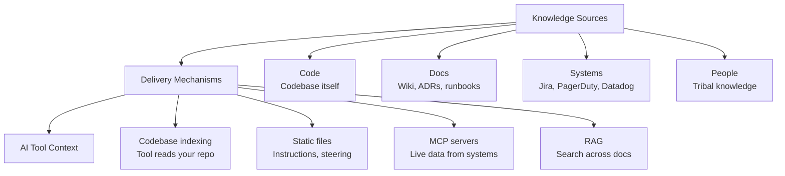
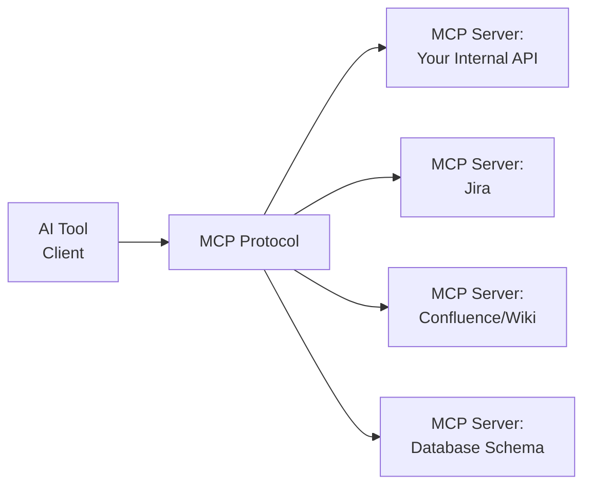
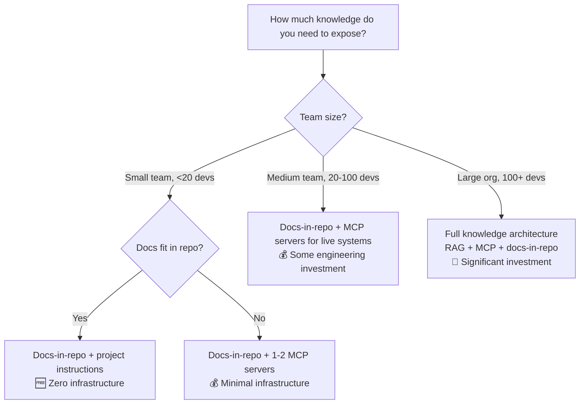

# Knowledge Architecture

> Making team knowledge accessible to AI — MCP servers, RAG, codebase indexing, and live data integration.

## The Knowledge Gap

AI tools have a fundamental limitation: they only know what's in their context window. Your team has vast amounts of knowledge locked in:

- Internal wikis and documentation
- Runbooks and playbooks
- API specifications (internal services)
- Architecture decision records
- Incident history and postmortems
- Ticket systems and project context
- Monitoring dashboards and metrics
- Team-specific domain knowledge

Without deliberate architecture, none of this is available to AI when developers need it.

---

## How Knowledge Reaches AI



---

## Mechanism 1: Codebase Indexing

### What It Is

Most AI coding tools index your codebase and use it as context. This is the baseline — the AI can "see" your code.

| Tool | Indexing approach | Quality |
|------|------------------|---------|
| Cursor | Full repo indexing, embeddings | High — strong codebase awareness |
| GitHub Copilot | Workspace context, open files | Medium — limited to visible files |
| Kiro | Dynamic context selection | High — intelligent scoping |
| Claude Code | Reads files on demand | High — but you guide what to read |
| Windsurf | Full repo indexing | High — similar to Cursor |

### Optimization

- Keep your repo clean (dead code confuses AI just like it confuses humans)
- Good file/folder naming helps AI find relevant code
- README files in subdirectories help AI understand module purpose
- Remove large generated files from context (lock files, bundles)

---

## Mechanism 2: MCP (Model Context Protocol)

### What It Is

MCP is an open standard for connecting AI tools to external data sources. It lets AI query live systems during interactions — not static files, but real-time data.



### Why It Matters

Without MCP: "What's the current deployment status?" → AI says "I don't have access to that information."

With MCP: "What's the current deployment status?" → AI queries your deployment system via MCP and gives a real answer.

### Practical MCP Use Cases for Engineering

| Use case | MCP server provides | Developer experience |
|----------|--------------------|--------------------|
| **Internal API schemas** | Live OpenAPI specs from service registry | "Generate a client for the payments API" → AI fetches current spec and generates |
| **Ticket context** | Current sprint tickets, requirements | "What's the acceptance criteria for PROJ-123?" → AI queries Jira directly |
| **Architecture docs** | Searchable wiki content | "How does auth work in our system?" → AI searches Confluence/wiki |
| **Database schema** | Current table definitions | "Add a field to the users table" → AI knows the current schema |
| **Deployment status** | Current deployed versions, health | "Is the users service healthy?" → AI checks your monitoring |
| **Incident history** | Past incidents for this service | "Has this endpoint had issues before?" → AI searches incident history |

### Setting Up MCP

MCP servers are configured in your tool's settings. Example for Kiro/VS Code-based tools:

```json
// .kiro/settings/mcp.json
{
  "mcpServers": {
    "internal-api-docs": {
      "command": "node",
      "args": ["./tools/mcp-api-docs-server.js"],
      "env": { "API_REGISTRY_URL": "https://internal-registry.company.com" }
    },
    "jira": {
      "command": "uvx",
      "args": ["mcp-jira-server"],
      "env": {
        "JIRA_URL": "https://company.atlassian.net",
        "JIRA_TOKEN": "${JIRA_API_TOKEN}"
      }
    },
    "wiki-search": {
      "command": "node",
      "args": ["./tools/mcp-wiki-search.js"],
      "env": { "CONFLUENCE_URL": "https://company.atlassian.net/wiki" }
    }
  }
}
```

### Build vs. Use Existing MCP Servers

| Need | Approach | Effort |
|------|----------|--------|
| Standard tools (Jira, Confluence, GitHub) | Use community MCP servers | 🆓 Hours to configure |
| Internal APIs | Build lightweight MCP server | 💰 1–3 days |
| Complex internal systems | Build custom MCP server | 💰 1–2 weeks |
| Database schema access | Use generic DB MCP server | 🆓 Hours to configure |

**Our recommendation:** Start with community servers for standard tools. Build custom only for internal systems that provide high-value context.

---

## Mechanism 3: RAG (Retrieval-Augmented Generation)

### What It Is

RAG indexes your documentation and retrieves relevant chunks when the AI needs context. It's like giving AI a search engine for your internal knowledge.

### When to Use RAG

| Scenario | RAG helpful? | Why |
|----------|:-----------:|-----|
| Large documentation corpus (100+ pages) | ✅ | AI can't fit it all in context; RAG retrieves relevant pieces |
| Frequently changing docs | ✅ | RAG re-indexes; static files get stale |
| Codebase understanding | ❌ | Use codebase indexing instead (better for code) |
| Small team with few docs | ❌ | Just put key docs in project instructions |
| Knowledge scattered across many systems | ✅ | RAG can unify sources |

### Implementation Options

| Approach | Cost | Complexity | Best for |
|----------|------|-----------|----------|
| MCP server with search | 💰 Engineering time | Medium | Targeted knowledge (API docs, wiki) |
| Vendor RAG features (built into tool) | 💰 Usually paid tier | Low | Teams using tools that support this natively |
| Custom RAG pipeline | 🏢 Significant engineering | High | Large orgs with unique knowledge management needs |
| Simple docs-in-repo approach | 🆓 | Low | Small teams where key docs fit in the codebase |

**Our recommendation for most teams:** Start with docs-in-repo (a `/docs` folder with key architecture docs). Graduate to MCP when you outgrow that. Only build custom RAG if you have 500+ developers or massive documentation needs.

---

## Mechanism 4: Docs-in-Repo (Simplest)

The most underrated approach: just put your important documentation in the repository where AI tools can already see it.

```
project/
├── docs/
│   ├── ARCHITECTURE.md        # System design overview
│   ├── API-CONVENTIONS.md     # How we design APIs
│   ├── DATA-MODEL.md          # Current data model
│   ├── SECURITY.md            # Security guidelines
│   └── decisions/             # Architecture Decision Records
│       ├── 001-use-postgres.md
│       ├── 002-event-driven.md
│       └── 003-api-versioning.md
├── CLAUDE.md                  # References docs/ for context
└── src/
```

**In CLAUDE.md:**
```markdown
## Architecture
See `docs/ARCHITECTURE.md` for system design.
See `docs/decisions/` for architectural decision records.
When making changes that affect the architecture, check relevant ADRs first.
```

**Why this works:** AI tools that index your codebase will pick up these docs automatically. No infrastructure needed. No MCP server. Just Markdown files in the right place.

---

## Choosing Your Knowledge Architecture



---

## Getting Started

### Week 1: Docs-in-Repo
1. Create a `docs/` directory in your main repos
2. Add: ARCHITECTURE.md, key ADRs, security guidelines
3. Reference from project instructions
4. Already accessible to AI — zero configuration

### Month 1: First MCP Server
1. Pick your highest-value external system (Jira? Wiki? Internal API?)
2. Use a community MCP server if one exists
3. Configure in `.kiro/settings/mcp.json` or equivalent
4. Test: can the AI now answer questions about that system?

### Quarter 1: Assess and Expand
1. What questions do developers still ask that AI can't answer?
2. Where is the knowledge? (Wiki? Slack? Someone's head?)
3. Build MCP servers or improve docs for the top 3 gaps

---

## Next

- Scaling knowledge across org → [Org-Wide Strategy](./org-wide-strategy.md)
- Event-driven behavior → [Skills and Hooks](./skills-and-hooks.md)
- Project-level instructions → [Project Instructions](./project-instructions.md)
