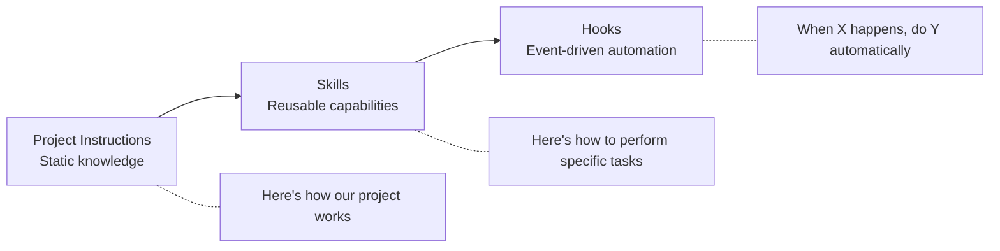
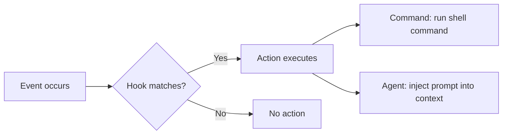

# Skills and Hooks

> Extending AI agent behavior with reusable capabilities and event-driven automation.

## Beyond Static Instructions

Project instructions tell AI *what to know*. Skills and hooks tell AI *what to do* — and *when*.



---

## Skills: Reusable Capability Packages

### What Skills Are

A skill is a packaged bundle of instructions, context, and optionally tooling that teaches the AI how to perform a specific task well — every time, for any developer on the team.

**Without a skill:** Every developer writes their own prompt for "add a new API endpoint" — each gets slightly different output, some forget to include validation, some forget tests.

**With a skill:** The team has a skill called "new-endpoint" that encodes exactly how to create an endpoint in this project — validation, tests, error handling, documentation — all included automatically.

### Skill Anatomy

```
skills/
├── new-endpoint/
│   ├── instructions.md    # How to create an endpoint (steps, conventions)
│   ├── template/          # Boilerplate files to start from
│   └── checklist.md       # What must be included (validation, tests, docs)
├── add-migration/
│   ├── instructions.md    # How to create a DB migration safely
│   └── checklist.md       # Verification steps
└── security-review/
    └── instructions.md    # How to conduct a security-focused review
```

### Example: "New API Endpoint" Skill

```markdown
# Skill: Create New API Endpoint

## When to use
When a developer asks to add a new endpoint to the API.

## Steps
1. Create route handler in `src/routes/{resource}.ts`
2. Create Zod validation schema in `src/schemas/{resource}.ts`
3. Create service function in `src/services/{resource}.ts`
4. Create repository method in `src/repositories/{resource}.ts`
5. Add route to router in `src/routes/index.ts`
6. Create test file `tests/routes/{resource}.test.ts`
7. Add entry to API documentation

## Conventions
- HTTP methods: GET (read), POST (create), PUT (update), DELETE (remove)
- Validation happens in route handler before calling service
- Service contains business logic only (no HTTP concerns)
- Repository handles database queries only
- Return 201 for creation, 200 for success, 204 for deletion

## Error Handling
Use AppError class:
- 400: Validation errors (Zod handles this)
- 404: Resource not found
- 409: Conflict (duplicate)
- 500: Unexpected (log and rethrow)

## Testing Requirements
- Happy path for each HTTP method
- Validation error cases (missing fields, wrong types)
- Not found cases
- Auth failure (401/403) if endpoint is protected

## Reference Implementation
See `src/routes/users.ts` and `tests/routes/users.test.ts`
```

### Skills in Kiro

Kiro has first-class skill support:

```
.kiro/skills/
├── my-skill/
│   ├── instructions.md    # Loaded when skill is activated
│   └── [additional files]
```

Skills are activated via context (`#SkillName` in chat) or automatically based on configuration. They can include file references for additional context.

### Skills in Other Tools

| Tool | How to implement skills |
|------|----------------------|
| Claude Code | Files in a `/skills` or `/docs` directory referenced from CLAUDE.md |
| Cursor | Separate rules files referenced via @-notation or stored in project docs |
| Copilot | Content in copilot-instructions.md or linked via file references |
| Aider | Conventions file + additional context files |

The concept is universal even if the mechanism differs.

---

## Hooks: Event-Driven AI Behavior

### What Hooks Are

Hooks connect AI behavior to events in your development workflow. When something happens (file saved, PR opened, task started), the hook triggers an action (run a command, inject a prompt, enforce a standard).



### Hook Triggers

| Trigger | When it fires | Use cases |
|---------|--------------|-----------|
| **PostFileSave** | Developer saves a file | Auto-lint, format, validate |
| **PostFileCreate** | New file created | Auto-add boilerplate, check naming |
| **PreToolUse** | Before AI tool executes something | Access control, approval gates |
| **PostToolUse** | After AI tool completes an action | Logging, validation |
| **SessionStart** | New AI session begins | Load context, check environment |
| **PreTaskExec** | Before a spec task starts | Verify prerequisites |
| **PostTaskExec** | After a spec task completes | Run tests, verify quality |
| **UserPromptSubmit** | User sends a message | Inject context, enforce guardrails |

### Practical Hook Examples

#### Auto-Lint on Save (TypeScript files)

```json
{
  "version": "v1",
  "hooks": [{
    "name": "Lint TypeScript on Save",
    "trigger": "PostFileSave",
    "matcher": "\\.(ts|tsx)$",
    "action": { "type": "command", "command": "npx eslint --fix ${file}" }
  }]
}
```

#### Run Tests After Task Completion

```json
{
  "version": "v1",
  "hooks": [{
    "name": "Verify Tests Pass",
    "trigger": "PostTaskExec",
    "action": { "type": "command", "command": "npm test" }
  }]
}
```

#### Security Gate on Sensitive Files

```json
{
  "version": "v1",
  "hooks": [{
    "name": "Security Review for Auth Changes",
    "trigger": "PreToolUse",
    "matcher": "fs_write|str_replace",
    "action": {
      "type": "agent",
      "prompt": "Before modifying this file, verify: 1) No secrets are being hardcoded, 2) Authentication/authorization checks are not being weakened, 3) Input validation is not being removed. If any concern, explain the risk."
    }
  }]
}
```

#### Inject Team Context at Session Start

```json
{
  "version": "v1",
  "hooks": [{
    "name": "Load Team Context",
    "trigger": "SessionStart",
    "action": {
      "type": "command",
      "command": "cat .kiro/context/current-sprint.md"
    }
  }]
}
```

---

## Patterns for Teams

### Pattern 1: Quality Gate Hooks

**Goal:** Ensure AI-generated code meets team standards before it leaves the agent.

```
PostTaskExec → Run tests
PostTaskExec → Run linter
PostTaskExec → Check for TODO/FIXME that should be resolved
PostFileSave → Validate against team schema (for config files)
```

**Value:** AI self-checks its work. Fewer "AI generated code that doesn't build" experiences.

### Pattern 2: Contextual Awareness Hooks

**Goal:** AI always knows about relevant current state.

```
SessionStart → Load current sprint context
SessionStart → Check for recent incidents affecting this service
UserPromptSubmit → Inject relevant architecture decisions
PreToolUse (file_read) → Warn if file is deprecated/scheduled for removal
```

**Value:** AI doesn't suggest changes to code that's about to be deleted. AI knows about the current sprint context.

### Pattern 3: Governance Hooks

**Goal:** Enforce policies without blocking developer flow.

```
PreToolUse (fs_write on auth/) → Require security review prompt
PreToolUse (execute on production commands) → Block with explanation
PostFileCreate → Check if new file follows naming conventions
PostTaskExec → Verify commit message format
```

**Value:** Policy enforcement without manual gates. Developers get immediate feedback.

### Pattern 4: Learning Hooks

**Goal:** Capture patterns for improvement.

```
PostTaskExec → Log task type, duration, success/failure
PostToolUse → Track which tools are used most
Stop → Summarize session learnings
```

**Value:** Data for improving context engineering over time.

---

## Skills + Hooks Together

The real power comes from combining them:

```mermaid
flowchart TD
    A[Developer: "Add a new endpoint for orders"] --> B[Skill: new-endpoint activated]
    B --> C[Agent follows structured steps]
    C --> D[PostTaskExec hook: run tests]
    D --> E{Tests pass?}
    E -->|Yes| F[PostTaskExec hook: run linter]
    E -->|No| G[Agent iterates on failures]
    F --> H[Complete — consistent, tested, linted]
```

**The developer did:** Asked for a feature in one sentence.
**The system did:** Applied team conventions (skill), verified quality (hooks), enforced standards (automated).
**The result:** Consistent, high-quality output that matches team standards — regardless of who asked.

---

## Getting Started

### Week 1: First Skill
Pick your most common task (new endpoint, new component, new test file). Write a skill document for it (30 min). Try it with your team.

### Week 2: First Hook
Add a PostTaskExec hook that runs tests. This one hook catches the most common "AI generated code that doesn't work" scenario.

### Week 3: Expand
Add 2–3 more skills for common tasks. Add a linting hook. Share with team and iterate.

### Ongoing
- New patterns emerge → codify into skills
- Quality issues recur → add hooks to catch them
- Review quarterly: which skills are used? Which hooks fire most?

---

## Cost Context

| Activity | Cost | Impact |
|----------|------|--------|
| Write first skill | 🆓 30 min | One common task becomes consistently excellent |
| Set up 3 quality hooks | 🆓 1 hour | AI self-validates work before presenting |
| Build team skill library | 🆓 4–8 hours over a month | All common tasks have AI-friendly playbooks |
| Custom hooks for governance | 🆓 2–4 hours | Policy enforcement without human bottleneck |

---

## Next

- Connecting to live data → [Knowledge Architecture](./knowledge-architecture.md)
- Scaling across the org → [Org-Wide Strategy](./org-wide-strategy.md)
- Project-level configuration → [Project Instructions](./project-instructions.md)
