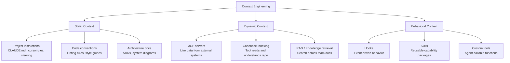

# What Is Context Engineering?

> The discipline of ensuring AI tools have the right information, at the right time, to produce consistently useful output — independent of who's using them.

## Context Engineering vs. Prompt Engineering

These are related but different:

| | Prompt Engineering | Context Engineering |
|---|---|---|
| **Scope** | One interaction | All interactions across a project/team/org |
| **Who does it** | Individual developer | Team, platform team, or engineering leadership |
| **Lifespan** | Ephemeral (per-prompt) | Durable (persisted in repo, config, infra) |
| **Effect** | Makes one developer's experience better | Makes every developer's experience better |
| **Scales with** | Individual skill | Organization investment |
| **Example** | "Generate tests using Jest following AAA pattern" | A project instructions file that tells every tool to always use Jest with AAA pattern |

**Prompt engineering is a personal skill. Context engineering is an organizational capability.**

---

## Why It Matters

### The Consistency Problem

Without context engineering, AI output quality depends on:
- How well each developer prompts (varies enormously)
- Whether they remember to include conventions (they forget)
- Whether they know the project's patterns (new hires don't)
- Whether they provide enough context each time (tedious, so they skip it)

With context engineering, AI output quality depends on:
- How well the project/team/org has codified its knowledge (done once, benefits everyone)
- The tool automatically receives the right context every time

### The Math

```
Traditional AI experience:
  Quality = (Model capability) × (Individual prompt skill)
  → Varies wildly by developer

Context-engineered AI experience:
  Quality = (Model capability) × (Codified context + Individual prompt)
  → Consistent baseline with individual upside
```

---

## The Building Blocks

Context engineering isn't one thing — it's a collection of mechanisms that deliver context to AI tools:



### Static Context
Information that changes infrequently. Written once, maintained occasionally. Loaded into AI tool context at the start of every interaction.

**Examples:** Project conventions, error handling patterns, file structure, testing approach, security rules.

**Maintenance cost:** Low. Update when conventions change (quarterly or less).

### Dynamic Context
Information pulled at interaction time from external sources. Always fresh.

**Examples:** Current tickets from Jira, live API schemas, database state, deployment status, recent error logs.

**Maintenance cost:** Medium. Requires integration (MCP servers, APIs) but stays current automatically.

### Behavioral Context
Not information — but rules about how the AI should behave. Automation triggers, guardrails, and extended capabilities.

**Examples:** "Run linter after every file save," "Require approval before executing shell commands," "Use our internal API client instead of raw fetch."

**Maintenance cost:** Low-Medium. Set up once, adjust as needs evolve.

---

## What Good Context Engineering Looks Like

### Level 0: Nothing
- AI uses default behavior
- Developers prompt from scratch every time
- Inconsistent output, low adoption

### Level 1: Project Instructions
- One instruction file per project (CLAUDE.md, .cursorrules, etc.)
- AI knows your stack, conventions, and patterns
- Consistent output within a project
- **Effort: 2–4 hours per project. Massive ROI.**

> **Our take on where to start:** Start at Level 1 this week. Literally today. Write a CLAUDE.md (or equivalent) for your most active project. It takes 2 hours and immediately improves every AI interaction for every developer on that project. This is the single highest-ROI activity in AI adoption. Don't plan an org-wide context strategy before you've done this for one project. Do the simple thing first, experience the improvement, then scale.

### Level 2: Team Context
- Shared steering across multiple projects
- Domain knowledge codified (architecture, business rules)
- Common prompts and skills shared within team
- AI understands not just "how" but "why" for your team
- **Effort: 1–2 days per team. High ROI.**

### Level 3: Organizational Context
- Standards propagated org-wide via shared steering
- MCP servers providing live organizational data
- Knowledge architecture connecting AI to internal docs, APIs, runbooks
- Context governance: who maintains what, how it's reviewed
- **Effort: Ongoing investment. Compounding returns.**

### Level 4: Adaptive Context
- Context self-maintains — AI updates its own instructions when conventions change
- Feedback loops: context quality measured and improved continuously
- New projects and teams inherit context automatically
- Context engineering is a recognized discipline with owned practices
- **Effort: Ongoing. Competitive advantage.**

---

## The Return on Context

| Context investment | One-time cost | Recurring benefit |
|-------------------|---------------|-------------------|
| Write CLAUDE.md for one project | 2 hours | Every AI interaction in that project is better, for every developer, forever |
| Create team-wide steering files | 4 hours | Every new project starts with team standards baked in |
| Build MCP integration for internal API | 2–3 days | AI can query your systems directly — no more copy-pasting from dashboards |
| Set up hooks for code quality | 2 hours | Automated enforcement without human overhead |
| Org-wide context strategy | 1–2 weeks | Compounding improvement across hundreds of developers |

**The key insight:** Context engineering front-loads effort into durable, shared assets rather than repeating effort in every individual interaction. It's the same principle as writing good documentation or building good CI — invest once, benefit continuously.

---

## Who Owns Context Engineering?

| Level | Owner | Review cadence |
|-------|-------|----------------|
| Project instructions | Team (any developer can update) | On architecture changes |
| Team-level context | Tech lead / architect | Quarterly |
| Org-level standards | Platform team / enablement | Quarterly |
| MCP servers / integrations | Platform / infra team | As systems change |
| Hooks and automation | Team (with platform team support) | As workflow evolves |

---

## Common Objections

### "This is over-engineering"

Writing a 50-line CLAUDE.md takes 30 minutes and improves every AI interaction for the team. That's not over-engineering — it's the same as writing a good README or setting up linting.

### "It'll get stale"

Yes, like all documentation. But:
- Instructions that are 80% current are still far better than zero instructions
- Review cadence prevents total drift
- AI can help maintain its own context (use agents to update instructions when conventions change)

### "Every tool has different formats"

True. The concepts are universal; the file formats differ. Most projects need 1–2 files covering the same concepts. The effort is in *thinking about what to include*, not the formatting.

### "My developers should just write better prompts"

Some will. Most won't. And new hires won't know your conventions even if they're expert prompters. Context engineering ensures the floor is high, regardless of individual skill.

---

## Next

- How to write effective project instructions → [Project Instructions](./project-instructions.md)
- Extending AI with skills and automation → [Skills and Hooks](./skills-and-hooks.md)
- Connecting AI to your knowledge → [Knowledge Architecture](./knowledge-architecture.md)
- Scaling this across your org → [Org-Wide Strategy](./org-wide-strategy.md)
