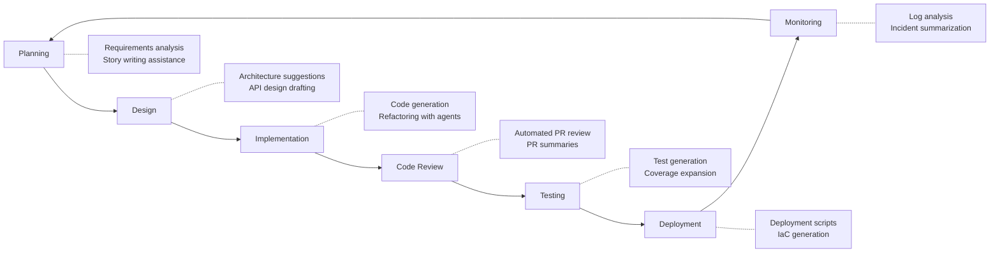

# 04 — Engineering Workflows

> Integrating AI into the software development lifecycle — from planning to production.

## Why This Section Matters

AI doesn't just help write code. It can augment every stage of the engineering workflow. But bolting AI onto a broken process won't fix the process — it'll amplify the dysfunction. This section covers practical integration patterns that work.

## In This Section

| Page | What you'll learn |
|------|-------------------|
| [AI Across the SDLC](./ai-in-sdlc.md) | Where AI fits in each phase of development |
| [Code Review with AI](./code-review.md) | Augmenting PR review without replacing human judgment |
| [Testing Workflows](./testing.md) | AI-assisted test generation, coverage, and quality |
| [CI/CD Integration](./cicd-integration.md) | Embedding AI in your pipelines |
| [Documentation](./documentation.md) | Keeping docs alive with AI assistance |

## Key Principle

> **AI should accelerate existing good practices, not replace process discipline.**
>
> If your team doesn't do code review well today, AI won't fix that. Fix the process first, then augment it.

## The SDLC Integration Map

## Cost Context for Workflow Integration

| Integration type | Cost | POC feasibility |
|-----------------|------|-----------------|
| Built-in tool features (PR summaries, inline review) | 💰 Included in tool license | 🆓 Available on free tiers |
| CI/CD pipeline AI steps | 💰 API costs per run | ⚠️ Can add up with high PR volume |
| Custom automation (bots, webhooks) | 💰 API costs + engineering time | 🆓 Can prototype with free API credits |
| Full workflow embedding | 🏢 Enterprise tooling + custom build | Requires pilot budget |

## Status

🟢 Active — content being written and refined.
