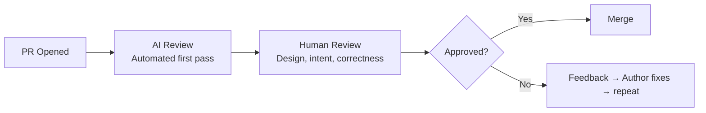

# Code Review with AI

> Augmenting pull request review without replacing the human judgment that makes review valuable.

## The Role of AI in Code Review

AI code review is best understood as a **first pass** — catching the mechanical issues so human reviewers can focus on what matters: design, intent, correctness, and mentoring.

---

## What AI Review Catches Well

| Category | Examples | Reliability |
|----------|----------|-------------|
| **Style/formatting** | Naming conventions, line length, import order | High — but a linter does this too |
| **Common bugs** | Null checks, off-by-one, resource leaks | Medium-High |
| **Security patterns** | SQL injection, XSS, hardcoded secrets | Medium-High |
| **Performance** | N+1 queries, unnecessary allocations, missing indexes | Medium |
| **Missing error handling** | Uncaught exceptions, ignored error returns | Medium-High |
| **Test coverage** | Untested code paths, missing edge cases | Medium |

## What AI Review Misses

| Category | Why AI struggles | Human needed for |
|----------|-----------------|-----------------|
| **Business logic correctness** | Doesn't know your domain rules | "This logic is wrong for our use case" |
| **Design coherence** | Doesn't understand system architecture vision | "This doesn't fit our architecture pattern" |
| **Intent validation** | Doesn't know what the PR is trying to achieve | "This solves the wrong problem" |
| **Mentoring/growth** | Can't develop your team | "Here's a better approach and why" |
| **Context** | Doesn't know project history/decisions | "We tried this before and it broke X" |

---

## Practical Implementation Patterns

### Pattern 1: AI-Generated PR Summaries

**What:** Auto-generate a structured PR description when a PR is opened.

**Value:** Reviewers understand the change faster. Authors don't skip description writing.

**How:**
- GitHub Copilot: Generates summary automatically in PR creation flow
- Custom: GitHub Action that calls AI API on PR open, posts summary as comment

**Cost:** 🆓 Included in Copilot plans. Custom: ~$0.01–0.05 per PR in API costs.

---

### Pattern 2: Automated First-Pass Review

**What:** AI posts review comments on the PR identifying potential issues.

**Value:** Catches mechanical issues before human reviewer spends time on them.

**How:**
- CodeRabbit: GitHub/GitLab app, reviews every PR automatically
- GitHub Copilot: Built-in review suggestions
- Custom: GitHub Action → AI API → post review comments

**Configuration guidance:**
- Set sensitivity to avoid noise (too many false positives = ignored tool)
- Focus on: security, bugs, error handling
- Avoid: style nitpicks (use linters for that)
- Allow developers to dismiss AI comments without friction

**Cost:** 💰 $15–30/user/month for dedicated tools. Built-in with Copilot plans.

---

### Pattern 3: Review of AI-Generated Code

**Important:** Reviewing code written by an agent requires different attention than reviewing human-written code.

| Human-written PR | Agent-written PR |
|-----------------|-----------------|
| Check for logic errors and typos | Check for coherence and hidden assumptions |
| Review design choices | Verify the design matches intent |
| Style feedback | Check for over-engineering or unnecessary abstractions |
| Standard correctness review | Extra scrutiny on security boundaries |
| Trust the author's domain knowledge | Verify domain logic — agents may not know edge cases |

**Specific things to watch for in agent PRs:**
- Tautological tests (tests that test the implementation, not behavior)
- Missing error handling for edge cases the agent didn't consider
- Over-abstraction (agents love creating unnecessary interfaces)
- Scope creep (changes outside the intended scope)
- Subtle correctness issues in business logic

---

### Pattern 4: Review Acceleration for Large PRs

**What:** AI summarizes large PRs, highlights the most important files/changes, and provides a reading order.

**Value:** Reduces time-to-first-review for large PRs. Reviewers know where to focus.

**How:** Built into tools like CodeRabbit ("walkthrough" feature) or custom prompt with PR diff as input.

---

## Anti-Patterns

| Anti-pattern | Why it's bad | Instead |
|-------------|-------------|---------|
| AI review replaces human review | Misses intent, design, mentoring | AI as first pass, human as decision-maker |
| AI review is mandatory blocker | False positives block PRs needlessly | AI review is advisory, human review is the gate |
| Ignoring all AI feedback | Tool becomes useless noise | Tune sensitivity, keep only high-value checks |
| Different standards for AI-authored PRs | Either too strict (blocking) or too lenient (risky) | Same quality bar, different focus areas |

---

## Setting Up AI Code Review for Your Team

### Step 1: Start Small
- Enable PR summaries only (low noise, immediate value)
- Let the team observe for 2 weeks

### Step 2: Add Automated Review (Advisory)
- Enable AI review comments (not blocking)
- Focus on security and bugs only
- Review false positive rate weekly

### Step 3: Tune and Expand
- Adjust sensitivity based on team feedback
- Add categories (performance, testing) if false positive rate is acceptable
- Consider team-specific rules (custom prompts with your conventions)

### Step 4: Establish Norms
- "AI comments are suggestions, not mandates"
- "If AI catches something real, author fixes. If it's noise, dismiss without guilt."
- "Human reviewer still required — AI review doesn't replace approval."

---

## Cost-Benefit Analysis

| Implementation | Monthly cost (50 devs) | Time saved per review | Break-even |
|---------------|----------------------|----------------------|-----------|
| PR summaries only | 🆓 (included in Copilot) | 5–10 min per large PR | Immediate |
| Full AI review (CodeRabbit) | ~$750 ($15/user) | 15–30 min per PR in reduced review cycles | ~2 weeks |
| Custom review bot | ~$100 API + eng time | Depends on quality | 1–3 months |

---

## Next

- Testing integration → [Testing Workflows](./testing.md)
- CI/CD pipeline patterns → [CI/CD Integration](./cicd-integration.md)
- Return to overview → [AI Across the SDLC](./ai-in-sdlc.md)
