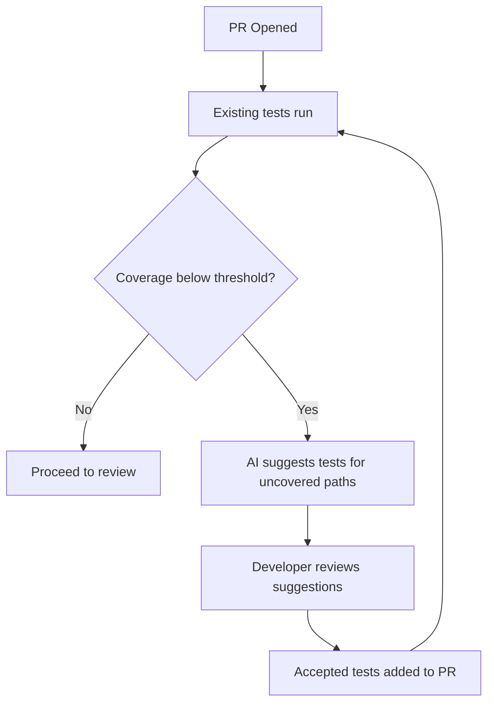

# Testing Workflows with AI

> AI-assisted test generation, coverage expansion, and quality improvement — done right.

## Where AI Testing Helps

AI test generation works best when you have:
- Existing code with low coverage that needs tests added
- Clear function signatures with well-defined inputs/outputs
- Established test patterns in your codebase that the AI can follow
- A CI pipeline that runs tests (so the agent can verify its own output)

## Where AI Testing Struggles

- Writing tests for requirements (AI tests what the code *does*, not what it *should* do)
- Complex integration tests requiring infrastructure setup
- Tests for concurrent/distributed behavior
- Replacing thoughtful test design with volume

---

## Practical Patterns

### Pattern 1: Coverage Expansion

**What:** Use agents to add tests for untested modules.

**When to use:** Legacy code with low coverage. New code where tests were skipped under time pressure.

**Approach:**
1. Identify untested files (use coverage reports)
2. Ask agent: "Generate unit tests for [file]. Follow the patterns in [existing test file]. Aim for edge cases and error paths."
3. Run tests to verify they pass
4. Human reviews: Are these testing behavior or just implementation?

**Quality check:** Delete the implementation and see if tests fail for the right reasons. If not, the tests are tautological.

**Cost:** 🆓 Built into any coding agent. One of the best tasks for free-tier exploration.

---

### Pattern 2: Edge Case Discovery

**What:** Ask AI to identify edge cases and boundary conditions you haven't tested.

**Approach:**
1. Point agent at a function
2. Ask: "What edge cases and boundary conditions are not covered by existing tests? List them, then implement test cases."
3. Review the edge cases — are they real? Do they matter?
4. Keep the valuable ones, discard the noise

**Value:** AI is good at systematically enumerating cases humans skip (null inputs, empty collections, boundary values, Unicode, concurrent access).

---

### Pattern 3: Test-Driven Bug Reproduction

**What:** When a bug is reported, write a failing test first, then fix.

**Approach:**
1. Describe the bug to the agent: "Users report [behavior] when [condition]"
2. Agent writes a failing test that reproduces the bug
3. Agent (or human) fixes the code until the test passes
4. The test remains as regression protection

**Value:** Bug fix + regression test in one flow. The test proves the bug existed and is now fixed.

---

### Pattern 4: Contract/Property-Based Tests

**What:** Generate property-based tests that verify invariants rather than specific examples.

**Approach:**
1. Identify functions with clear contracts (sort should return sorted, parse should round-trip with serialize)
2. Ask agent to generate property-based tests using your framework (Hypothesis, fast-check, QuickCheck)
3. These tests are often higher value than example-based tests

---

## Quality Checklist for AI-Generated Tests

Before accepting AI-generated tests, verify:

- [ ] Tests test *behavior*, not *implementation* (would they still pass after a valid refactor?)
- [ ] Tests have meaningful assertions (not just "doesn't throw")
- [ ] Test names describe the expected behavior clearly
- [ ] Edge cases are genuinely relevant (not just padding coverage numbers)
- [ ] Tests don't depend on implementation details (internal method names, private state)
- [ ] Tests are maintainable (not overly complex setup for simple behavior)
- [ ] Tests actually fail when the behavior is wrong (delete the implementation and check)

---

## Anti-Patterns in AI Testing

| Anti-pattern | Example | Why it's harmful |
|-------------|---------|-----------------|
| **Coverage theater** | AI generates tests that hit lines but verify nothing meaningful | False confidence, maintenance burden |
| **Tautological tests** | `expect(add(1,2)).toBe(add(1,2))` or tests that mock the thing they're testing | Zero value, pure noise |
| **Snapshot overuse** | AI generates snapshot tests for everything | Brittle, no one reads the snapshots, approved blindly |
| **Testing the mock** | Complex mocking that tests the test setup, not the code | Maintenance nightmare, false confidence |
| **Volume over quality** | "Generate 100 tests" with no curation | Maintenance burden, slow CI, signal buried in noise |

---

## Integration with CI

**Implementation options:**
- GitHub Action that checks coverage diff and comments with AI-generated test suggestions
- Pre-commit hook that generates tests for new/modified functions
- Scheduled job that identifies low-coverage modules and creates draft PRs with tests

---

## Cost Context

| Approach | Cost | Value |
|----------|------|-------|
| Agent generates tests during development | 🆓/💰 Included in coding tool | Highest — tests written alongside code |
| CI-integrated test suggestions | 💰 API costs per PR (~$0.05–0.20) | Medium — catches coverage gaps automatically |
| Dedicated test generation tool | 💰 $15–30/user/month | Variable — worth it only for large coverage gaps |
| Batch coverage expansion project | 💰 One-time agent cost | High — brings legacy code up to standard |

---

## Next

- CI/CD integration patterns → [CI/CD Integration](./cicd-integration.md)
- Documentation workflows → [Documentation](./documentation.md)
- Return to overview → [AI Across the SDLC](./ai-in-sdlc.md)
