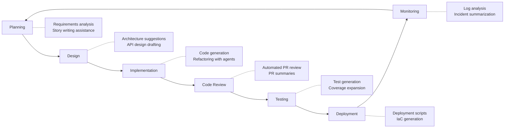

# 04 — Engineering Workflows

> Integrating AI into the software development lifecycle — from planning to production.

## Why This Section Matters

AI doesn't just help write code. It can augment every stage of the engineering workflow — review, testing, documentation, deployment, monitoring. But most teams stop at "autocomplete in the IDE" and leave 70% of the value on the table.

**What goes wrong without deliberate workflow integration:**
- AI tools adopted but only used for code generation — no impact on review bottlenecks, test coverage, or documentation debt
- Teams bolt AI onto broken processes and amplify the dysfunction (faster bad PRs are still bad PRs)
- CI/CD remains untouched — manual processes that AI could automate continue burning developer time
- Documentation is still stale — despite AI being excellent at keeping it current
- Individual developers get faster but team throughput doesn't improve because the bottleneck is elsewhere (review, testing, deployment)

This section covers practical integration patterns across the full SDLC — where AI adds value beyond code writing, and where it doesn't.

## In This Section

| Page | What you'll learn |
|------|-------------------|
| [AI Across the SDLC](./ai-in-sdlc.md) | Where AI fits in each phase of development |
| [Code Review with AI](./code-review.md) | Augmenting PR review without replacing human judgment |
| [Testing Workflows](./testing.md) | AI-assisted test generation, coverage, and quality |
| [CI/CD Integration](./cicd-integration.md) | Embedding AI in your pipelines |
| [Documentation](./documentation.md) | Keeping docs alive with AI assistance |

## Key Principle

> **AI should accelerate existing good practices, not replace process discipline.**
>
> If your team doesn't do code review well today, AI won't fix that. Fix the process first, then augment it.

## The SDLC Integration Map

## Cost Context for Workflow Integration

| Integration type | Cost | POC feasibility |
|-----------------|------|-----------------|
| Built-in tool features (PR summaries, inline review) | 💰 Included in tool license | 🆓 Available on free tiers |
| CI/CD pipeline AI steps | 💰 API costs per run | ⚠️ Can add up with high PR volume |
| Custom automation (bots, webhooks) | 💰 API costs + engineering time | 🆓 Can prototype with free API credits |
| Full workflow embedding | 🏢 Enterprise tooling + custom build | Requires pilot budget |

## Status

🟢 Active — content being written and refined.

## AI Engineering Maturity: Workflow Integration

> **Engineering Manager Note**
>
> If your developers are faster but your PRs still take 3 days to review, you haven't improved delivery.
>
> Find the bottleneck. Apply AI there. Not just where it's shiny.

| Level | What it looks like | What to do |
|:-----:|-------------------|-----------|
| **0** | No AI in workflows | Start with [01 — Foundations](../01-foundations/) |
| **1** | AI autocomplete in IDE only | Enable PR summaries (zero effort, immediate value) |
| **2** | AI in code review + test generation | Add CI-integrated AI steps (coverage, doc freshness) |
| **3** | AI in CI/CD pipelines + documentation | Expand to IaC generation, incident analysis |
| **4** | AI across full SDLC, continuously optimized | Regular review of integration effectiveness, new patterns |
