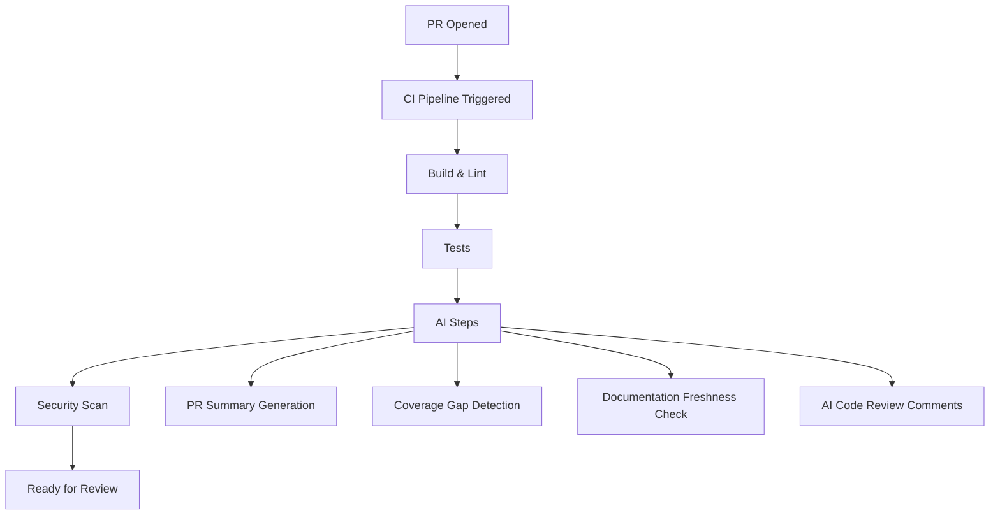

# CI/CD Integration

> Embedding AI into your pipelines — automated documentation, review, testing, and quality gates.

## Where AI Fits in CI/CD



---

## Pattern 1: PR Summary Generation

**Trigger:** PR opened or updated
**Action:** Generate structured PR description from diff
**Output:** Comment on PR with summary

**Value:** Reviewers get context immediately. Reduces "what does this PR do?" questions.

> **Our take on where to start in CI:** PR summary generation. Full stop. It's the easiest to implement (one GitHub Action, 20 lines), cheapest to run ($0.01–0.10/PR), zero risk (advisory only), and immediately useful to every reviewer on every PR. If you're only going to add one AI step to your pipeline, this is it. Everything else (coverage suggestions, doc freshness, AI review) is Phase 2.

**Implementation (GitHub Actions):**
```yaml
# Conceptual — not production-ready
name: PR Summary
on: pull_request
jobs:
  summarize:
    runs-on: ubuntu-latest
    steps:
      - uses: actions/checkout@v4
      - name: Generate summary
        # Call AI API with diff, post as PR comment
        run: ./scripts/generate-pr-summary.sh
```

**Cost:** ~$0.01–0.10 per PR (depending on diff size and model choice).

---

## Pattern 2: Coverage-Aware Test Suggestions

**Trigger:** PR changes files with low coverage
**Action:** AI analyzes uncovered paths, suggests tests
**Output:** Comment with suggested test cases (not auto-committed)

**Value:** Coverage gaps caught at PR time, with actionable suggestions.

**When to use:** Teams with coverage goals that don't want hard enforcement but want guidance.

---

## Pattern 3: Documentation Freshness Check

**Trigger:** Code changes that might make docs stale
**Action:** AI checks if related documentation needs updates
**Output:** Comment flagging potentially stale docs

**Implementation logic:**
1. Map code files to related doc files (by convention or explicit mapping)
2. When code changes, check if corresponding docs mention the changed APIs/interfaces
3. If mismatch detected, flag for author to update (or generate suggested update)

**Value:** Fights the "docs are always stale" problem at the source.

---

## Pattern 4: AI as CI Quality Gate (Use With Caution)

**What:** AI evaluates code quality and can block merge.

**⚠️ Caution:** Making AI a hard gate is risky:
- False positives block legitimate PRs
- Developers lose trust in the pipeline
- AI quality varies by code type

**When it's OK:**
- Security-specific checks (AI + traditional SAST) for known patterns
- License compliance detection
- Secrets detection

**When it's NOT OK:**
- Subjective quality assessment
- Style or design opinions
- General "is this good code" evaluation

---

## Cost Management in CI

AI in CI adds per-run costs. Manage this:

| Strategy | How | Impact |
|----------|-----|--------|
| **Run only on PR, not every commit** | Trigger on `pull_request`, not `push` | 80%+ cost reduction |
| **Cache context** | Reuse AI analysis for unchanged files | 30–50% cost reduction |
| **Use cheaper models** | GPT-4o-mini / Haiku for simple tasks | 5–10× cheaper per call |
| **Rate limit per repo** | Cap AI calls per day | Hard ceiling on costs |
| **Skip for small PRs** | Only run for PRs > N lines changed | Reduces unnecessary calls |

**Budget estimate (100 PRs/week, moderate org):**
- Summary generation only: ~$5–20/month
- Full AI review + summary: ~$50–200/month
- All patterns combined: ~$100–500/month

---

## What NOT to Do

| Don't | Why | Instead |
|-------|-----|---------|
| Add AI steps that increase CI time by >2 min | Developers wait; adoption drops | Run AI steps in parallel, or async (post as comment after CI passes) |
| Make AI a hard merge blocker | False positives create frustration | Advisory comments only (unless security-specific) |
| Run AI on every commit in a branch | Expensive and noisy | PR-level only |
| Commit AI-generated code automatically | No human review in the loop | Suggest in comments; human adds to PR |

---

## Next

- Documentation workflows → [Documentation](./documentation.md)
- Return to overview → [AI Across the SDLC](./ai-in-sdlc.md)
- Security in CI → [05 — Security](../06-security/)
