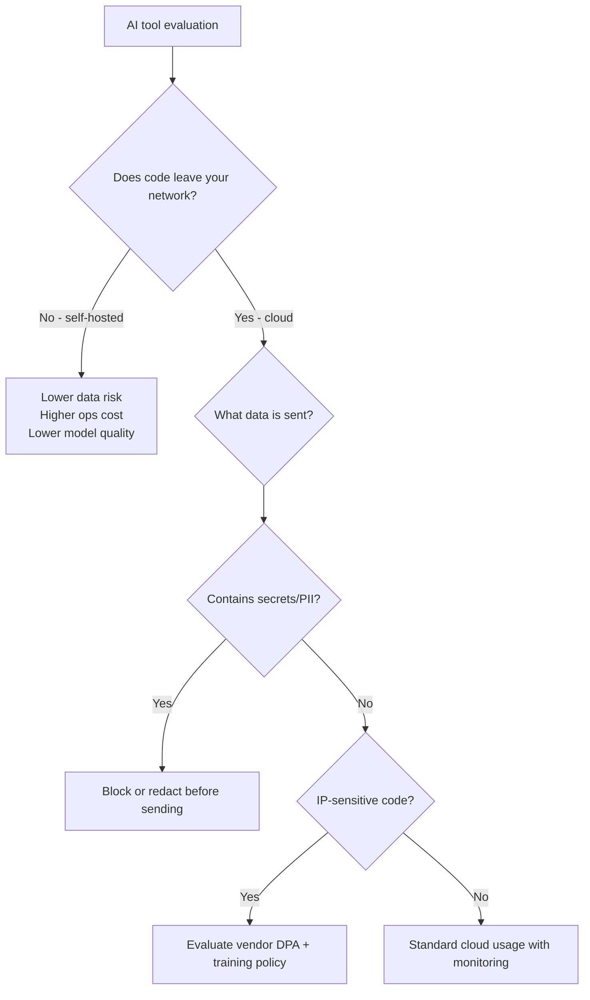

# 05 — Security

> Threat models, data privacy, supply chain risks, and compliance for AI in engineering.

## Why This Section Matters

Security is the most common blocker for AI adoption in enterprise environments — and rightfully so. But "no AI" is not a security strategy. It pushes usage underground. This section covers real risks, practical mitigations, and how to build a security posture that *enables* adoption within safe boundaries.

## In This Section

| Page | What you'll learn |
|------|-------------------|
| [Threat Model](./threat-model.md) | What can go wrong — a structured view of AI-specific threats |
| [Data Classification](./data-classification.md) | What code can go where — frameworks for data handling decisions |
| [AI-Generated Code Risks](./generated-code-risks.md) | Vulnerabilities, license issues, and supply chain risks in AI output |
| [Enterprise Controls](./enterprise-controls.md) | Network, identity, DLP, and monitoring controls for AI tools |

## Key Principle

> **Security should enable AI adoption, not just block it.**
>
> A "no AI" policy is not a security strategy — it pushes usage underground where you have zero visibility. Build guardrails that let teams move fast within safe boundaries.

## Decision Framework: Cloud vs. Self-Hosted

## Cost Context

| Security approach | Cost | Trade-off |
|------------------|------|-----------|
| Cloud AI with enterprise DPA | 💰 Standard enterprise pricing | Trust vendor, contractual protection |
| Cloud AI with proxy/DLP | 💰 Tool cost + proxy infra | Higher control, some latency |
| Self-hosted models | 🏢 GPU infra + ops team | Full control, lower model quality, high cost |
| No AI (prohibition) | 🆓 (nominally) | Hidden cost: shadow IT, talent attrition, competitive disadvantage |

## Status

🟢 Active — content being written and refined.
