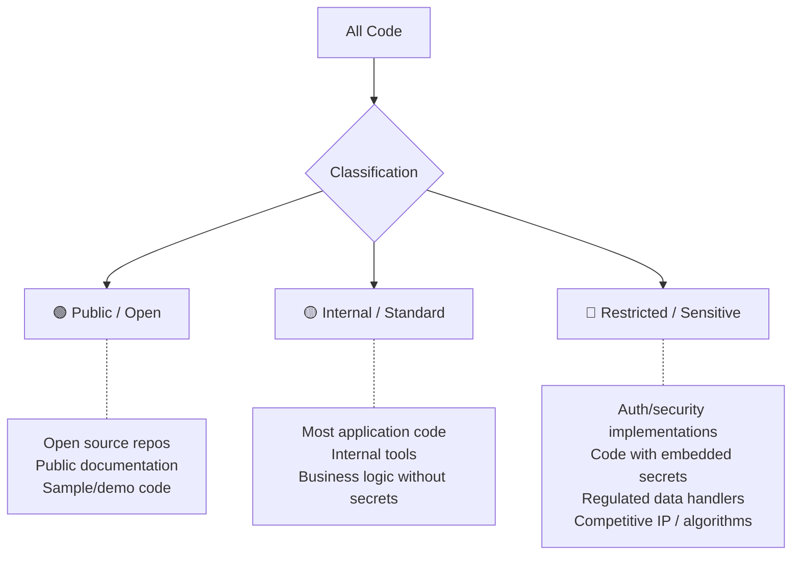

# Data Classification for AI Tools

> What code can go where — a practical framework for deciding what's safe to send to AI services.

## Why Classification Matters

Without data classification, every AI tool decision becomes a binary: "Is ALL our code safe to send to a cloud service?" The answer is always "no" for some code, which leads to blanket bans. Classification lets you say "yes" for most code and "no" (or "with extra controls") for the rest.

---

## The Three-Tier Model



---

## Classification → Tool Policy

| Classification | Allowed AI tools | Controls required |
|---------------|-----------------|-------------------|
| 🟢 **Public** | Any AI tool, any tier | None — this is public anyway |
| 🟡 **Internal** | Approved tools with enterprise DPA (no training clause) | Standard: approved tool list, usage monitoring |
| 🔴 **Restricted** | Self-hosted models only, or no AI | Maximum: air-gapped, self-hosted, audit trail |

**For most organizations, ~80% of code is 🟡 Internal.** This means the majority of your codebase can use standard cloud AI tools under an enterprise agreement with appropriate contractual protections.

---

## How to Classify Your Repositories

### Step 1: Default Classification

Set a default and override for exceptions:
- Default: 🟡 Internal (most code)
- Override to 🟢: Open source repos, public docs
- Override to 🔴: Security-sensitive, regulated, or competitive-advantage code

### Step 2: Identify Restricted Code

Code is 🔴 Restricted if ANY of these apply:

| Criteria | Examples |
|----------|---------|
| Contains or handles customer PII | User data services, analytics pipelines |
| Implements authentication/authorization | Auth service, token generation, access control |
| Handles financial transactions | Payment processing, billing, accounting |
| Subject to specific regulation | HIPAA, PCI-DSS, FedRAMP scope |
| Core competitive IP | Proprietary algorithms, unique business logic |
| Contains embedded secrets (even if it shouldn't) | Legacy code with hardcoded credentials |

### Step 3: Document and Enforce

| Mechanism | Implementation |
|-----------|---------------|
| Repository metadata | Tag repos with classification in your platform (GitHub topics, labels) |
| `.copilotignore` / content exclusion | Vendor-specific file to exclude paths from AI context |
| Policy documentation | Written policy mapping classifications to allowed tools |
| Technical enforcement | Proxy/DLP rules blocking restricted code from reaching AI APIs |

---

## Practical Example

```
Organization: Acme Corp (100 developers, SaaS product)

🟢 Public (5% of code)
├── open-source-sdks/        (public GitHub repos)
├── developer-docs/          (public documentation site)
└── sample-apps/             (demo code for customers)

🟡 Internal (80% of code)
├── web-frontend/            (React app — standard business logic)
├── api-services/            (REST APIs — CRUD, business rules)
├── internal-tools/          (Admin dashboards, scripts)
├── mobile-app/              (Customer-facing mobile app)
└── infrastructure/          (Terraform, CI/CD — no secrets inline)

🔴 Restricted (15% of code)
├── auth-service/            (OAuth, token management, access control)
├── payment-processor/       (PCI-DSS scope, handles card data)
├── ml-recommendation-engine/ (Core competitive algorithm)
├── compliance-reporter/     (Handles PII for regulatory reports)
└── secrets-config/          (Even though secrets should be in vault...)
```

---

## Handling the Gray Areas

### "But there are secrets in our normal code..."

**Reality:** Many codebases have secrets or sensitive config scattered in non-restricted code. This is a pre-existing problem that AI adoption makes more urgent.

**Fix first, classify second:**
1. Move secrets to vault/secrets manager (this is urgent regardless of AI)
2. Scan for remaining secrets (git-secrets, truffleHog)
3. Once secrets are extracted, the code itself drops to 🟡 Internal

### "Our business logic IS our competitive advantage"

**Consider:** Is the business logic truly unique and reverse-engineerable from AI suggestions? For most companies, the answer is no — execution and operations matter more than code secrecy.

**If genuinely yes:** Classify as 🔴 Restricted. Use self-hosted models or exclude from AI context.

### "Everything is regulated in our industry"

**Distinguish between:**
- Code that *handles* regulated data → May be 🔴
- Code that *runs in* a regulated environment but handles non-sensitive data → Likely 🟡
- Being in a regulated industry doesn't make all code restricted — it makes some code restricted

---

## AI-Specific File Exclusions

Most AI tools support excluding files from AI context:

**GitHub Copilot:** `.copilotignore` (same syntax as `.gitignore`)
```
# Exclude sensitive paths from Copilot context
auth/
payments/
secrets/
*.key
*.pem
.env*
```

**Cursor:** Settings → Privacy → excluded paths

**Kiro:** Steering files can control what enters context

**General (for any tool):** `.aiignore` convention (not standardized yet but some tools support it)

---

## Review Cadence

Classification isn't set-and-forget:

- **Quarterly:** Review 🔴 Restricted list. Has anything changed? New repos? Decommissioned services?
- **On new repo creation:** Classify immediately (default 🟡 unless criteria for 🔴 apply)
- **On regulation change:** Re-evaluate if scope expands or contracts
- **On AI tool change:** New tool may have different data handling — re-verify classification policy still applies

---

## Next

- Risks in AI-generated code → [Generated Code Risks](./generated-code-risks.md)
- Technical controls to enforce this → [Enterprise Controls](./enterprise-controls.md)
- Return to section overview → [README](./README.md)
