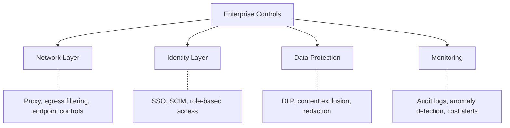

# Enterprise Security Controls for AI Tools

> Network, identity, DLP, and monitoring controls to enforce AI security at scale.

## Defense in Depth

No single control is sufficient. Layer controls across multiple dimensions:

---

## Network Layer Controls

### Proxy / Gateway

**What:** Route all AI tool traffic through a proxy that can inspect, log, and filter.

**Why:** Visibility into what's being sent, ability to block sensitive content.

| Approach | Cost | Complexity |
|----------|------|-----------|
| Cloud proxy (Cloudflare, Zscaler) | 💰 Per-user pricing | Medium |
| Self-hosted proxy (mitmproxy, custom) | 💰 Infra + engineering | High |
| Vendor-provided gateway (Bedrock Guardrails) | 💰 API usage based | Low-Medium |

### Egress Filtering

**What:** Control which AI API endpoints developers can reach.

**Implementation:**
- Allow only approved AI service domains (api.anthropic.com, api.openai.com, etc.)
- Block unauthorized AI services at the network level
- Exception process for evaluation of new tools

---

## Identity Layer Controls

### SSO / SAML Integration

**What:** AI tool access managed through your identity provider.

**Why:** Single point for provisioning, deprovisioning, access review. Employee leaves → access revoked automatically.

**Availability by tool:**
| Tool | SSO available | Tier required |
|------|:------------:|:------------:|
| GitHub Copilot | ✅ | Enterprise |
| Amazon Q | ✅ | Any (via IAM) |
| Cursor | ✅ | Business/Enterprise |
| Windsurf | ✅ | Enterprise |

### Role-Based Access

**What:** Different AI capabilities for different roles/teams.

**Examples:**
- All developers: autocomplete + chat
- Approved teams: agent mode
- Security team: unrestricted for security research
- Contractors: read-only AI (suggestions, no command execution)

---

## Data Protection (DLP)

### Content Filtering

**What:** Inspect outbound AI requests and block/redact sensitive content.

**What to filter:**
- API keys and tokens (regex patterns)
- Connection strings
- PII patterns (emails, SSNs, phone numbers)
- Specific file paths (secrets, config)
- Custom patterns for your org

### Content Exclusion

**What:** Prevent specific files/repos from entering AI context.

**Implementation:**
- `.copilotignore` files in repositories
- Admin-level exclusion rules (by repository, path pattern, or file type)
- Repository classification → automatic exclusion of 🔴 Restricted repos

---

## Monitoring and Audit

### What to Monitor

| Signal | Why | Alert threshold |
|--------|-----|----------------|
| Token/cost usage spikes | Runaway agent or abuse | >200% of daily average |
| Usage from unusual locations | Compromised credentials | Any non-expected geography |
| Large context windows | Bulk code exfiltration attempt | >100K tokens in single request |
| Off-hours heavy usage | Potential unauthorized automation | Contextual — depends on team |
| New tool connections | Shadow IT | Any unapproved AI service |

### Audit Log Requirements

For compliance-ready deployments, capture:
- Who used the AI tool (user identity)
- When (timestamp)
- What was sent (or hash/summary — full content may be too much)
- What was returned
- What actions were taken (files modified, commands run)

**Storage:** Treat as security logs — retention per your compliance requirements (typically 1–7 years).

---

## Implementation Priority

| Control | Priority | Reason |
|---------|---------|--------|
| Enterprise DPA (no training) | 🔴 Before any usage | Contractual baseline |
| SSO integration | 🔴 Before team rollout | Access management |
| Content exclusion for sensitive repos | 🔴 Before team rollout | Prevent accidental exposure |
| Secrets detection pre-send | 🟡 Before org-wide | Catches the highest-risk data |
| Audit logging | 🟡 Before org-wide | Compliance readiness |
| Network proxy/DLP | 🟢 For enterprise scale | Comprehensive but complex |
| Anomaly detection | 🟢 Optimization phase | Refinement after baseline established |

---

## Vendor Security Assessment Questions

Ask these before signing an enterprise AI tool agreement:

**Data handling:**
1. Is our code used for model training? (Answer must be: No)
2. Where is our data processed geographically? (Must meet residency requirements)
3. How long is our data retained? (Prefer: zero retention or shortest possible)
4. Is data encrypted at rest and in transit? (Must be: Yes, with details)
5. What happens to our data if we cancel the contract? (Must be: Deleted)

**Access and security:**
6. Do you have SOC 2 Type II certification? (Must be: Yes, recent)
7. Do you support SSO/SAML? (Must be: Yes, with SCIM)
8. What is your incident response process? (Must be: Documented, with SLA)
9. Do you conduct regular penetration testing? (Must be: Yes, third-party)
10. Do you offer a Bug Bounty program? (Positive signal, not required)

**Contractual:**
11. Do you offer IP indemnification? (Important for legal risk)
12. What is your SLA? (99.9% minimum for production tooling)
13. Do you support content exclusion at admin level? (Must be: Yes)
14. Can we export audit logs to our SIEM? (Should be: Yes, or API available)

---

## Cost Context

| Control category | Estimated cost | When required |
|-----------------|---------------|---------------|
| Enterprise AI tool tier (SSO, audit) | 💰 +$10–20/user/month over standard tier | Team rollout |
| Proxy/DLP for AI traffic | 💰 $5–15/user/month | Org-wide rollout in regulated industries |
| Self-hosted models (if needed) | 🏢 $50K–200K/year (GPU + ops) | Restricted code only |
| Security review and assessment | 🆓 Internal team time | Before any enterprise purchase |

---

## Next

- Start with threat model → [Threat Model](./threat-model.md)
- Data classification framework → [Data Classification](./data-classification.md)
- Return to section overview → [README](./README.md)
