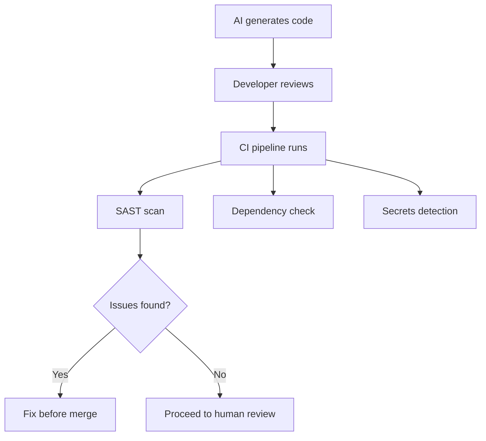

# AI-Generated Code Risks

> Vulnerabilities, license issues, and supply chain risks specific to code produced by AI.

## The Fundamental Issue

AI-generated code isn't inherently more or less secure than human-written code. But it introduces different risk patterns:

| Human-written code risks | AI-generated code risks |
|-------------------------|------------------------|
| Individual skill gaps | Consistent subtle errors across many files |
| Known bad patterns from habit | Plausible-looking but subtly wrong implementations |
| Slow introduction rate | Rapid introduction rate (volume) |
| Author can explain intent | No one fully understands why the AI chose this approach |
| Review focused on "does this developer usually make mistakes?" | No prior reputation to calibrate review intensity |

---

## Risk 1: Security Vulnerabilities in Generated Code

### Common Vulnerability Patterns

AI models have seen vast amounts of code — including insecure code. They may reproduce insecure patterns, especially when:
- Security wasn't explicitly requested in the prompt
- The generated code prioritizes functionality over security
- The training data included vulnerable examples of the same pattern

**Most common AI-generated vulnerabilities:**

| Vulnerability | Example | Why AI does this |
|--------------|---------|-----------------|
| Missing input validation | User input passed directly to queries | Training data often shows the "simple" version |
| Insecure defaults | `cors: { origin: '*' }`, `verify: false` | Common in tutorials and examples |
| Injection risks | String concatenation in SQL/commands | Simpler code, common in training data |
| Improper error handling | Stack traces exposed to users | "Get it working" bias |
| Hardcoded secrets | API keys in code | Seen frequently in training data |
| Weak cryptography | MD5, SHA1, ECB mode | Historical code in training data |

### Mitigations

1. **SAST in CI (non-negotiable)** — Catches known vulnerability patterns regardless of author
2. **Security-aware prompting** — Include security requirements in agent instructions
3. **Custom instructions** — Configure tools to always consider security (e.g., CLAUDE.md, .cursorrules)
4. **Focused review** — Extra security scrutiny for AI-generated code touching auth, data, or crypto
5. **Security champions** — Designated reviewer for AI-generated PRs touching sensitive areas

---

## Risk 2: Hallucinated Dependencies

### The Attack Pattern

1. AI suggests: `npm install image-resize-helper` (doesn't exist)
2. Developer doesn't verify, gets install error, moves on
3. Attacker monitors AI suggestions, registers package `image-resize-helper` on npm
4. Future developer (or agent) installs it → malicious code runs

### Real-World Frequency

Research has shown AI models suggest non-existent packages 5–15% of the time (varies by language and model). This is a real attack surface.

### Mitigations

| Control | How | Effectiveness |
|---------|-----|--------------|
| **Verify before install** | Check package exists, has downloads, is maintained | High (manual) |
| **Private registry** | Only approved packages available | High (automated) |
| **Lockfile review** | New dependencies flagged in PR review | Medium |
| **SCA tools** | Flag new, unpopular, or recently-created packages | Medium-High |
| **Package provenance** | Require signed packages (npm, PyPI supports this) | Medium (adoption still low) |

---

## Risk 3: License Contamination

### The Concern

AI models trained on copyleft-licensed code (GPL, AGPL) might generate output that's substantially similar. If that output enters your proprietary codebase, you might have a derivative work issue.

### Reality Check

- No court has ruled on this definitively (as of 2025)
- The legal risk is theoretical but non-zero
- Most enterprise AI tools offer IP indemnification (they assume the legal risk)
- Practically: AI-generated code tends to be generic enough that substantial similarity is rare

### Mitigations

| Approach | When to use |
|----------|-------------|
| IP indemnification from vendor | Default — most enterprise tiers offer this |
| License scanning tools | Run on AI-generated code same as human code |
| Avoid verbatim prompts | Don't prompt "generate code like [specific open-source project]" |
| Legal review of terms | Understand exactly what your vendor indemnifies |

---

## Risk 4: Consistent Errors at Scale

### The Pattern

An agent makes a subtle logical error and applies it consistently across 30 files. Because it's consistent, reviewers assume it's intentional. The error propagates.

**Examples:**
- Off-by-one in pagination applied to every endpoint
- Race condition in a connection pool pattern used everywhere
- Incorrect timezone handling applied to all date operations

### Why This Is AI-Specific

Humans make *inconsistent* errors — one file has a bug, the next doesn't. This inconsistency is a signal during review ("why is this different?"). Agents make *consistent* errors that look deliberate.

### Mitigations

1. **Review the pattern first** — Before an agent applies a pattern broadly, review one instance deeply
2. **Test the pattern** — Verify with edge cases before applying to all files
3. **Sample-based deep review** — For large agent PRs, deeply review 3–5 files (not just skim all 30)
4. **Behavioral tests** — Tests that verify correctness of the pattern, not just that code exists

---

## The Bottom Line

AI-generated code needs the same security controls as human code — **plus awareness of AI-specific patterns**. The controls are:

1. ✅ SAST/DAST in CI (you should have this already)
2. ✅ Dependency scanning (you should have this already)
3. ✅ Secrets detection (you should have this already)
4. ➕ Awareness of hallucinated dependencies (AI-specific)
5. ➕ Pattern review before broad application (AI-specific)
6. ➕ Extra security attention for AI code touching sensitive areas (AI-specific)
7. ➕ IP indemnification in vendor contract (AI-specific)

If you already have good security practices (items 1–3), adding AI-specific awareness (items 4–7) is incremental, not transformational.

---

## Next

- Technical controls for enforcement → [Enterprise Controls](./enterprise-controls.md)
- Data classification → [Data Classification](./data-classification.md)
- Return to section overview → [README](./README.md)
