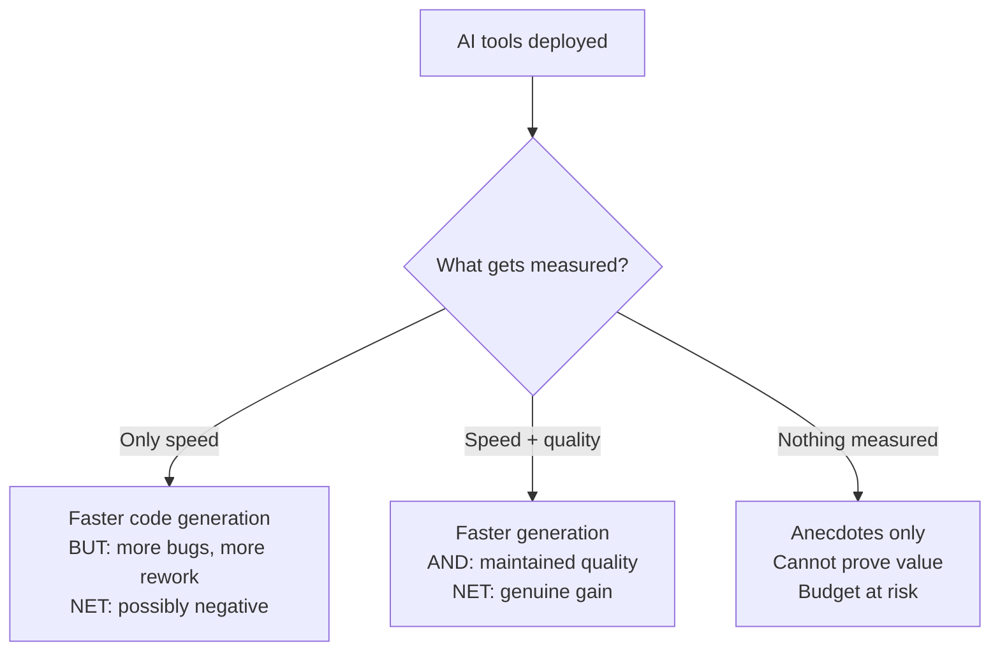

# 06 — Productivity

> Measuring and improving developer productivity with AI tools — beyond anecdotes.

## Why This Section Matters

"Are we actually more productive with AI?" is the question every leader will face. Anecdotes ("it feels faster") won't satisfy executives or justify budget. This section covers how to define, measure, and demonstrate productivity impact rigorously.

## In This Section

| Page | What you'll learn |
|------|-------------------|
| [Defining Productivity](./defining-productivity.md) | What productivity means in the AI era — frameworks and pitfalls |
| [What AI Accelerates](./what-ai-accelerates.md) | Where AI genuinely saves time, and where it doesn't |
| [Measurement Approaches](./measurement-approaches.md) | Methods for proving (or disproving) productivity gains |

## Key Principle

> **Productivity gains from AI compound over time — but only if quality doesn't regress.**
>
> Fast but broken code creates more work downstream. Measure the whole cycle, not just the generation step.

## The Productivity Paradox

## Cost Context

| Measurement approach | Cost | Accuracy |
|---------------------|------|----------|
| Developer surveys | 🆓 No tool cost, just time | Low-Medium (subjective) |
| Git/PR analytics | 🆓 Built into platforms | Medium (proxy metrics) |
| DORA metrics tracking | 💰 Dedicated tools ($5–15/dev/month) | Medium-High |
| Controlled experiment (A/B) | 💰 Lost productivity during control period | High |
| Time tracking studies | 💰 Developer time + analysis | Medium-High |

## Status

🟢 Active — content being written and refined.
