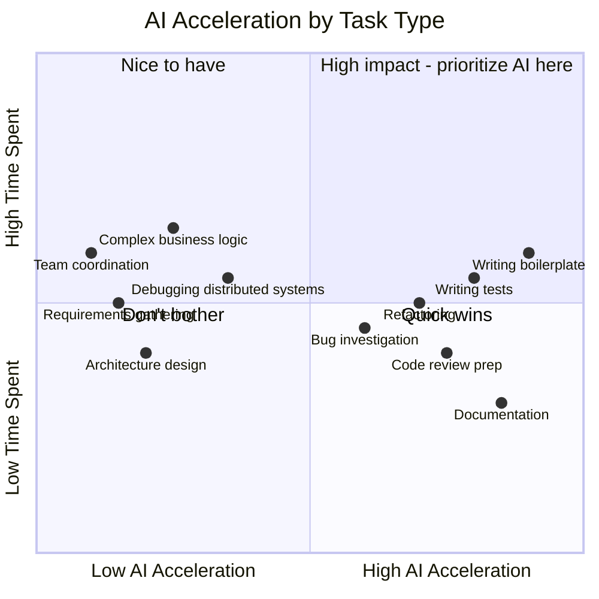

# What AI Actually Accelerates

> Honest assessment of where AI provides real speed-up and where it doesn't — based on practitioner experience.

## The Acceleration Map

Not all tasks benefit equally from AI. This matters for setting expectations and measuring impact.

---

## High Acceleration Tasks

### Boilerplate and Repetitive Code (70–90% faster)

**Examples:** CRUD endpoints, form components, configuration files, similar-structure classes.

**Why AI excels:** Pattern recognition is what AI does best. If a pattern exists in the codebase, AI reproduces it accurately.

**Real-world impact:** A developer who spends 2 hours on boilerplate daily saves 1.5–2 hours. But not every developer spends this much time on boilerplate — measure your baseline.

### Test Generation (50–80% faster)

**Examples:** Unit tests for existing functions, edge case generation, test data creation.

**Why AI excels:** Tests are formulaic — given input X, expect output Y. AI generates volume quickly.

**Caveat:** Speed ≠ quality. AI-generated tests need human review for meaningfulness. See [Testing Workflows](../04-engineering-workflows/testing.md).

### Documentation (60–80% faster for first draft)

**Examples:** API docs from code, README generation, inline comment generation.

**Why AI excels:** Transforming structured code into natural language is straightforward for LLMs.

**Caveat:** First draft only. Human must add "why" context, verify accuracy, and curate.

### Multi-File Refactoring (50–70% faster)

**Examples:** Rename across codebase, pattern migration, interface updates.

**Why AI excels:** Systematic, rule-based changes applied consistently across many files.

**Caveat:** Agent must understand the pattern correctly first. One wrong assumption applied to 30 files is expensive to fix.

---

## Medium Acceleration Tasks

### Bug Investigation (30–50% faster)

**Why medium:** AI can read error messages, trace code paths, and hypothesize. But complex bugs often require system knowledge, runtime context, or understanding of race conditions that AI doesn't have.

**Best approach:** AI investigates first pass, human validates hypothesis and checks system-level interactions.

### Code Review Preparation (30–50% faster)

**Why medium:** AI summarizes PRs well and catches mechanical issues. But the highest-value review (design, intent, correctness) still requires human judgment.

### Learning New Codebases (30–50% faster)

**Why medium:** "Explain this module" is genuinely useful. But deep understanding requires building mental models that come from reading, modifying, and debugging — not just getting explanations.

---

## Low/No Acceleration Tasks

### Architecture Design (<10% acceleration)

**Why AI doesn't help much:** Architecture requires understanding business context, organizational constraints, team capability, operational maturity, and long-term evolution. AI provides generic patterns without this context.

**Where AI does help:** Drafting diagrams, comparing pattern options, generating ADR documents from decisions already made.

### Requirements and Product Decisions (<10%)

**Why AI doesn't help much:** Understanding user needs, prioritizing features, and navigating stakeholder tradeoffs are fundamentally human activities.

### Team Coordination (negligible)

**Why AI doesn't help:** Meetings, alignment, conflict resolution, mentoring, and relationship building are human activities that can't be delegated.

### Debugging Complex Distributed Systems (10–30%)

**Why AI struggles:** Requires understanding runtime behavior, system topology, timing, state machines, and often reading logs that exceed context windows. AI can assist but rarely solves independently.

---

## Time Saved: Realistic Estimates

Based on available research and practitioner reports:

| Developer profile | Realistic daily time saved | Where the time goes |
|------------------|--------------------------|---------------------|
| Heavy boilerplate work (CRUD services) | 45–90 minutes | Code generation, tests |
| Feature development (varied) | 20–45 minutes | Generation, review prep, debugging assist |
| Architecture and design-heavy | 10–20 minutes | Documentation, diagram drafting |
| Operations/SRE focused | 15–30 minutes | Log analysis, runbook drafting |

**Industry average (conservative):** 25–45 minutes per developer per day.

**Important:** These are averages. Some tasks see massive acceleration; some see none. Don't promise "60 minutes saved daily" uniformly — it varies by work type.

---

## What AI Doesn't Speed Up (Yet)

Be honest about current limitations:

| Activity | Why AI doesn't help (yet) | May change when |
|----------|--------------------------|----------------|
| Understanding ambiguous requirements | Requires asking humans the right questions | AI gets better at stakeholder interaction |
| Cross-team coordination | Social/organizational challenge | Maybe never — fundamentally human |
| Production incident response (novel failures) | Requires system context AI doesn't have | Better observability integration |
| Career development and mentoring | Human relationship | Probably never |
| Dealing with legacy systems with no docs | Requires runtime experimentation | Better code understanding + execution |

---

## Implications for Leaders

1. **Set realistic expectations:** 20–45 min/day average, not "10x productivity."
2. **Invest where acceleration is highest:** Boilerplate-heavy teams see most value. Architecture teams see least.
3. **Don't measure uniformly:** Different teams/roles will show different gains.
4. **Quality must be tracked alongside speed:** If bugs go up, net productivity may be negative.
5. **The compounding effect is real:** 30 min/day × 220 days × 50 developers = meaningful value. But only if quality holds.

---

## Next

- How to actually measure these gains → [Measurement Approaches](./measurement-approaches.md)
- Detailed metrics framework → [08 — Metrics](../08-metrics/)
- What's worth it at your scale → [01 — Business Case](../01-foundations/business-case.md)
