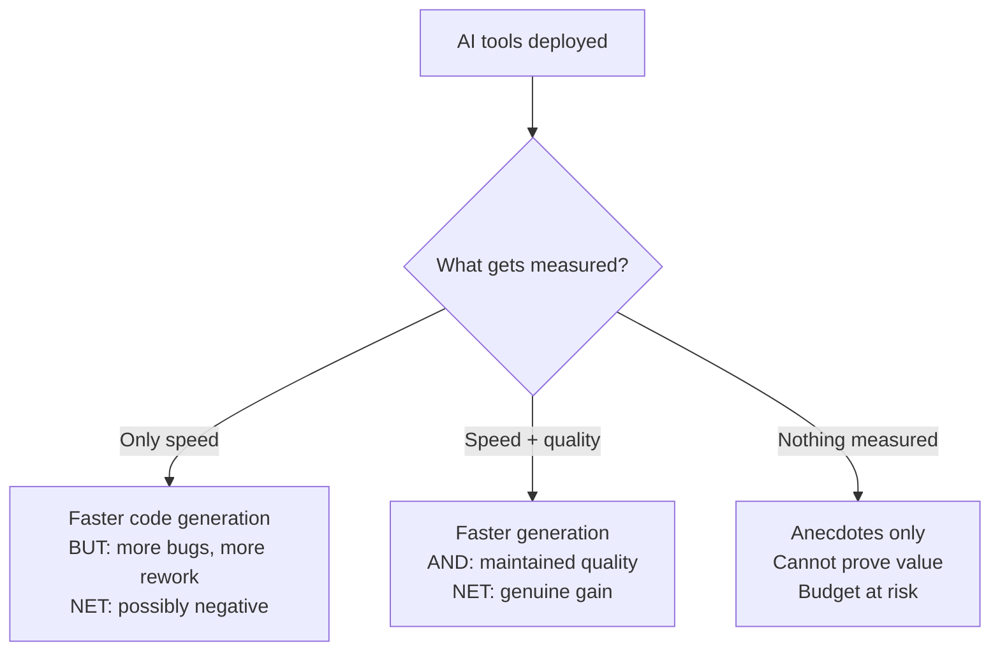

# 06 — Productivity

> Measuring and improving developer productivity with AI tools — beyond anecdotes.

## Why This Section Matters

"Are we actually more productive with AI?" is the question every leader will face. Anecdotes ("it feels faster") won't satisfy executives or justify budget. Without rigorous productivity measurement:

- **You can't tell if AI is helping or hurting quality** — speed increases might be masking a rise in defects and rework
- **You can't identify which teams need support** — some teams thrive, others struggle silently, and you have no signal to differentiate
- **You can't justify expanding what's working** — a genuinely successful pilot stays small because the evidence is "people seem to like it"
- **Budget renewal becomes a fight** — without measurable ROI, AI tools are the first line item cut when budgets tighten

This section covers how to define, measure, and demonstrate productivity impact rigorously — for your teams, your leadership, and your budget conversations.

## In This Section

| Page | What you'll learn |
|------|-------------------|
| [Defining Productivity](./defining-productivity.md) | What productivity means in the AI era — frameworks and pitfalls |
| [What AI Accelerates](./what-ai-accelerates.md) | Where AI genuinely saves time, and where it doesn't |
| [Measurement Approaches](./measurement-approaches.md) | Methods for proving (or disproving) productivity gains |

## Key Principle

> **Productivity gains from AI compound over time — but only if quality doesn't regress.**
>
> Fast but broken code creates more work downstream. Measure the whole cycle, not just the generation step.

## The Productivity Paradox

## Cost Context

| Measurement approach | Cost | Accuracy |
|---------------------|------|----------|
| Developer surveys | 🆓 No tool cost, just time | Low-Medium (subjective) |
| Git/PR analytics | 🆓 Built into platforms | Medium (proxy metrics) |
| DORA metrics tracking | 💰 Dedicated tools ($5–15/dev/month) | Medium-High |
| Controlled experiment (A/B) | 💰 Lost productivity during control period | High |
| Time tracking studies | 💰 Developer time + analysis | Medium-High |

## Status

🟢 Active — content being written and refined.

## AI Engineering Maturity: Productivity Measurement

> **Engineering Manager Note**
>
> Don't measure AI success by lines of code.
>
> Track one thing: how long from "PR opened" to "merged and deployed." If that number drops and bugs don't rise — AI is working.

| Level | What it looks like | What to do |
|:-----:|-------------------|-----------|
| **0** | No measurement at all | Nothing to compare against — start collecting baseline |
| **1** | Anecdotal only ("it feels faster") | Establish baseline metrics (4–6 weeks before pilot) |
| **2** | Pilot metrics tracked (cycle time, velocity, sentiment) | Before/after comparison, developer surveys |
| **3** | Team dashboards, DORA metrics, regular reporting | Cohort studies, ROI calculations for leadership |
| **4** | Automated reporting tied to business outcomes | Continuous measurement, optimization feedback loops |
