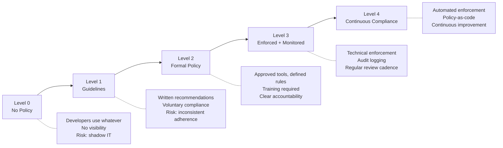
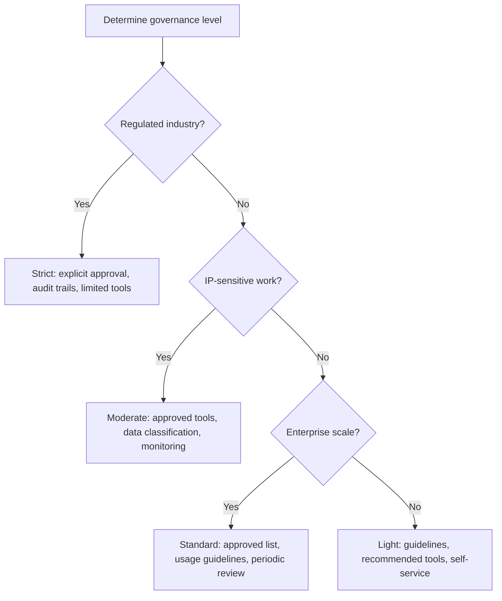

# 07 — Governance

> Policies, compliance, accountability, and responsible AI practices for engineering organizations.

## Why This Section Matters

Governance is what separates ad-hoc experimentation from sustainable, scalable AI adoption. Without it, you get shadow IT, security incidents, and inability to answer "who's responsible when AI-generated code breaks?"

## In This Section

| Page | What you'll learn |
|------|-------------------|
| [AI Usage Policy](./ai-usage-policy.md) | How to write an effective AI acceptable use policy |
| [Responsible AI in Engineering](./responsible-ai.md) | Bias, transparency, accountability for AI-assisted development |
| [Compliance Considerations](./compliance.md) | Regulatory landscape and how to stay ahead |

## Key Principle

> **Good governance is invisible to developers when it's working.**
>
> If your AI policy creates friction in every interaction, it will be routed around. Design policies that integrate into existing workflows.

## Governance Maturity Levels

> **Engineering Manager Note**
>
> Standardize policies. Personalize tools.
>
> Your policy should be the same for every team. Which tool they use within that policy? Let them choose.

**Most organizations should target Level 2 before org-wide rollout, Level 3 for enterprise scale, and Level 4 for regulated industries.**

## Decision Framework: Policy Strictness

## Cost Context

| Governance activity | Cost | Who does it |
|-------------------|------|-------------|
| Writing AI policy | 🆓 Internal team time (1–2 weeks) | Engineering + Legal + Security |
| Tool approval process | 🆓 Internal time per tool evaluated | Security + Engineering leadership |
| Training and communication | 🆓 Internal time | Engineering enablement |
| Audit logging setup | 💰 Part of enterprise tool tier | Platform/Security team |
| Compliance review (external) | 💰 Legal/consulting fees | Legal + External counsel |
| Regular policy review | 🆓 Internal time (quarterly) | Governance committee |

## Status

🟢 Active — content being written and refined.
