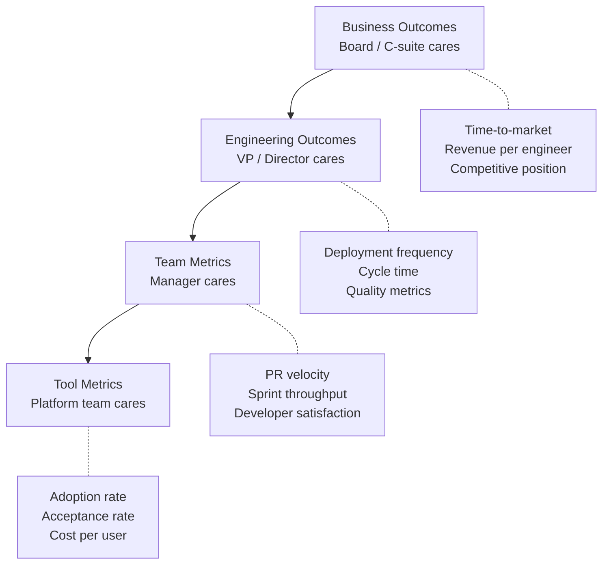

# 08 — Metrics

> Defining success metrics, measuring ROI, and reporting AI adoption impact to leadership.

## Why This Section Matters

"Is AI working for us?" needs a data-driven answer. This section provides the metrics framework, dashboard design, and reporting strategies to answer that question for every audience in your organization.

## In This Section

| Page | What you'll learn |
|------|-------------------|
| [Metrics Framework](./metrics-framework.md) | What to measure, organized by leading/lagging indicators |
| [Dashboard Design](./dashboard-design.md) | Building dashboards for different audiences |
| [Reporting to Leadership](./reporting.md) | Translating metrics into executive language |

## Key Principle

> **Measure outcomes, not activity. Report in the language your audience speaks.**
>
> An executive doesn't care about acceptance rate. They care about time-to-market and cost. Translate accordingly.

## The Metrics Hierarchy

**Key insight:** Each level cares about different things. Never report tool metrics to executives or business outcomes to individual developers.

## Status

🟢 Active — content being written and refined.
