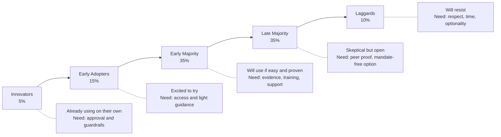

# 09 — Team Adoption

> Change management, upskilling, rollout strategies, and building AI-native engineering culture.

## Why This Section Matters

Tools don't adopt themselves. The best AI tool fails if teams don't trust it, know how to use it, or feel forced into it. This section covers the human side of AI adoption.

## In This Section

| Page | What you'll learn |
|------|-------------------|
| [Adoption Phases](./adoption-phases.md) | The journey from pilot to org-wide — what changes at each stage |
| [Handling Resistance](./handling-resistance.md) | Common objections, honest responses, and engagement strategies |
| [Upskilling](./upskilling.md) | Training developers to be effective with AI tools |
| [Champions Model](./champions-model.md) | Building internal advocacy without top-down mandate |

## Key Principle

> **Adoption is a change management problem, not a technology problem.**
>
> Invest in the human side. Meet people where they are. Make it easy to start and hard to fail.

## The Adoption Curve

**Strategy:** Don't try to convert everyone at once. Enable innovators → amplify early adopters → make it easy for the majority → respect the rest.

## Cost Context

| Adoption activity | Cost | Impact |
|------------------|------|--------|
| Self-serve documentation | 🆓 Internal time | Enables majority without hand-holding |
| Champions program | 🆓 10% of champion time | Peer support, scales sustainably |
| Training sessions | 🆓 Internal time (2–4 hours one-time) | Accelerates early majority |
| External training (if needed) | 💰 $500–2000/person | For deep upskilling or certification |
| Dedicated enablement person | 💰 Portion of FTE | Required at 200+ developers |
| Office hours (weekly) | 🆓 1 hour/week of expert time | Ongoing support channel |

## Status

🟢 Active — content being written and refined.
