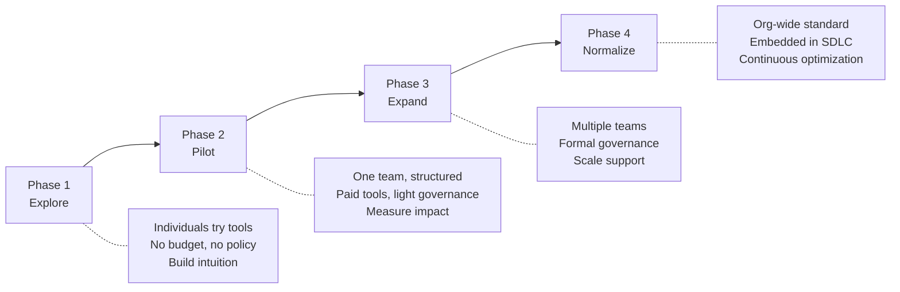

# Adoption Phases

> The journey from first user to org-wide AI tooling — what changes at each stage and common pitfalls.

## The Four Phases

---

## Phase 1: Explore (Individual Learning)

**Duration:** 2–6 weeks
**Who:** 3–10 individuals (self-selected or encouraged)
**Budget:** 🆓 Free tiers only

**Goals:**
- Build hands-on experience among leaders and influencers
- Develop informed opinion on tool quality and fit
- Generate internal interest through word of mouth

**What happens:**
- Developers use free tiers on personal or low-sensitivity work
- Engineering manager or director tries tools themselves
- Informal sharing: "I just used X to do Y in 5 minutes instead of 2 hours"

**Success criteria:**
- At least 3 people have meaningful hands-on experience
- Someone can articulate: "Here's what works, here's what doesn't, here's what I'd recommend"
- Enough evidence to justify a pilot budget

**Common mistakes:**
- Skipping this phase (jumping to pilot without anyone having experience)
- Staying here too long (exploration paralysis)
- Only technical people explore (leadership should too)

---

## Phase 2: Pilot (Team Adoption)

**Duration:** 4–8 weeks
**Who:** One team (5–8 developers)
**Budget:** 💰 Paid tier ($10–40/user/month)

**Goals:**
- Validate productivity gains with measurement
- Test governance and security requirements
- Develop patterns and best practices from real usage
- Build business case for expansion

**What changes from Phase 1:**
- Official tool, official budget, official permission
- Metrics baseline established before pilot starts
- Weekly check-ins to capture learnings
- Written output: "Here's what we found"

**Success criteria:**
- Developers voluntarily continue using after initial novelty (week 4+)
- Measurable improvement in at least one metric (cycle time, velocity, satisfaction)
- No security incidents or quality regressions
- Clear recommendation: expand, adjust, or stop

**Common mistakes:**
- Picking your best team (results won't generalize)
- No baseline metrics (can't prove improvement)
- Too short (2 weeks isn't enough for habit formation)
- No check-ins (issues fester silently)

For detailed pilot execution guidance (team selection criteria, pilot structure week-by-week, metrics to track, anti-patterns): see [03 — Production Rollout: Stage 1](../03-ai-coding-agents/production-rollout.md).

---

## Phase 3: Expand (Multi-Team)

**Duration:** 2–4 months
**Who:** 3–10 teams (20–100 developers)
**Budget:** 💰/🏢 Business tier, centralized budget

**Goals:**
- Scale adoption with sustainable support
- Formalize governance and security controls
- Build internal community and knowledge sharing
- Prove ROI at meaningful scale

**What changes from Phase 2:**
- Can't hand-hold every team — need self-serve materials
- Governance must be written and enforced (not just verbal norms)
- Support infrastructure: channel, docs, champions, office hours
- Cost becomes a real line item requiring budget approval

**Success criteria:**
- Multiple teams showing sustained value (not just pilot team)
- Governance handling edge cases smoothly
- Cost within budget, ROI positive
- Internal community generating peer-to-peer support

**Common mistakes:**
- Expanding before governance is ready (security incident risk)
- No support infrastructure (teams fail silently)
- Comparing teams against each other (different contexts)
- Forcing resistant teams to adopt (poisons the well)

For detailed expansion strategy (wave-based vs. opt-in, community building, standardization decisions, cost projections, enterprise procurement checklist): see [03 — Production Rollout: Stage 2–3](../03-ai-coding-agents/production-rollout.md).

---

## Phase 4: Normalize (Org-Wide)

**Duration:** Ongoing
**Who:** All engineering (100–1000+ developers)
**Budget:** 🏢 Enterprise agreement, dedicated budget line

**Goals:**
- AI tools are standard infrastructure (like IDE, CI/CD)
- Governance embedded in normal processes
- Continuous optimization: tools, practices, prompts
- Talent development includes AI-assisted workflows

**What changes from Phase 3:**
- Enterprise agreements with volume pricing
- Full SSO/SCIM integration
- AI mentioned in job descriptions and onboarding
- Metrics automated and dashboarded
- Regular cadence: tool re-evaluation, policy review, community events

**Success criteria:**
- >70% of developers actively using (not mandated — chosen)
- Quality metrics stable or improved
- New hires onboarded with AI tools from day one
- AI usage is unremarkable — just how work gets done

**Common mistakes:**
- Mandating usage (creates resentment)
- Declaring "done" (adoption is continuous, not a project)
- Ignoring the 20% who don't adopt (they may have valid reasons)
- Not re-evaluating tools periodically (market moves fast)

---

## Phase Transitions: Are You Ready?

| From → To | Key question | If "no," stay in current phase |
|-----------|-------------|-------------------------------|
| Explore → Pilot | Do we have budget and a willing team? | Keep exploring, build the case |
| Pilot → Expand | Did the pilot prove value with data? | Run pilot longer or with different team |
| Expand → Normalize | Is governance solid and support scalable? | Fix gaps before scaling |

---

## Next

- Dealing with resistance → [Handling Resistance](./handling-resistance.md)
- Training developers → [Upskilling](./upskilling.md)
- Building advocacy → [Champions Model](./champions-model.md)
