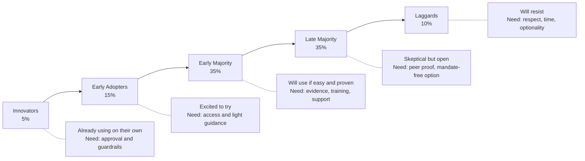

# 09 — Team Adoption

> Change management, upskilling, rollout strategies, and building AI-native engineering culture.

## Why This Section Matters

Tools don't adopt themselves. The best AI tool fails if teams don't trust it, know how to use it, or feel forced into it. Without deliberate adoption strategy:

- **40% of licensed seats go unused** — you're paying for tools nobody opens, and ROI calculations collapse
- **Adoption is uneven and unmeasured** — two enthusiastic teams love it, eight teams ignore it, leadership sees only the average
- **Vocal skeptics poison perception** — one influential senior engineer's bad first experience becomes the team's consensus without structured counter-evidence
- **Forced rollouts create resentment** — mandated usage metrics lead to gaming, not genuine adoption, and the tool becomes associated with management distrust

This section covers the human side of AI adoption — change management, training, resistance handling, and building organic advocacy that scales.

## In This Section

| Page | What you'll learn |
|------|-------------------|
| [Adoption Phases](./adoption-phases.md) | The journey from pilot to org-wide — what changes at each stage |
| [Handling Resistance](./handling-resistance.md) | Common objections, honest responses, and engagement strategies |
| [Upskilling](./upskilling.md) | Training developers to be effective with AI tools |
| [Champions Model](./champions-model.md) | Building internal advocacy without top-down mandate |

## Key Principle

> **Adoption is a change management problem, not a technology problem.**
>
> Invest in the human side. Meet people where they are. Make it easy to start and hard to fail.

## The Adoption Curve

**Strategy:** Don't try to convert everyone at once. Enable innovators → amplify early adopters → make it easy for the majority → respect the rest.

> **Our take: Most organizations move too slowly, not too fast.** The risk of moving fast (with guardrails) is a fixable mistake. The risk of waiting 12 months "to get it right" is that your best developers leave for companies that give them AI tools, your competitors ship faster, and your organization develops institutional resistance to change that's harder to overcome than any technical challenge. If you have the basics (CI, code review, willing team), start your Phase 1 this month, not next quarter.

## Cost Context

| Adoption activity | Cost | Impact |
|------------------|------|--------|
| Self-serve documentation | 🆓 Internal time | Enables majority without hand-holding |
| Champions program | 🆓 10% of champion time | Peer support, scales sustainably |
| Training sessions | 🆓 Internal time (2–4 hours one-time) | Accelerates early majority |
| External training (if needed) | 💰 $500–2000/person | For deep upskilling or certification |
| Dedicated enablement person | 💰 Portion of FTE | Required at 200+ developers |
| Office hours (weekly) | 🆓 1 hour/week of expert time | Ongoing support channel |

## AI Engineering Maturity: Team Adoption

> **Engineering Manager Note**
>
> You can't mandate enthusiasm.
>
> But you can do this: give the team access, run one 30-minute workshop, and then get out of the way. Adoption happens when the tool proves itself — not when you prove it to them.

| Level | What it looks like | What to do |
|:-----:|-------------------|-----------|
| **0** | No AI tools, no awareness | Start at [01 — Foundations](../01-foundations/) |
| **1** | Individuals exploring on their own (shadow IT possible) | Sanction exploration, provide access to free tiers |
| **2** | One team piloting with support, measuring impact | Build champions, define success criteria |
| **3** | Multiple teams, champions network, formal training, community growing | Scale support infrastructure, opt-in expansion |
| **4** | Org-wide standard, embedded in onboarding and culture, continuously improving | Optimize, re-evaluate tools quarterly, celebrate and share |

## Status

🟢 Active — content being written and refined.
