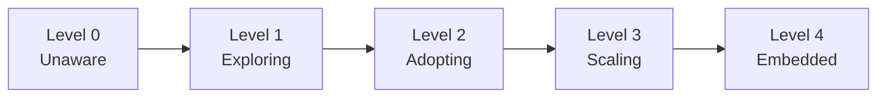

# AI Engineering Playbook

> How should a modern engineering organization adopt AI responsibly, securely, and effectively?

A decision framework and practical handbook for engineering leaders — VPs, Directors, Engineering Managers, and Principal Engineers — navigating the adoption of AI across their organizations.

## Why This Exists

AI tooling is evolving faster than most organizations can evaluate it. Leaders face pressure to adopt quickly while managing real risks: security, quality, developer experience, and organizational change. This playbook provides structured thinking for those decisions — opinionated where the answer is clear, and framework-driven where tradeoffs depend on context.

## Who This Is For

- **Engineering Managers** making tool and process decisions for their teams
- **Directors & VPs** setting AI strategy across multiple teams
- **CTOs & Heads of Engineering** defining organizational policy
- **Principal / Staff Engineers** influencing technical direction and standards

## How to Use This Playbook

Each section is self-contained. Start with what's most relevant to your current challenge:

| If you need to... | Start here |
|---|---|
| Understand the AI landscape and build mental models | [01 — Foundations](./01-foundations/) |
| Evaluate and choose AI developer tools | [02 — AI Tools](./02-ai-tools/) |
| Understand AI coding agents and when to use them | [03 — AI Coding Agents](./03-ai-coding-agents/) |
| Make AI consistently useful across your org | [04 — Context Engineering](./04-context-engineering/) |
| Integrate AI into your engineering workflows | [05 — Engineering Workflows](./05-engineering-workflows/) |
| Secure AI usage across your org | [06 — Security](./06-security/) |
| Measure and improve developer productivity with AI | [07 — Productivity](./07-productivity/) |
| Build governance policies and responsible AI practices | [08 — Governance](./08-governance/) |
| Define metrics and report ROI to leadership | [09 — Metrics](./09-metrics/) |
| Roll out AI adoption across teams | [10 — Team Adoption](./10-team-adoption/) |
| Learn from real-world implementations | [11 — Case Studies](./11-case-studies/) |

## Repository Structure

```
ai-engineering-playbook/
├── README.md
├── 01-foundations/           # Mental models, landscape, org readiness
├── 02-ai-tools/             # Tool landscape, comparison frameworks
├── 03-ai-coding-agents/     # Agents deep-dive (Copilot, Q, Claude Code, etc.)
├── 04-context-engineering/   # Making AI consistently useful — steering, skills, MCP, knowledge
├── 05-engineering-workflows/ # AI in SDLC, CI/CD, code review
├── 06-security/             # Threat models, data privacy, supply chain
├── 07-productivity/         # Developer productivity with AI
├── 08-governance/           # Policies, compliance, accountability
├── 09-metrics/              # Measuring success, reporting upward
├── 10-team-adoption/        # Change management, upskilling, rollout
├── 11-case-studies/         # Real-world examples
├── prompts/                 # Reusable prompt library
├── templates/               # Decision docs, RFCs, eval templates
├── diagrams/                # Visual assets (Mermaid source files)
├── examples/                # Code and config examples
└── references/              # Links, papers, further reading
```

## Principles

1. **Decision-framework first** — Where tradeoffs exist, we present options with context. Where the answer is clear, we say so directly.
2. **Practitioner-tested** — Advice grounded in real adoption experience, not theory.
3. **Tool-aware, not tool-locked** — The landscape moves fast. We compare options fairly and update regularly.
4. **Security is non-negotiable** — Every recommendation considers the security posture.
5. **Cost-aware from day one** — We clearly distinguish what's free to explore from what requires budget. See [Cost Context](#cost-context) below.
6. **Iterative by design** — This playbook evolves. Contributions welcome.

## AI Engineering Maturity Model

Where is your organization on the AI adoption journey? Use this model to self-assess and identify your next step.



| Level | Name | What it looks like |
|:-----:|------|-------------------|
| **0** | **Unaware** | No AI tools in use. No policy. No organizational awareness of opportunity or risk. |
| **1** | **Exploring** | Individuals experimenting on free tiers. No budget. Learning what's possible. Shadow IT may exist. |
| **2** | **Adopting** | One team piloting with paid tools. Light governance in place. Measuring impact. Budget approved for pilot. |
| **3** | **Scaling** | Multiple teams using AI tools. Formal governance, security controls, and context engineering. Reporting ROI. |
| **4** | **Embedded** | AI is standard engineering infrastructure. Org-wide deployment, continuous optimization, competitive advantage. |

### How Each Section Maps to Maturity

| Section | Level 1 | Level 2 | Level 3 | Level 4 |
|---------|---------|---------|---------|---------|
| **02 Tools** | Free tiers explored | Paid tool for pilot team | Approved shortlist, enterprise eval | Enterprise agreement, regular re-evaluation |
| **03 Agents** | Chat/autocomplete only | Agents on one team (supervised) | Agents across teams (governed) | Agents embedded in SDLC workflows |
| **04 Context** | — | Project instructions written | Team steering + hooks + skills | Org-wide context strategy + MCP servers |
| **05 Workflows** | AI in IDE only (autocomplete) | AI in review + testing | AI in CI/CD + documentation | AI across full SDLC, continuously optimized |
| **06 Security** | No policy (shadow IT) | Data classified, DPA signed | Enterprise controls, audit logging | DLP, proxy/gateway, anomaly detection |
| **07 Productivity** | Anecdotal ("feels faster") | Baseline + pilot metrics | Team dashboards, DORA metrics | Automated ROI reporting, cohort analysis |
| **08 Governance** | No policy | Written guidelines | Formal policy, enforced | Continuous compliance, automated enforcement |
| **09 Metrics** | None | 3 core metrics tracked manually | Dashboards per audience | Automated, tied to business outcomes |
| **10 Adoption** | Individuals exploring | One team pilot | Multi-team expansion with champions | Org-wide, embedded in culture and hiring |

> **How to use this:** Find your current level across most sections. Your weakest dimension is your bottleneck. Don't try to advance all dimensions simultaneously — focus on the bottleneck first. Most organizations in 2025 are at Level 1–2.

## Cost Context

Throughout this playbook, we use the following labels to help you understand the investment required:

| Label | Meaning |
|-------|---------|
| 🆓 **Free / Explore** | No cost. Available on free tiers or open-source. Good for individual experimentation and learning. |
| 💰 **Paid / Team** | Requires a paid license or subscription. Necessary for team-wide or production usage. |
| 🏢 **Enterprise** | Requires enterprise agreements, custom pricing, or significant infrastructure investment. |

We also distinguish between:

| Context | What it means |
|---------|---------------|
| **POC / Exploration** | Getting your hands dirty. Learning, evaluating, building intuition. Should cost little to nothing. |
| **Production / At Scale** | Running in anger across teams. Requires budget, governance, and support. |

> **Why this matters:** It's easy to conflate "I tried it and it's great" with "we should roll this out to 200 developers." The cost, security posture, and operational overhead are radically different between a personal POC and a production deployment. This playbook will always make that distinction explicit.

## Contributing

See [CONTRIBUTING.md](./CONTRIBUTING.md) for guidelines on how to contribute.

## License

This work is licensed under [Creative Commons Attribution 4.0 International (CC BY 4.0)](./LICENSE).
