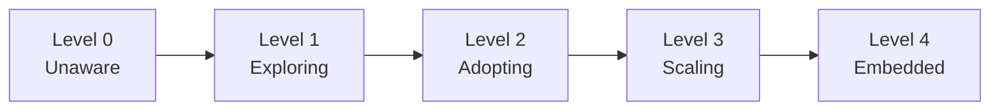

# AI Engineering Playbook

> How should a modern engineering organization adopt AI responsibly, securely, and effectively?

The AI Engineering Playbook is a practical operating manual for engineering leaders introducing AI into software organizations. Rather than focusing on individual tools, it provides decision frameworks, governance models, implementation guidance, and measurement strategies for scaling AI across teams.

## Why This Exists

AI tooling is evolving faster than most organizations can evaluate it. Leaders face pressure to adopt quickly while managing real risks: security, quality, developer experience, and organizational change. This playbook provides structured thinking for those decisions — opinionated where the answer is clear, and framework-driven where tradeoffs depend on context.

## Who This Is For

- **Engineering Managers** making tool and process decisions for their teams
- **Directors & VPs** setting AI strategy across multiple teams
- **CTOs & Heads of Engineering** defining organizational policy
- **Principal / Staff Engineers** influencing technical direction and standards

## How to Use This Playbook

The playbook is organized into three tracks. Start with the one that matches your current need:

### 🧭 Decide — Strategy and Direction

> For Directors, VPs, and CTOs setting AI strategy.

| Section | What you'll learn |
|---------|-------------------|
| [Foundations](./foundations/) | Mental models, landscape overview, organizational readiness |
| [AI Strategy](./ai-strategy/) | Investment, org models, vendor strategy, executive alignment, [operating model](./ai-strategy/operating-model.md) |

### 🔧 Implement — Tools and Integration

> For EMs, Principal Engineers, and Staff+ building AI into engineering.

| Section | What you'll learn |
|---------|-------------------|
| [AI Tools](./ai-tools/) | Tool landscape, evaluation framework, build vs. buy |
| [AI Coding Agents](./ai-coding-agents/) | Agent comparison, when to use, governance, getting started free |
| [Context Engineering](./context-engineering/) | Project instructions, steering, skills, hooks, MCP, knowledge architecture |
| [Engineering Workflows](./engineering-workflows/) | AI across the SDLC — review, testing, CI/CD, documentation |

### 🔁 Sustain — Governance, Measurement, and Scale

> For EMs, Directors, and Platform Teams keeping AI adoption healthy.

| Section | What you'll learn |
|---------|-------------------|
| [Security](./security/) | Threat models, data classification, enterprise controls |
| [Productivity](./productivity/) | Defining and measuring developer productivity with AI |
| [Governance](./governance/) | Policies, compliance, accountability, responsible AI |
| [Metrics](./metrics/) | What to measure, dashboards, reporting to leadership |
| [Team Adoption](./team-adoption/) | Change management, resistance, upskilling, champions |
| [Case Studies](./case-studies/) | Real-world patterns — startup, mid-size, enterprise |

### ⚠️ Avoid — Common Mistakes

> For anyone starting or scaling AI adoption — read this first.

| Section | What you'll learn |
|---------|-------------------|
| [AI Anti-Patterns](./ai-anti-patterns/) | The 18 mistakes orgs keep making — and how to avoid each one |
## Repository Structure

```
ai-engineering-playbook/
├── README.md
│
│   🧭 DECIDE
├── foundations/            # Mental models, landscape, org readiness
├── ai-strategy/           # Investment, org models, vendor strategy, exec alignment
│
│   🔧 IMPLEMENT
├── ai-tools/              # Tool landscape, comparison frameworks
├── ai-coding-agents/      # Agents deep-dive (Copilot, Q, Claude Code, etc.)
├── context-engineering/   # Steering, skills, hooks, MCP, knowledge architecture
├── engineering-workflows/ # AI in SDLC, CI/CD, code review, testing, docs
│
│   🔁 SUSTAIN
├── security/              # Threat models, data privacy, supply chain
├── productivity/          # Developer productivity with AI
├── governance/            # Policies, compliance, accountability
├── metrics/               # Measuring success, reporting upward
├── team-adoption/         # Change management, upskilling, rollout
├── case-studies/          # Real-world examples
│
│   ⚠️ AVOID
├── ai-anti-patterns/      # The 18 mistakes orgs keep making
│
│   RESOURCES
├── prompts/               # Reusable prompt library
├── templates/             # Decision docs, RFCs, eval templates
├── diagrams/              # Visual assets (Mermaid source files)
├── examples/              # Code and config examples
└── references/            # Links, papers, further reading
```

## Principles

1. **Decision-framework first** — Where tradeoffs exist, we present options with context. Where the answer is clear, we say so directly.
2. **Practitioner-tested** — Advice grounded in real adoption experience, not theory.
3. **Tool-aware, not tool-locked** — The landscape moves fast. We compare options fairly and update regularly.
4. **Security is non-negotiable** — Every recommendation considers the security posture.
5. **Cost-aware from day one** — We clearly distinguish what's free to explore from what requires budget. See [Cost Context](#cost-context) below.
6. **Iterative by design** — This playbook evolves. Contributions welcome.

## AI Engineering Maturity Model

Where is your organization on the AI adoption journey? Use this model to self-assess and identify your next step.



| Level | Name | What it looks like |
|:-----:|------|-------------------|
| **0** | **Unaware** | No AI tools in use. No policy. No organizational awareness of opportunity or risk. |
| **1** | **Exploring** | Individuals experimenting on free tiers. No budget. Learning what's possible. Shadow IT may exist. |
| **2** | **Adopting** | One team piloting with paid tools. Light governance in place. Measuring impact. Budget approved for pilot. |
| **3** | **Scaling** | Multiple teams using AI tools. Formal governance, security controls, and context engineering. Reporting ROI. |
| **4** | **Embedded** | AI is standard engineering infrastructure. Org-wide deployment, continuous optimization, competitive advantage. |

### How Each Section Maps to Maturity

| Section | Level 1 | Level 2 | Level 3 | Level 4 |
|---------|---------|---------|---------|---------|
| **Strategy** | Awareness, no coordinated approach | Strategy documented, budget allocated, owner assigned | Multi-team with governance, vendor agreements | AI embedded in engineering strategy, reviewed quarterly |
| **Tools** | Free tiers explored | Paid tool for pilot team | Approved shortlist, enterprise eval | Enterprise agreement, regular re-evaluation |
| **Agents** | Chat/autocomplete only | Agents on one team (supervised) | Agents across teams (governed) | Agents embedded in SDLC workflows |
| **Context** | — | Project instructions written | Team steering + hooks + skills | Org-wide context strategy + MCP servers |
| **Workflows** | AI in IDE only (autocomplete) | AI in review + testing | AI in CI/CD + documentation | AI across full SDLC, continuously optimized |
| **Security** | No policy (shadow IT) | Data classified, DPA signed | Enterprise controls, audit logging | DLP, proxy/gateway, anomaly detection |
| **Productivity** | Anecdotal ("feels faster") | Baseline + pilot metrics | Team dashboards, DORA metrics | Automated ROI reporting, cohort analysis |
| **Governance** | No policy | Written guidelines | Formal policy, enforced | Continuous compliance, automated enforcement |
| **Metrics** | None | 3 core metrics tracked manually | Dashboards per audience | Automated, tied to business outcomes |
| **Adoption** | Individuals exploring | One team pilot | Multi-team expansion with champions | Org-wide, embedded in culture and hiring |

> **How to use this:** Find your current level across most sections. Your weakest dimension is your bottleneck. Don't try to advance all dimensions simultaneously — focus on the bottleneck first. Most organizations in 2025 are at Level 1–2.

> **Engineering Manager Note**
>
> You don't need to solve all of this at once.
>
> Pick the section that matches your most urgent problem. Ship one improvement. Then come back for the next one.
>
> The playbook is a buffet, not a curriculum.

## Cost Context

Throughout this playbook, we use the following labels to help you understand the investment required:

| Label | Meaning |
|-------|---------|
| 🆓 **Free / Explore** | No cost. Available on free tiers or open-source. Good for individual experimentation and learning. |
| 💰 **Paid / Team** | Requires a paid license or subscription. Necessary for team-wide or production usage. |
| 🏢 **Enterprise** | Requires enterprise agreements, custom pricing, or significant infrastructure investment. |

We also distinguish between:

| Context | What it means |
|---------|---------------|
| **POC / Exploration** | Getting your hands dirty. Learning, evaluating, building intuition. Should cost little to nothing. |
| **Production / At Scale** | Running in anger across teams. Requires budget, governance, and support. |

> **Why this matters:** It's easy to conflate "I tried it and it's great" with "we should roll this out to 200 developers." The cost, security posture, and operational overhead are radically different between a personal POC and a production deployment. This playbook will always make that distinction explicit.

## Contributing

See [CONTRIBUTING.md](./CONTRIBUTING.md) for guidelines on how to contribute.

For a full list of terms and acronyms used throughout this playbook, see the [Glossary](./references/glossary.md).

## License

This work is licensed under [Creative Commons Attribution 4.0 International (CC BY 4.0)](./LICENSE).
