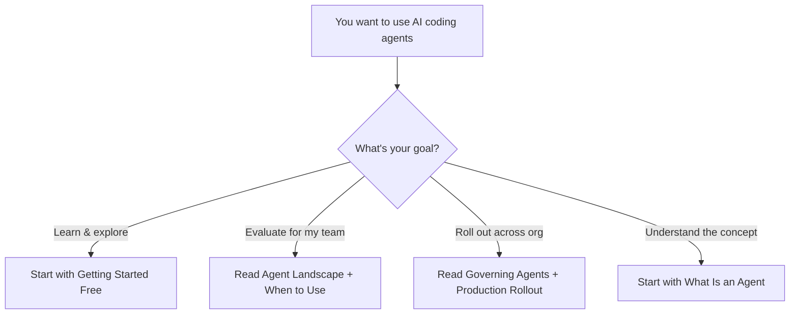

# 03 — AI Coding Agents

> Understanding, evaluating, and deploying AI agents that write and modify code autonomously.

## Why This Section Matters

AI coding agents represent the biggest shift in developer tooling since the IDE. Unlike autocomplete or chat assistants, agents can plan multi-step tasks, execute commands, modify multiple files, and iterate on their own output.

**What goes wrong without guidance:**
- Teams use agents without guardrails — a 30-file PR generated in 5 minutes that nobody fully reviews
- Cost surprises — one developer burns $200 in a day on a complex task, no one sees it coming
- Security exposure — an agent with command execution access running unchecked in a sensitive codebase
- Hype-driven adoption — agents deployed for tasks they're terrible at (architecture, novel design), creating skepticism when they fail
- Quality regression — volume of code increases but defect rate climbs because review discipline drops

The question for leaders isn't "if" your teams will use agents — it's how to deploy them safely, effectively, and economically.

## In This Section

| Page | What you'll learn |
|------|-------------------|
| [What Is an Agent?](./what-is-an-agent.md) | The progression from autocomplete → chat → agents, and why it matters |
| [Agent Landscape](./agent-landscape.md) | Detailed comparison of current tools with cost labels |
| [When to Use Agents](./when-to-use-agents.md) | Use cases, anti-patterns, and decision frameworks |
| [Governing Agent Usage](./governing-agents.md) | Audit, permissions, cost controls, human-in-the-loop |
| [Getting Started Free](./getting-started-free.md) | Zero-cost exploration guide for hands-on learning |
| [Production Rollout](./production-rollout.md) | Scaling agents across teams with enterprise considerations |

## Quick Decision Framework

## 💡 Key Insights for This Section

1. **Agents are tools, not replacements** — They amplify skilled developers; they don't eliminate the need for engineering judgment.
2. **Autonomy is a spectrum** — From "suggest and wait" to "plan and execute." Match the autonomy level to the risk level.
3. **Cost scales with usage** — A single developer's API bill looks nothing like 50 developers using agents daily. Plan for this.
4. **Governance before scale** — Get your guardrails right with a small group before rolling out broadly.

## AI Engineering Maturity: Coding Agents

> **Engineering Manager Note**
>
> Agents amplify your team's strengths *and* weaknesses.
>
> A team with good review culture + agents = shipping machine.
>
> A team with no review culture + agents = shipping bugs faster.

| Level | What it looks like | What to do |
|:-----:|-------------------|-----------|
| **0** | No AI tools at all | Start with autocomplete, not agents — see [Foundations](../foundations/) |
| **1** | Autocomplete + chat only, no agent usage | Explore agents on free tiers — see [Getting Started Free](./getting-started-free.md) |
| **2** | One team using agents (supervised, governed) | Pilot with measurement — see [Production Rollout](./production-rollout.md) |
| **3** | Multiple teams, formal governance, cost controls, task suitability defined | Scale with enterprise controls — see [Governing Agents](./governing-agents.md) |
| **4** | Agents embedded in team workflows, self-correcting via CI, continuously optimized | Optimize: context engineering, skills, advanced decomposition patterns |

## Status

🟢 Active — content being written and refined.
