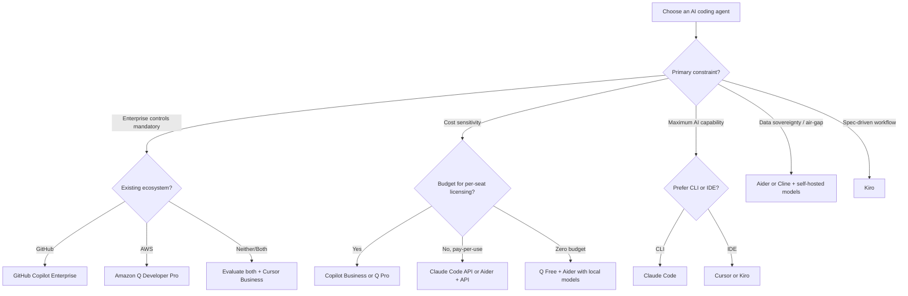

# AI Coding Agent Landscape (2025)

> A detailed comparison of current AI coding agents — capabilities, cost, enterprise readiness, and where each shines.

## How to Read This Page

This page compares agents across dimensions that matter for organizational decisions — not just "which one writes better code." We evaluate:

- **Capability** — What can it actually do?
- **Integration** — Where does it live in your workflow?
- **Enterprise readiness** — SSO, audit, data controls, admin features
- **Cost** — What does it really cost at scale?
- **Best for** — Where each tool has a genuine advantage

> ⚠️ **This landscape moves fast.** Tools release features weekly. Prices change. This page reflects the state as of mid-2025. If something looks outdated, it probably is — check the vendor's current docs and consider contributing an update.

---

## The Agents

### Claude Code (Anthropic)

**What it is:** A CLI and IDE-integrated agent built on Claude. Deep reasoning, multi-file awareness, and the ability to execute terminal commands.

| Dimension | Details |
|-----------|---------|
| **Mode** | CLI (primary), IDE (via Kiro, VS Code extensions) |
| **Autonomy levels** | Suggest → Auto-edit → Full autonomous (configurable) |
| **Multi-file** | Yes — reads, creates, edits across codebase |
| **Command execution** | Yes — runs tests, builds, linters, git |
| **Context window** | 200K tokens |
| **Customization** | CLAUDE.md project instructions, memory files |
| **Enterprise controls** | API-level controls, usage dashboards |
| **Data handling** | Does not train on inputs (API). Check specific plan terms. |

**Cost:**
| Tier | Price | What you get |
|------|-------|-------------|
| 🆓 Free | Limited via free API credits | Enough for exploration |
| 💰 Pro | $20/month (Max plan via Claude Pro) | High usage limits |
| 💰 API | Pay-per-token ($3/$15 per 1M input/output for Sonnet) | Full control, scales with usage |
| 🏢 Enterprise | Custom via Anthropic sales | SSO, enhanced privacy, SLA |

**Best for:**
- Complex multi-step tasks requiring deep reasoning
- Large-scale refactoring
- Developers comfortable with CLI workflows
- Teams that want model-agnostic flexibility (via API)

**Watch out for:**
- Token costs compound quickly on large tasks (a complex refactor can be $5–20)
- CLI-first experience has a learning curve for IDE-native developers
- Context management on very large codebases requires thoughtful setup

---

### GitHub Copilot (Agent Mode)

**What it is:** GitHub's AI coding assistant, evolved from autocomplete into a full agent mode integrated deeply with VS Code and the GitHub ecosystem.

| Dimension | Details |
|-----------|---------|
| **Mode** | IDE (VS Code, JetBrains), GitHub.com (Copilot Workspace) |
| **Autonomy levels** | Autocomplete → Chat → Edit → Agent (progressive) |
| **Multi-file** | Yes (in agent mode) |
| **Command execution** | Yes (terminal commands in agent mode) |
| **Context window** | Varies by model selected (supports multiple models) |
| **Customization** | .github/copilot-instructions.md, custom instructions |
| **Enterprise controls** | Org-level policies, content exclusion, audit logs, SSO |
| **Data handling** | Enterprise: no code retention, no training. Individual: check terms. |

**Cost:**
| Tier | Price | What you get |
|------|-------|-------------|
| 🆓 Free | $0 (limited) | 2000 completions + 50 chat messages/month |
| 💰 Pro | $10/month | Unlimited completions, agent mode |
| 💰 Business | $19/user/month | Org management, policy controls, IP indemnity |
| 🏢 Enterprise | $39/user/month | SSO/SAML, audit logs, content exclusion, fine-tuning |

**Best for:**
- Teams already in the GitHub ecosystem (repos, Actions, PRs)
- Organizations wanting a single vendor for code hosting + AI tooling
- Gradual adoption — progression from autocomplete to agent is smooth
- Enterprises requiring IP indemnification

**Watch out for:**
- Agent mode quality varies by model selection
- Tightly coupled to VS Code for full experience (JetBrains support is thinner)
- Free tier is quite limited for meaningful agent exploration

---

### Amazon Q Developer

**What it is:** AWS's AI coding assistant with deep integration into AWS services, IDE support, and agent capabilities for code transformation and generation.

| Dimension | Details |
|-----------|---------|
| **Mode** | IDE (VS Code, JetBrains), CLI, AWS Console |
| **Autonomy levels** | Autocomplete → Chat → Agent (code transformation) |
| **Multi-file** | Yes (especially for migrations/upgrades) |
| **Command execution** | Yes (in agent mode) |
| **Context window** | Varies by task type |
| **Customization** | Context from workspace, AWS resource awareness |
| **Enterprise controls** | IAM integration, organizational policies, SSO, audit via CloudTrail |
| **Data handling** | Enterprise: no code stored or used for training. AWS data handling standards. |

**Cost:**
| Tier | Price | What you get |
|------|-------|-------------|
| 🆓 Free | $0 | Generous — code suggestions, chat, basic agent, security scans |
| 💰 Pro | $19/user/month | Higher limits, organizational features, admin controls |
| 🏢 Enterprise | Custom | Full governance, customization, dedicated support |

**Best for:**
- AWS-heavy shops (Lambda, CDK, CloudFormation expertise baked in)
- Java modernization (language upgrades, framework migrations)
- Teams wanting the most generous free tier for exploration
- Organizations already managing identity through AWS IAM

**Watch out for:**
- AWS-centric context means less depth for non-AWS infrastructure
- Agent capabilities more focused on specific transformation tasks than general-purpose coding
- Smaller community/ecosystem compared to Copilot or Claude

---

### Cursor

**What it is:** A fork of VS Code rebuilt around AI. The entire IDE is designed for AI-assisted coding, with agent mode, multi-file editing, and deep codebase indexing.

| Dimension | Details |
|-----------|---------|
| **Mode** | IDE (Cursor editor — VS Code fork) |
| **Autonomy levels** | Autocomplete → Chat → Composer → Agent |
| **Multi-file** | Yes — Composer and Agent mode work across files |
| **Command execution** | Yes (in agent mode) |
| **Context window** | Large (codebase indexing + model context) |
| **Customization** | .cursorrules, project-level instructions, @-mentions for context |
| **Enterprise controls** | Privacy mode, team settings, usage analytics |
| **Data handling** | Privacy mode available (no code stored). Check terms for non-privacy mode. |

**Cost:**
| Tier | Price | What you get |
|------|-------|-------------|
| 🆓 Free | $0 (limited) | 2 weeks Pro trial, then limited completions |
| 💰 Pro | $20/month | 500 "fast" requests/month, unlimited slow |
| 💰 Business | $40/user/month | Team management, enforced privacy mode, admin controls |
| 🏢 Enterprise | Custom | SSO, audit logs, deployment options |

**Best for:**
- Developers who want AI integrated at every level of the IDE experience
- Fast iteration cycles — the feedback loop is tight
- Teams willing to adopt a new IDE (the switching cost is real but low since it's VS Code-based)
- Individual productivity (the "feel" of coding with Cursor is distinctly different)

**Watch out for:**
- Requires switching IDE (even though it's VS Code-based, extensions/settings need migration)
- Business tier is pricier than alternatives
- Data handling policies require careful review for enterprise (enable privacy mode)
- Less established enterprise track record compared to GitHub or AWS

---

### Kiro (AWS / Amazon)

**What it is:** An AI-powered IDE built on VS Code with a focus on spec-driven development. Agents work from structured requirements through design to implementation via a spec workflow.

| Dimension | Details |
|-----------|---------|
| **Mode** | IDE (VS Code-based) |
| **Autonomy levels** | Supervised (approve each change) → Autopilot (autonomous execution) |
| **Multi-file** | Yes |
| **Command execution** | Yes |
| **Context window** | Dynamic model selection |
| **Customization** | Steering files (.kiro/steering/), hooks, skills, CLAUDE.md-equivalent |
| **Enterprise controls** | Hooks for access control, MCP integration, structured workflows |
| **Data handling** | AWS-backed infrastructure |

**Cost:**
| Tier | Price | What you get |
|------|-------|-------------|
| 🆓 Free (Preview) | $0 | Full access during preview period |

**Best for:**
- Teams wanting structured, spec-driven development (requirements → design → tasks)
- Organizations that value repeatability and auditability in AI-assisted work
- Those who want agent hooks and event-driven automation
- Early adopters comfortable with newer tooling

**Watch out for:**
- Still in preview — pricing and enterprise features will evolve
- Newer entrant — community and ecosystem still building
- Spec workflow has a learning curve (but enforces good practices)

---

### Windsurf (Codeium)

**What it is:** An AI IDE (VS Code fork) from Codeium, focused on "flows" — multi-step agent interactions with strong codebase awareness.

| Dimension | Details |
|-----------|---------|
| **Mode** | IDE (Windsurf editor — VS Code fork) |
| **Autonomy levels** | Autocomplete → Chat → Cascade (agent mode) |
| **Multi-file** | Yes |
| **Command execution** | Yes (in Cascade mode) |
| **Context window** | Large (proprietary indexing) |
| **Customization** | Project rules, context pinning |
| **Enterprise controls** | Team plans, admin controls |
| **Data handling** | No code stored for training (enterprise). Check specific tier. |

**Cost:**
| Tier | Price | What you get |
|------|-------|-------------|
| 🆓 Free | $0 (limited) | Limited flow actions and completions |
| 💰 Pro | $15/month | Unlimited flows, priority models |
| 💰 Teams | $30/user/month | Admin controls, team features |
| 🏢 Enterprise | Custom | SSO, audit, deployment options |

**Best for:**
- Developers who like Cursor's approach but want an alternative
- Cost-sensitive teams (Pro tier is cheaper than Cursor)
- Those who want strong codebase indexing without extensive setup

**Watch out for:**
- Relatively newer — enterprise track record still building
- Smaller community than Copilot or Cursor
- Feature parity with competitors is still catching up in some areas

---

### Aider

**What it is:** An open-source CLI tool for AI pair programming. Model-agnostic — works with OpenAI, Anthropic, local models, and others.

| Dimension | Details |
|-----------|---------|
| **Mode** | CLI |
| **Autonomy levels** | Chat with auto-commit → architect mode → full edit |
| **Multi-file** | Yes |
| **Command execution** | Limited (primarily code editing, can run linters/tests via config) |
| **Context window** | Depends on model chosen |
| **Customization** | .aider.conf.yml, conventions file, model selection |
| **Enterprise controls** | None built-in (it's a CLI tool — you control the infrastructure) |
| **Data handling** | You choose the model and endpoint. Self-hosted = full control. |

**Cost:**
| Tier | Price | What you get |
|------|-------|-------------|
| 🆓 Tool | $0 | Open source, fully functional |
| 💰 API costs | Variable | You pay model provider directly (OpenAI, Anthropic, etc.) |
| 🆓 Fully free | $0 | Pair with local models (Ollama, etc.) for zero-cost usage |

**Best for:**
- Developers who want full control over model choice and data flow
- Cost-conscious teams (no per-seat fee, just API costs)
- Self-hosted/air-gapped environments
- Open-source enthusiasts and tinkerers

**Watch out for:**
- No enterprise controls — you build your own governance layer
- CLI-only — not for developers who prefer IDE-integrated experiences
- Quality depends entirely on model choice
- No vendor support — community-driven

---

### Cline

**What it is:** An open-source VS Code extension that turns any LLM into a coding agent. Highly configurable, supports multiple providers.

| Dimension | Details |
|-----------|---------|
| **Mode** | IDE (VS Code extension) |
| **Autonomy levels** | Ask permission → Auto-approve reads → Auto-approve all |
| **Multi-file** | Yes |
| **Command execution** | Yes (terminal commands with approval flow) |
| **Context window** | Depends on model chosen |
| **Customization** | Custom instructions, MCP server integration, model selection |
| **Enterprise controls** | None built-in (open-source tool) |
| **Data handling** | You choose the provider. API key stays local. |

**Cost:**
| Tier | Price | What you get |
|------|-------|-------------|
| 🆓 Tool | $0 | Open source, VS Code extension |
| 💰 API costs | Variable | You pay model provider directly |
| 🆓 Fully free | $0 | Pair with local models for zero-cost |

**Best for:**
- Teams wanting an IDE agent without switching to a new editor
- Maximum flexibility in model choice
- Developers who want fine-grained control over what the agent can do
- Experimenting with different models for different tasks

**Watch out for:**
- No enterprise layer — governance is your responsibility
- Configuration complexity (many options = many decisions)
- Extension quality varies with updates — track releases carefully

---

## Comparison Matrix

### Capability Comparison

| Feature | Claude Code | Copilot | Q Developer | Cursor | Kiro | Windsurf | Aider | Cline |
|---------|:-----------:|:-------:|:-----------:|:------:|:----:|:--------:|:-----:|:-----:|
| Multi-file editing | ✅ | ✅ | ✅ | ✅ | ✅ | ✅ | ✅ | ✅ |
| Command execution | ✅ | ✅ | ✅ | ✅ | ✅ | ✅ | Limited | ✅ |
| Codebase indexing | Via context | ✅ | ✅ | ✅ | ✅ | ✅ | Manual | Via context |
| Self-correction loop | ✅ | ✅ | ✅ | ✅ | ✅ | ✅ | ✅ | ✅ |
| Custom instructions | ✅ | ✅ | Limited | ✅ | ✅ | ✅ | ✅ | ✅ |
| Model choice | Anthropic | Multiple | AWS models | Multiple | Dynamic | Codeium | Any | Any |
| Open source | ❌ | ❌ | ❌ | ❌ | ❌ | ❌ | ✅ | ✅ |

### Enterprise Readiness

| Feature | Claude Code | Copilot | Q Developer | Cursor | Kiro | Windsurf | Aider | Cline |
|---------|:-----------:|:-------:|:-----------:|:------:|:----:|:--------:|:-----:|:-----:|
| SSO/SAML | 🏢 | ✅ | ✅ (IAM) | 🏢 | TBD | 🏢 | ❌ | ❌ |
| Audit logging | API logs | ✅ | ✅ (CloudTrail) | 🏢 | Hooks | 🏢 | ❌ | ❌ |
| Content exclusion | ❌ | ✅ | ✅ | ❌ | Steering | ❌ | Manual | Manual |
| IP indemnification | ❌ | ✅ (Enterprise) | ✅ | ❌ | TBD | ❌ | ❌ | ❌ |
| Admin dashboard | API dashboard | ✅ | ✅ | ✅ (Business) | TBD | ✅ (Teams) | ❌ | ❌ |
| Self-hosted option | Via API | GHES | ❌ | ❌ | ❌ | ❌ | ✅ | ✅ |
| No training on code | ✅ (API) | ✅ (Enterprise) | ✅ (Pro+) | Privacy mode | TBD | ✅ (Enterprise) | N/A | N/A |

### Cost at Scale (50 developers, monthly)

| Tool | Estimated Monthly Cost | Notes |
|------|----------------------|-------|
| GitHub Copilot Enterprise | ~$1,950 | $39/user × 50. Predictable. |
| GitHub Copilot Business | ~$950 | $19/user × 50. Most common tier. |
| Amazon Q Pro | ~$950 | $19/user × 50. Generous free tier for eval. |
| Cursor Business | ~$2,000 | $40/user × 50. |
| Windsurf Teams | ~$1,500 | $30/user × 50. |
| Claude Code (API) | ~$1,500–5,000+ | Highly variable. Depends on usage patterns. |
| Aider + API | ~$500–3,000+ | No seat fee. API costs only. Variable. |
| Cline + API | ~$500–3,000+ | No seat fee. API costs only. Variable. |

> **Key insight:** Seat-based pricing (Copilot, Q, Cursor) is predictable but you pay for inactive users. Token-based pricing (Claude Code API, Aider, Cline) is variable but you only pay for actual usage. For heavy users, token-based can be more expensive. For light users, it's cheaper.

---

## Choosing: Decision Framework

## The Uncomfortable Truth About Choosing

There is no single best agent. The landscape is genuinely competitive, and the "best" choice depends on:

1. **Your existing ecosystem** — If you're all-in on GitHub, Copilot's integration advantage is real. If you're AWS-native, Q's context awareness matters.

2. **Your security posture** — If you need air-gapped or self-hosted, your options narrow to open-source tools with local models.

3. **Your budget model** — Predictable per-seat vs. variable per-usage is a real financial decision, not just a preference.

4. **Your developers' preferences** — Tool adoption is higher when developers like using the tool. IDE-native developers won't love CLI-only tools and vice versa.

5. **Where you are on the maturity curve** — Early exploration? Use free tiers of everything. Production rollout? Pick one or two and standardize.

✅ **Our take: For most mid-to-large engineering organizations in 2025, the practical choice is between **GitHub Copilot** (if you want ecosystem integration and enterprise controls out of the box) and **Claude Code** (if you want maximum reasoning capability and are comfortable with API/token-based costs). Everything else is either a better fit for specific constraints (Q for AWS shops, Aider for air-gapped) or a matter of developer preference (Cursor, Windsurf).

---

## Next Steps

- Not sure if agents are right for your use case? → [When to Use Agents](./when-to-use-agents.md)
- Want to try these tools for free first? → [Getting Started Free](./getting-started-free.md)
- Ready to roll out to your team? → [Production Rollout](./production-rollout.md)
