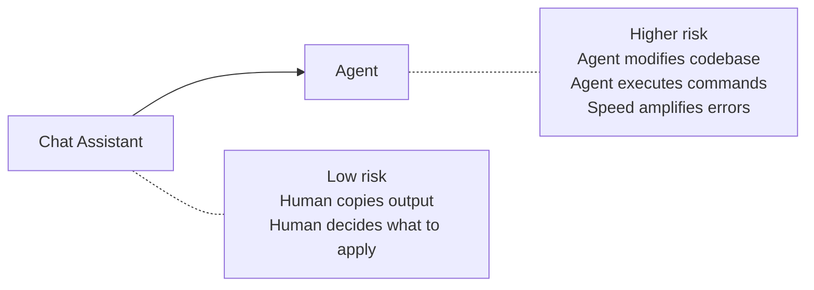
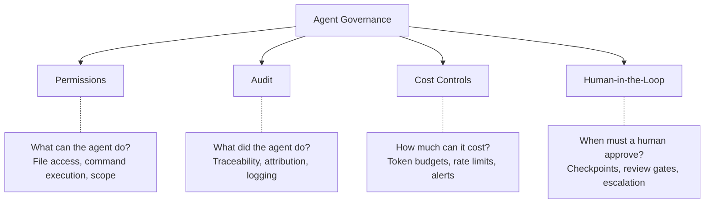
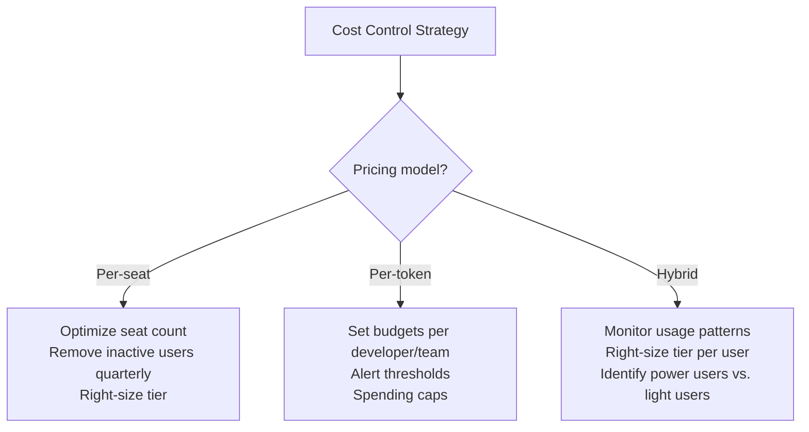
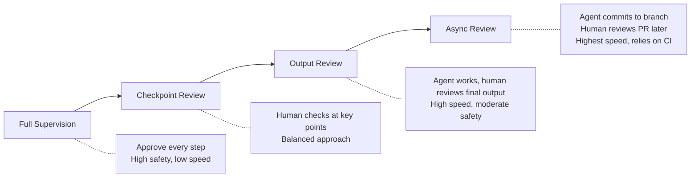

# Governing Agent Usage

> Audit trails, permissions, cost controls, and human-in-the-loop patterns for responsible agent deployment.

## Why Governance Matters for Agents Specifically

Chat assistants suggest — developers decide. Agents *act*. They modify files, run commands, and can make dozens of changes in minutes. This shift from "advisor" to "actor" means governance isn't optional — it's the difference between a force multiplier and a liability.



**The governance principle:** Controls should be proportional to the agent's autonomy level and the sensitivity of what it's touching.

---

## The Four Pillars of Agent Governance



---

## Pillar 1: Permissions

### What to Control

| Permission | Question to answer | Risk if uncontrolled |
|-----------|-------------------|---------------------|
| **File access** | Which files/directories can the agent read and modify? | Agent modifies config, secrets, or unrelated code |
| **Command execution** | Which shell commands can the agent run? | Arbitrary command execution, data deletion |
| **Network access** | Can the agent reach external services? | Data exfiltration, unintended API calls |
| **Git operations** | Can the agent commit, push, create branches? | Unreviewed code in shared branches |
| **Scope boundaries** | Can the agent modify files outside the current task? | Scope creep, unrelated changes mixed in |

### Permission Models by Tool

| Tool | Permission Model | Configurability |
|------|-----------------|-----------------|
| Claude Code | Allowed/denied command lists, permission prompts | High — CLI flags and project config |
| GitHub Copilot | IDE sandbox, workspace-scoped | Medium — workspace trust settings |
| Cursor | Approval prompts for commands, auto-apply toggle | Medium — per-session settings |
| Kiro | Hooks system (PreToolUse triggers), supervised mode | High — event-driven access control |
| Cline | Granular approval (reads, writes, commands separately) | High — configurable per action type |
| Aider | Git-based (auto-commit to branch), limited command execution | Low — relies on git safety net |

### Recommended Permission Configuration

**For exploration/POC:**
```
✅ Read any file in workspace
✅ Modify files in workspace
✅ Run read-only commands (ls, cat, grep, test runners)
⚠️ Ask before: install commands, git push, network calls
❌ Never: modify files outside workspace, run as root, access credentials
```

**For production usage:**
```
✅ Read files within designated project directories
✅ Modify files within designated project directories
✅ Run approved command allowlist (test, lint, build)
⚠️ Ask before: any command not on allowlist
❌ Never: modify CI/CD config, access secrets, push to protected branches
❌ Never: modify infrastructure code without explicit approval
```

---

## Pillar 2: Audit

### Why Audit Matters

When an agent generates a 30-file PR in 5 minutes, you need to answer:
- What exactly did the agent do, step by step?
- What inputs (prompts, context) led to this output?
- Who initiated the task and approved the result?
- Which model/version produced this code?
- What commands were executed during the process?

### What to Log

| Event | What to capture | Why |
|-------|----------------|-----|
| Task initiated | Who, when, prompt text, files in context | Accountability, reproducibility |
| Files modified | Before/after content, or git diff | Traceability, rollback |
| Commands executed | Command text, exit code, stdout/stderr | Security audit, debugging |
| Errors and retries | What failed, how agent recovered | Quality assessment |
| Task completed | Final state, files changed, human approval status | Compliance |
| Cost incurred | Tokens consumed, API calls made | Budget tracking |

### Audit Implementation Approaches

**Lightweight (small teams):**
- Use git as your audit trail — agents work on branches, PRs capture the full diff
- Require meaningful PR descriptions (agents can generate these)
- Tag agent-generated commits with a consistent marker (e.g., `[ai-assisted]` prefix or git trailers)

**Medium (growing teams):**
- Centralized logging of agent sessions (tool-specific dashboards)
- Periodic review of agent activity patterns
- Cost attribution by team/project

**Enterprise:**
- Integration with SIEM/logging infrastructure
- Retention policies aligned with compliance requirements
- Automated alerts on anomalous agent behavior
- Regular access reviews of agent permissions

### Attribution: Who Wrote This Code?

This is a real question with no universal answer yet. Establish a team norm:

| Approach | Tradeoff |
|----------|---------|
| Developer owns all agent output | Clear accountability, developer must review thoroughly |
| Shared attribution (human + AI noted) | Honest, but ownership can be ambiguous |
| Agent output tagged, different review bar | Transparent, allows for different review rigor |

✅ **Our take: The developer who initiates and approves agent output owns it. Tag commits for transparency, but accountability stays with the human. This is the only model that works with existing code review and on-call responsibilities.

---

## Pillar 3: Cost Controls

### Why Cost Governance Matters

Agent costs are fundamentally different from seat-based tool costs:

| Cost model | Characteristic | Risk |
|-----------|---------------|------|
| **Per-seat** (Copilot, Q) | Predictable monthly cost | Paying for unused seats |
| **Per-token** (Claude API, Aider) | Variable, usage-based | A single developer can burn $200 in a day on a complex task |
| **Hybrid** (Cursor, Windsurf) | Seat + usage limits | "Fast" request caps can block work mid-task |

### Cost Control Strategies



### Setting Token Budgets

For API/token-based tools, establish guardrails:

| Level | Budget suggestion | Rationale |
|-------|------------------|-----------|
| Individual developer | $50–150/month | Covers typical daily agent usage |
| Heavy user (migrations, large refactors) | $200–500/month | Power users with valid high-usage patterns |
| Team monthly cap | Sum of individual + 20% buffer | Handles spikes without blocking work |
| Alert threshold | 80% of budget | Early warning before cap is hit |
| Hard cap (optional) | Team budget × 1.5 | Prevents runaway costs from stuck loops |

### 📋 Cost Monitoring Checklist

- [ ] Dashboard showing spend per developer, per team, per project
- [ ] Weekly/monthly cost reports to engineering leadership
- [ ] Alerts at 50%, 80%, and 100% of budget thresholds
- [ ] Process for requesting budget increases (don't block productive developers)
- [ ] Quarterly review: is spend delivering proportional value?

### Cost Optimization Tactics

1. **Model selection** — Not every task needs the most capable (expensive) model. Use cheaper models for simple tasks, expensive ones for complex reasoning.
2. **Context management** — Smaller, focused context = fewer input tokens = lower cost. Teach developers to scope agent tasks tightly.
3. **Task sizing** — Multiple small tasks are often cheaper and more effective than one massive task (agents get confused and loop on large, vague tasks).
4. **Caching and reuse** — Some tools cache context. Staying in the same session for related tasks is cheaper than starting fresh each time.
5. **Know when to stop** — A looping agent burns money. Teach developers to recognize stuck loops and intervene.

---

## Pillar 4: Human-in-the-Loop

### The Spectrum of Human Involvement



### Matching Review Level to Risk

| Task risk level | Human involvement | Examples |
|----------------|-------------------|----------|
| **Low risk** | Async review (PR later) | Documentation, test generation, boilerplate |
| **Medium risk** | Output review (before merge) | Feature implementation, refactoring, bug fixes |
| **High risk** | Checkpoint review | Database migrations, API changes, auth code |
| **Critical risk** | Full supervision or no agent | Security fixes, cryptography, compliance changes |

### Implementing Human Checkpoints

**In-tool mechanisms:**
- Supervised/approval mode (Kiro, Cline) — agent pauses before each action
- Diff review before apply (Cursor Composer, Copilot) — see changes before they hit disk
- Command approval prompts — agent asks before running shell commands

**Process mechanisms:**
- Branch protection rules — agent can't push to main
- Required reviewers on PRs — human must approve before merge
- CI gates — tests, security scans, and linting must pass
- Deployment gates — even if merged, requires human approval to deploy

**The recommended stack for production:**

```
Agent works on feature branch
    → Agent opens PR (or developer opens PR with agent changes)
        → CI runs: tests, lint, security scan, build
            → Human reviews PR (different review lens than human-authored code)
                → Merge requires approval
                    → Deploy requires separate approval (for critical services)
```

### How to Review Agent-Generated Code

Reviewing agent output requires a different focus than reviewing human code:

| Review focus | Why |
|-------------|-----|
| **Coherence** | Does it make sense as a whole? Agents can produce locally-correct but globally-incoherent changes. |
| **Completeness** | Did it handle all cases? Agents sometimes implement the happy path and skip edge cases. |
| **Over-engineering** | Agents can add unnecessary abstractions. Is this simpler than it needs to be? |
| **Security** | Agents may not consider auth, input validation, or injection by default. |
| **Test quality** | Agent-generated tests may test the implementation rather than the behavior (tautological tests). |
| **Scope creep** | Did the agent modify things outside the task scope? |

---

## Governance by Team Maturity

Not every team needs the same controls. Match governance to maturity:

### Phase 1: Early Exploration (1–5 developers experimenting)

```
Governance: Lightweight
- Git branches as safety net
- Verbal team norms ("don't let agents touch auth code")
- Individual cost awareness (personal API keys)
- PR review as the primary gate
```

### Phase 2: Team Adoption (Team using agents regularly)

```
Governance: Moderate
- Written policy: what agents can/can't do
- Standardized tool configuration across team
- Cost tracking by developer
- Agent output tagged in commits
- Defined review process for agent PRs
```

### Phase 3: Organizational Scale (Multiple teams, standardized usage)

```
Governance: Formal
- Approved tool list with enterprise controls
- Centralized cost management and budgets
- Audit logging integrated with security tooling
- Permission policies enforced at the org level
- Regular governance reviews and policy updates
- Training and certification for agent usage
```

---

## Policy Template: Agent Acceptable Use

For agent-specific acceptable use, define these boundaries. For a full org-wide AI policy template (covering all AI tools, not just agents), see [AI Usage Policy](../governance/ai-usage-policy.md).

**Agent-specific boundaries** (supplement your broader AI policy with these):

### Approved for Agents (No Additional Approval)
- Code generation, editing, and refactoring within project boundaries
- Test generation and coverage expansion
- Documentation generation and updates
- Bug investigation and fixing in non-critical paths
- Build and test execution within approved commands

### Requires Explicit Approval for Agent Use
- Modifications to authentication or authorization code
- Changes to CI/CD pipeline configuration
- Database schema changes or migrations
- Changes affecting production infrastructure
- Any task estimated to cost >$X in API fees

### Agents Prohibited Without Exception
- Direct deployment to production
- Modification of secrets, credentials, or environment configuration
- Accessing or processing customer PII
- Push to protected branches (main, release/*)
- Running with elevated system privileges

---

## ⚠️ Common Governance Mistakes

| Mistake | Why it fails | Better approach |
|---------|-------------|----------------|
| "No AI agents allowed" | Developers use them anyway, underground | Establish guardrails and approve specific tools |
| Governance so heavy nobody uses agents | Controls become a blocker | Tiered governance — light for low-risk, heavy for high-risk |
| Only technical controls, no cultural norms | People route around tools | Combine tool controls with team agreements |
| One-size-fits-all policy | Teams have different risk profiles | Allow team-level customization within org guardrails |
| Set-and-forget policies | Landscape changes quarterly | Scheduled policy reviews (at least quarterly) |

---

## Next Steps

- Want to try agents with zero governance overhead? → [Getting Started Free](./getting-started-free.md)
- Ready to roll out with these controls in place? → [Production Rollout](./production-rollout.md)
- Need org-wide governance beyond agents? → [Governance](../governance/)
