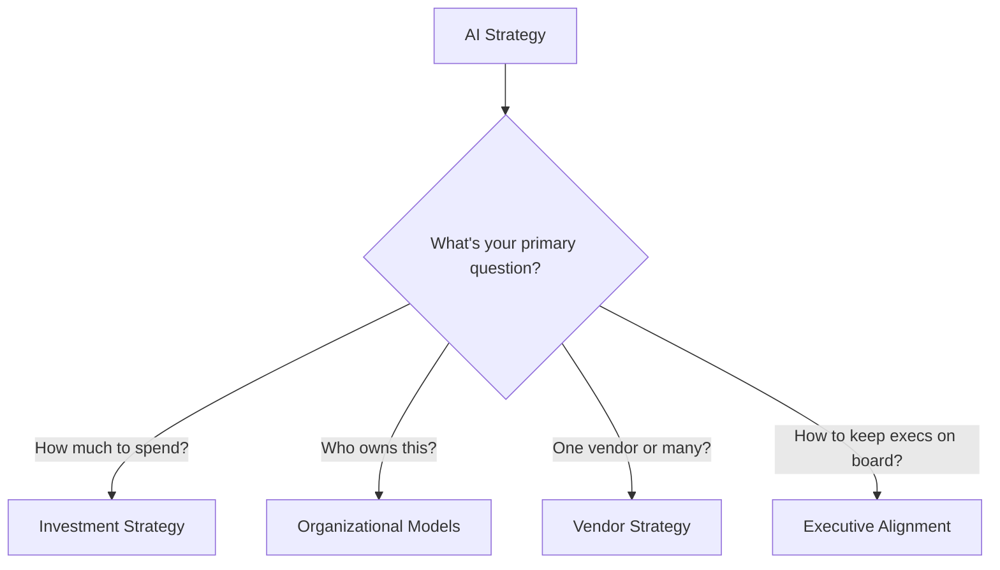

# 02 — AI Strategy

> How to think about AI as an organizational capability — investment, ownership, vendor management, and executive alignment.

## Why This Section Matters

Foundations give you vocabulary. Tools give you options. Strategy gives you **direction**.

Without an AI strategy:
- **Every team reinvents decisions independently** — one team picks Copilot, another picks Cursor, a third builds custom. Nobody learns from each other. Budget is fragmented.
- **AI becomes a cost center nobody owns** — $200K/year in tool licenses with no clear owner, no ROI measurement, no strategic direction
- **Executive support is fragile** — one bad quarter and "that AI experiment" gets cut because nobody positioned it as infrastructure
- **Structural mistakes compound** — you build a centralized CoE that nobody uses, or decentralize so far that governance is impossible

This section is for **Directors, VPs, and CTOs** who need to answer: "What's our AI strategy?" — not just "which tool do we buy?"

## In This Section

| Page | What you'll learn |
|------|-------------------|
| [Investment Strategy](./investment-strategy.md) | How to budget for AI — capital allocation, phasing, and ROI framing |
| [Organizational Models](./org-models.md) | CoE vs. Platform Team vs. Distributed — who owns AI enablement |
| [Vendor Strategy](./vendor-strategy.md) | Multi-vendor vs. single-vendor, lock-in mitigation, exit planning |
| [Executive Alignment](./executive-alignment.md) | Ongoing stakeholder management — not just initial buy-in |
| [Operating Model](./operating-model.md) | How AI runs at steady state — roles, cadence, decision rights, feedback loops |

## 💡 Key Insight

> **AI tooling is infrastructure, not an experiment.**
>
> Frame it like CI/CD or observability — a permanent capability investment with ongoing cost, clear ownership, and measurable returns. The moment you frame it as "an experiment" is the moment it's vulnerable to budget cuts.

## The Strategy Question Map

## AI Engineering Maturity: Strategy

> **Engineering Manager Note**
>
> Strategy isn't your job alone. But knowing your organization's strategic direction helps you make better tactical decisions.
>
> Read this section to understand what your VP is thinking about — and to speak their language when you need budget.

| Level | What it looks like | What to do |
|:-----:|-------------------|-----------|
| **0** | No strategy — individual teams doing their own thing | Build awareness, read [Foundations](../foundations/) |
| **1** | Awareness exists, no coordinated approach | Consolidate learnings, draft investment proposal |
| **2** | Strategy documented, budget allocated, ownership assigned | Execute pilot, measure, report to leadership |
| **3** | Multi-team strategy with governance, vendor agreements, clear ownership | Optimize spend, re-evaluate quarterly, expand |
| **4** | AI embedded in engineering strategy, reviewed at leadership level, competitive advantage | Continuous: monitor landscape, evolve the strategy itself |

## Status

🟢 Active — content being written and refined.
