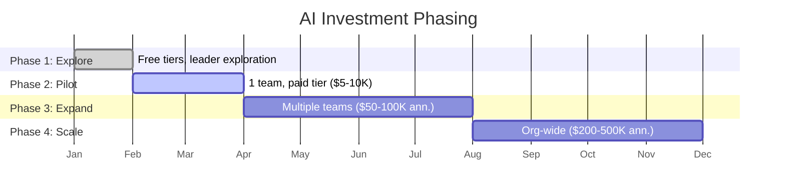

# Investment Strategy

> How to budget for AI across your engineering organization — capital allocation, phasing, and ROI framing.

## The Budgeting Challenge

AI tool costs don't fit neatly into existing budget categories:
- They're not headcount (but they affect headcount productivity)
- They're not infrastructure (but some require GPU infra)
- They're not software licenses (but some are per-seat SaaS)
- They're not R&D experiments (but they're often treated as such)

**The framing matters.** Where you put AI in your budget determines how it's perceived, how it's defended, and how it's measured.

---

## Where AI Belongs in Your Budget

| Budget category | Framing | Advantage | Risk |
|----------------|---------|-----------|------|
| **Developer Tooling** | Same line as IDEs, CI/CD, observability | Natural fit, familiar category, easy to justify | May inherit "tooling" budget constraints |
| **Engineering Productivity** | Investment in team velocity | Outcome-oriented, ties to business metrics | Harder to measure attribution |
| **R&D / Innovation** | Exploratory investment | Protects from ROI pressure early | Vulnerable to cuts; perceived as optional |
| **Platform / Infrastructure** | Foundational capability | Signals permanence | May over-invest before proving value |

> ✅ ✅ **Our take: Budget AI tools under **Developer Tooling** for tactical decisions (tool licenses, API costs) and under **Engineering Productivity** for strategic investment (enablement team, training, process change). Never put production AI tools under R&D — it signals "experiment" and makes budget fragile.

---

## The Investment Stack

```mermaid
flowchart TD
    A[Total AI Engineering Investment] --> B[Tool Costs]
    A --> C[People Costs]
    A --> D[Infrastructure]
    A --> E[Process Costs]

    B -.- B1[Licenses: $20-40/user/month<br/>API/tokens: variable<br/>Review tools: $15-30/user/month]
    C -.- C1[Enablement: 0.25-1 FTE<br/>Champions: 10% of N developers<br/>Security review: internal time]
    D -.- D1[Self-hosted models: $50-200K/year (if needed)<br/>Proxy/DLP: $5-15/user/month<br/>Monitoring: included in existing tools]
    E -.- E1[Training: 2-4 hours/developer one-time<br/>Policy development: 1-2 weeks<br/>Evaluation cycles: quarterly]
```

---

## Investment by Organization Size

| Org size | Year 1 investment (realistic) | Breakdown |
|----------|-------------------------------|-----------|
| **Startup (< 50 devs)** | $15K–50K/year | Tools only. No dedicated people. Governance is lightweight. |
| **Mid-size (50–200 devs)** | $80K–300K/year | Tools + 0.25–0.5 FTE enablement + training + enterprise tier |
| **Enterprise (200–1000 devs)** | $300K–1.5M/year | Tools + 0.5–2 FTE enablement + infrastructure + governance + vendor management |

**Context:** For a 200-developer org, $300K/year is:
- Less than 2 senior developer hires
- Less than your annual observability spend (probably)
- Less than one quarter of tech debt if AI helps reduce it

---

## Phased Investment (De-Risking)

Never ask for the full amount upfront. Phase it:



**Each phase has a go/no-go gate.** This makes each "yes" small and evidence-based.

> ✅ ✅ **Our take: Always present Phase 1 as $0 and Phase 2 as a single budget ask. Get the small "yes," deliver data, then ask for more. Executives who see pilot results say "yes" to expansion 80% of the time. Executives asked to fund full rollout from nothing say "let me think about it" — which means no.

---

## ROI Calculation Model

### The Simple Model (Use for initial pitch)

```
Annual value per developer:
  30 min saved/day × 220 working days × $75/hour = ~$8,250

Annual cost per developer:
  Tool license ($3,000) + API costs ($1,000) + enablement overhead ($500) = ~$4,500

Net value per developer: ~$3,750/year
ROI: 83%

At 100 developers: $375,000 net annual value
```

### The Honest Model (Use after pilot data)

```
Annual value per developer:
  [Measured time saved/day from pilot] × 220 × [your hourly rate]
  + quality improvement value (fewer bugs × bug fix cost)
  + onboarding acceleration (faster ramp × cost of slow ramp)

Annual cost per developer:
  [Actual tool cost] + [actual API cost] + [enablement allocation]
  + hidden costs (learning curve, review overhead, rework)

Net value: (value - cost)
ROI: net value ÷ cost × 100%
```

---

## What CFOs Want to Hear

| CFO question | Your answer |
|-------------|-------------|
| "What's the payback period?" | "2–4 months based on pilot data." |
| "Is this recurring?" | "Yes — SaaS subscription. Scales linearly with headcount. Cancelable." |
| "What if we cancel?" | "Productivity reverts. No sunk cost. No write-down." |
| "Can we capitalize this?" | "Typically OpEx (SaaS). Check with accounting." |
| "What's the risk of not doing this?" | "Competitors are adopting. Talent expects it. The gap compounds." |

---

## Budget Defense: When It Comes Under Pressure

AI budgets face scrutiny because they're new. Prepare for:

| Challenge | Defense |
|-----------|---------|
| "Cut it — we need to reduce costs" | "This $300K saves $1.2M in developer productivity. Cutting it costs us 4x the savings." |
| "We don't see the ROI" | "Here's the dashboard: [data]. If our measurement is wrong, let's fix measurement — not cut the tool." |
| "Other teams aren't using it" | "Adoption is at 70%. The 30% have valid reasons [specific]. We're not forcing — we're enabling." |
| "Just use the free tier" | "Free tier lacks governance (SSO, audit, DPA). We'd lose security visibility." |

---

## Next

- Who should own this? → [Organizational Models](./org-models.md)
- Managing vendor relationships → [Vendor Strategy](./vendor-strategy.md)
- Keeping execs aligned → [Executive Alignment](./executive-alignment.md)
