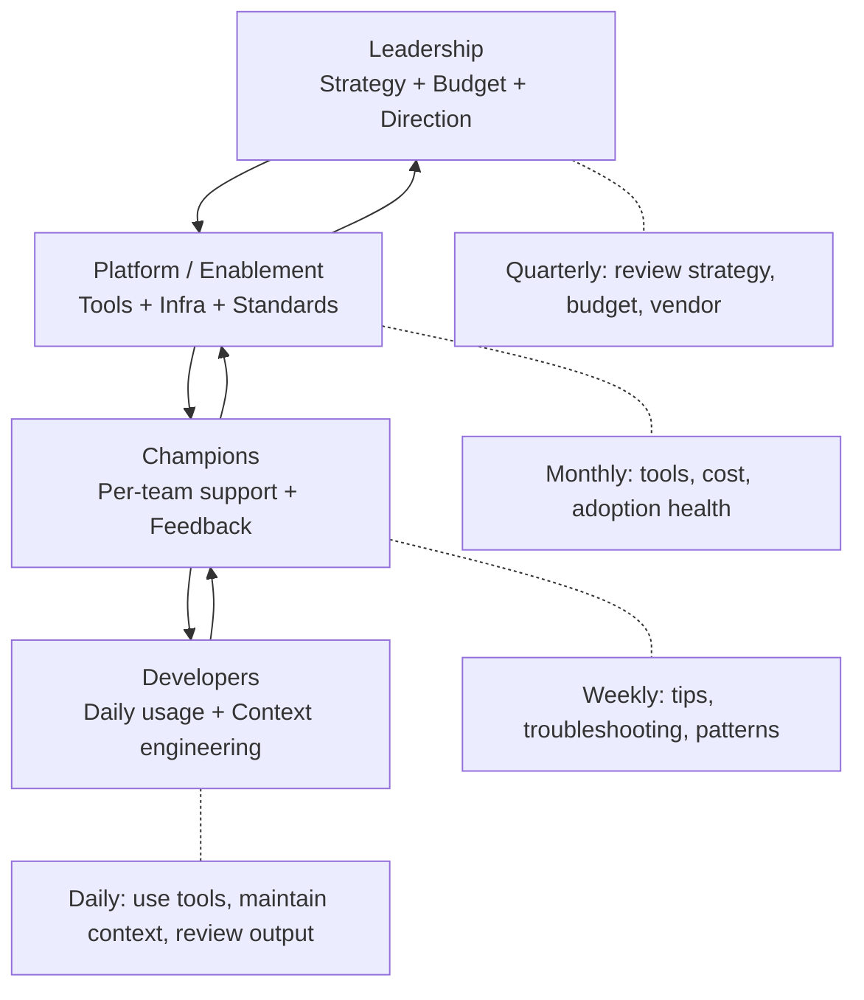
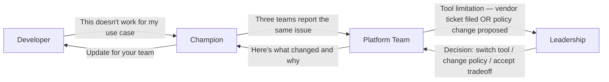

# The AI Engineering Operating Model

> How AI tooling works in your org at steady state — roles, cadence, decision rights, and feedback loops.

## What This Is

This is not about *adopting* AI (that's the journey — see [Team Adoption](../team-adoption/)). This is about *running* AI as a permanent engineering capability. The operating model answers: "Once AI tools are deployed, who does what, how often, and how do we keep it healthy?"

Use this as a blueprint. Adapt the specifics. The structure is what matters.

---

## The Operating Model at a Glance

---

## Roles and Responsibilities

### Leadership (VP / Director / CTO)

| Responsibility | Cadence | Artifacts |
|---------------|---------|-----------|
| Set AI strategy and direction | Annually (refresh quarterly) | Strategy document |
| Approve and defend budget | Annually (review quarterly) | Budget allocation |
| Vendor relationship decisions | Annually (evaluate semi-annually) | Vendor agreements |
| Executive alignment and reporting | Quarterly | Executive update (1-pager) |
| Policy approval (final sign-off) | As needed (review quarterly) | AI acceptable use policy |
| Maturity assessment | Semi-annually | Maturity scorecard |

**Time commitment:** 2–4 hours/month (excluding initial setup)

---

### Platform / Enablement Team

| Responsibility | Cadence | Artifacts |
|---------------|---------|-----------|
| Tool provisioning, configuration, SSO | Ongoing | Tool configurations, access management |
| Cost monitoring and budget alerts | Weekly | Cost dashboard, alerts |
| Adoption metrics and dashboards | Weekly (report monthly) | Metrics dashboard |
| Context engineering standards | Monthly (review quarterly) | Templates, org-level steering |
| Security controls maintenance | Monthly | DLP rules, audit log review |
| Vendor evaluation and landscape scanning | Quarterly | Landscape brief |
| Training materials and onboarding | Update as needed | Training docs, workshop materials |
| MCP servers and knowledge infrastructure | As systems change | MCP configuration, documentation |
| Policy drafts (for leadership approval) | Quarterly review | Policy updates |
| Champion coordination | Monthly sync | Meeting notes, action items |

**Time commitment:** 0.5–2 FTE depending on org size (50 devs = 0.25 FTE, 200 devs = 1 FTE, 500+ = 2 FTE)

---

### Champions (1 per 8–15 developers)

| Responsibility | Cadence | Artifacts |
|---------------|---------|-----------|
| Peer support within team | Daily/as-needed | — |
| Share tips and patterns | Weekly | Channel posts, demos |
| Surface issues and feedback upward | As they arise (monthly sync) | Feedback in monthly sync |
| Onboard new team members to AI tools | Per new hire | — |
| Test new tools/features before team rollout | As released | Brief assessment |
| Represent developer reality to platform team | Monthly sync | — |

**Time commitment:** ~10% of their time (4 hours/week). Not a full-time role.

---

### Developers (All engineering staff)

| Responsibility | Cadence | Artifacts |
|---------------|---------|-----------|
| Use AI tools for daily work | Daily | Code, PRs, tests |
| Maintain project instructions (CLAUDE.md, etc.) | With code changes | Project instruction files |
| Review AI-generated output before merging | Every PR | PR reviews |
| Follow AI acceptable use policy | Always | — |
| Report issues and suggestions | As they arise | Channel messages, feedback |
| Attend training (when offered) | One-time + optional advanced | — |

**Time commitment:** Part of normal work — no additional allocation needed.

---

## The Cadence

### Daily
- Developers use AI tools as part of normal workflow
- Champions available for questions (async, in-channel)
- Cost monitoring runs (automated alerts)

### Weekly
- Champion shares one tip/pattern in team channel
- Platform team reviews cost dashboard and adoption numbers
- Issues triaged (bugs, blockers, requests)

### Monthly
- Champions sync with platform team (30 min)
  - What's working? What's broken? What do teams need?
- Platform team updates metrics dashboard
- One-page summary to engineering leadership
- Context engineering review: any staleness? any gaps?

### Quarterly
- Leadership reviews strategy, budget, vendor
  - Is the tool still right? Is the investment delivering?
- Policy review: still current? any gaps?
- Maturity assessment: where are we now? what's next?
- Vendor landscape scan: anything changed that warrants action?
- Developer satisfaction survey (AI-specific questions)
- Training refresh (if new features/tools warrant it)

### Annually
- Strategic planning: AI in engineering roadmap for next year
- Budget setting for next fiscal year
- Vendor contract renewal/renegotiation
- Org model review: is current structure still working?
- Case study documentation: what we learned this year

---

## Decision Rights (RACI)

| Decision | Responsible | Accountable | Consulted | Informed |
|----------|------------|-------------|-----------|----------|
| **AI strategy and direction** | Platform team drafts | VP/CTO approves | Champions, Security | All engineering |
| **Tool selection** | Platform team evaluates | Director approves | Developers (pilot), Security | All engineering |
| **Budget allocation** | Platform team proposes | VP/CFO approves | Finance | Engineering managers |
| **Policy creation/updates** | Platform team drafts | VP approves | Security, Legal, Champions | All engineering |
| **Vendor contracts** | Platform team negotiates | VP/CTO signs | Legal, Finance | Engineering managers |
| **Context engineering standards** | Platform team sets | Tech lead approves (per team) | Champions | Developers |
| **Team-level context (steering, hooks)** | Developers write | Tech lead reviews | Champion | Platform team |
| **Project instructions** | Any developer | Tech lead | — | Team |
| **Cost anomaly response** | Platform team investigates | Director decides | Affected developer | Finance |
| **Security incident response** | Security team leads | CISO | Platform team, Legal | VP, affected teams |
| **Tool access for new hire** | Platform team provisions | Manager requests | — | New hire |
| **Exception to policy** | Requestor proposes | VP approves | Security, Platform | — |

---

## Feedback Loops

Healthy operating models have feedback flowing in both directions:

### What Flows Up
- Usage patterns (what's working, what's not)
- Cost anomalies and budget forecasts
- Tool limitations and feature requests
- Security concerns
- Developer satisfaction signals

### What Flows Down
- Strategic decisions and rationale
- Policy changes (with context for "why")
- New tool/feature availability
- Budget approvals or constraints
- Vendor roadmap intelligence

### Feedback Health Signals

| Signal | Healthy | Unhealthy |
|--------|---------|-----------|
| Time from issue → resolution | Days to weeks | Months (or never) |
| Developer awareness of policy changes | Know within a week | Discover by accident months later |
| Leadership awareness of adoption problems | Monthly report surfaces issues | Surprised by stalled adoption in quarterly review |
| Champion satisfaction | "I enjoy helping" | "Nobody listens" or "I'm overwhelmed" |

---

## Artifacts: What Documents Exist

| Artifact | Owner | Location | Update cadence |
|----------|-------|----------|---------------|
| AI Strategy document | VP/CTO | Internal wiki or repo | Annually (quarterly refresh) |
| AI Acceptable Use Policy | Platform team (VP approves) | Internal wiki + repo | Quarterly review |
| Approved tool list | Platform team | Internal wiki | As tools change |
| Data classification map | Security + Platform | Internal wiki or repo | Quarterly |
| Metrics dashboard | Platform team | Grafana / Datadog / Spreadsheet | Real-time or weekly |
| Cost report | Platform team | Finance system + dashboard | Monthly |
| Org-level context standards | Platform team | Repo (templates, steering) | Quarterly |
| Training materials | Platform team + Champions | Internal wiki or LMS | As tools/features change |
| Vendor assessment docs | Platform team | Internal wiki | Per evaluation |
| Quarterly executive update | Platform team (VP presents) | Slides or 1-pager | Quarterly |
| Champion network roster | Platform team | Internal wiki | As champions rotate |

---

## Scaling the Model

| Org size | Model configuration |
|----------|-------------------|
| **<50 devs** | No dedicated platform time. One senior dev + 2–3 champions. Quarterly review by engineering lead. |
| **50–200 devs** | 0.5–1 FTE platform/enablement. 5–15 champions. Monthly leadership touchpoint. |
| **200–500 devs** | 1–2 FTE platform team. 15–30 champions. Dedicated budget owner. Quarterly exec reporting. |
| **500+ devs** | 2–5 FTE (or CoE). 30+ champions. Formal governance committee. Board-level annual reporting. |

---

## Anti-Pattern: The Operating Model Nobody Follows

The biggest risk isn't having no model — it's having a model that exists on paper but not in practice.

| Sign it's not working | Root cause | Fix |
|----------------------|-----------|-----|
| Nobody attends monthly champion sync | Too many meetings, no value | Make it 15 min, action-oriented, or async |
| Policy hasn't been updated in 9 months | No owner, no cadence | Assign owner, put review on the quarterly calendar |
| Metrics dashboard is stale | Nobody looks at it | Automate data collection, attach to decision cadence |
| Champions burned out | Too much demand, no recognition | Rotate, recognize publicly, limit scope |
| Leadership surprised by problems | Feedback not flowing up | Fix monthly report, make issues visible earlier |

> ✅ **Our take:** The model above is the maximum. Most orgs need 60% of this. Start with: (1) clear ownership, (2) one monthly sync, (3) quarterly review, (4) a cost dashboard. Add the rest as your maturity demands it. A lightweight model that's followed beats a comprehensive model that's ignored.

---

## 📋 Operating Model Starter Checklist

### Minimum Viable Operating Model (start here)

- [ ] **Owner identified** — one person (even part-time) owns AI enablement
- [ ] **Tool access provisioned** — developers can self-serve getting started
- [ ] **Policy written** — one page, discoverable, communicated
- [ ] **Cost visibility** — someone can answer "how much are we spending?"
- [ ] **Monthly check-in** — 30 min, owner + 2–3 champions: what's working, what's not?
- [ ] **Quarterly review** — 1 hour, leadership: strategy still right? budget on track? metrics healthy?

### Full Operating Model (grow into this)

- [ ] All items above, plus:
- [ ] Champions network (1 per 8–15 devs)
- [ ] Automated metrics dashboard
- [ ] Quarterly executive report
- [ ] Vendor evaluation cadence (annual)
- [ ] Policy review cadence (quarterly)
- [ ] Context engineering standards documented
- [ ] Training program with clear levels
- [ ] Feedback loop: developer → champion → platform → leadership → back
- [ ] Incident response process for AI-specific issues

---

## Next

- Who owns what? → [Organizational Models](./org-models.md)
- How much to invest? → [Investment Strategy](./investment-strategy.md)
- Keeping executives aligned → [Executive Alignment](./executive-alignment.md)
- Return to section overview → [AI Strategy README](./README.md)
