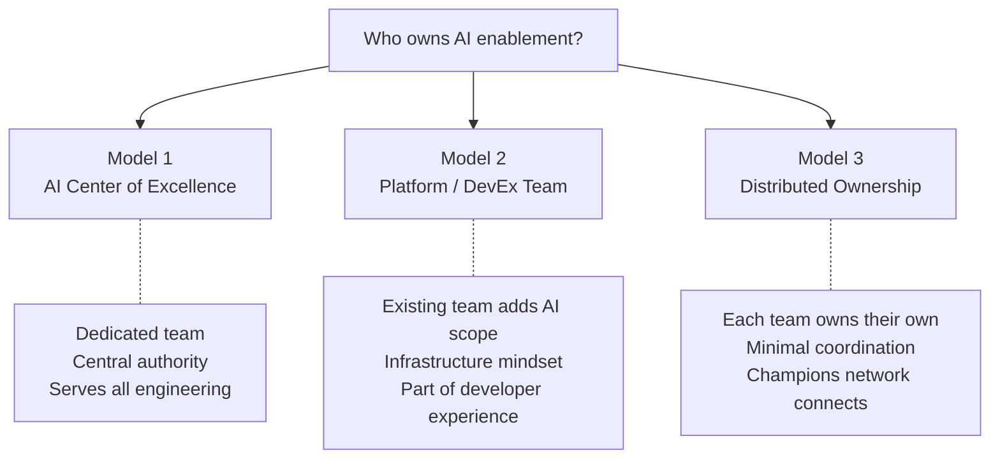
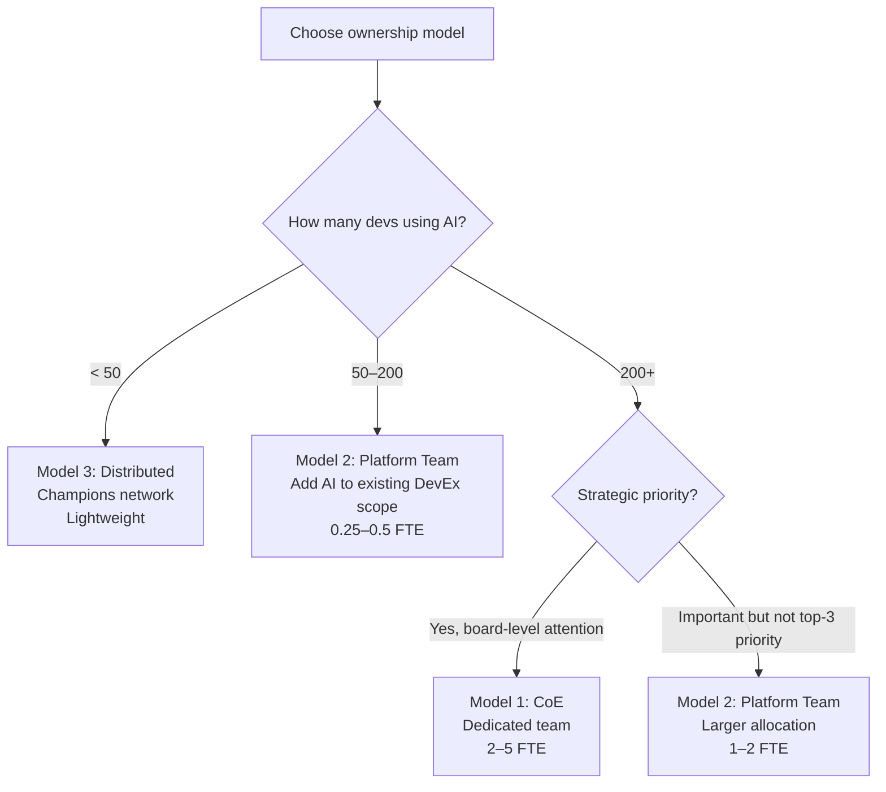

# Organizational Models

> Who owns AI enablement in your engineering org — and why the answer matters more than which tool you pick.

## The Ownership Question

Someone needs to own:
- Tool selection and vendor management
- Policy and governance
- Training and enablement
- Context engineering (project instructions, steering, MCP)
- Metrics and reporting
- Cost management
- Staying current with the landscape

If nobody owns it, all of the above happens ad-hoc or not at all. If everyone owns it, nobody's accountable.

---

## The Three Models



---

## Model 1: AI Center of Excellence (CoE)

**What it is:** A dedicated team (2–5 people) focused entirely on AI enablement across engineering.

**They own:**
- Tool evaluation and vendor relationships
- Org-wide context engineering
- Training programs and certification
- Policy development (with security and legal)
- Metrics, dashboards, and ROI reporting
- Research: what's new, what should we try next

**Best for:** Large enterprises (500+ devs) where AI is a strategic priority and there's budget for a dedicated team.

| Advantages | Disadvantages |
|-----------|---------------|
| Clear ownership and accountability | Can become disconnected from teams' real needs |
| Deep expertise, dedicated focus | Bottleneck if teams need to go through CoE for everything |
| Consistent standards across org | Expensive (2–5 FTE dedicated) |
| Strategic roadmap and vision | Risk of "ivory tower" — building things nobody asked for |

**When it fails:** CoE builds an elaborate internal platform nobody uses because they didn't talk to developers. Or CoE becomes a gate that slows adoption.

> **Our take:** Don't create a CoE until you have at least 200 developers using AI tools and clear evidence that distributed ownership isn't working. Most orgs jump to CoE too early, creating overhead before value. Start with Model 2 or 3, graduate to CoE when the complexity demands it.

---

## Model 2: Platform / DevEx Team Absorbs AI

**What it is:** Your existing platform engineering or developer experience team adds AI enablement to their scope.

**They own:**
- Tool provisioning and configuration (same as they manage CI/CD, IDEs)
- Infrastructure (proxies, MCP servers, self-hosted models if needed)
- Context engineering standards and templates
- Integration with existing developer workflows

**Teams own:**
- Their own project instructions and domain context
- Which approved tools they use
- How agents fit into their workflow
- Domain-specific training and skill building

**Best for:** Mid-size orgs (50–200 devs) that already have a platform or DevEx function.

| Advantages | Disadvantages |
|-----------|---------------|
| Leverages existing team and relationships | Platform team gets more scope without more headcount |
| AI treated as infrastructure (the right framing) | May lack AI-specific expertise |
| Natural integration with existing toolchain | AI might be deprioritized vs. other platform work |
| No new team to create or justify | Needs clear prioritization from leadership |

> **Our take:** This is the right model for most organizations in 2025. AI tools are developer infrastructure — they belong with the team that manages developer infrastructure. Add 0.25–0.5 FTE of capacity to the platform team for AI enablement. Don't create a new team unless that capacity is insufficient after 6 months.

---

## Model 3: Distributed Ownership

**What it is:** No central owner. Each team manages their own AI adoption. A lightweight champions network provides coordination.

**Champions network provides:**
- Monthly sync on what's working
- Shared learnings and tips
- Escalation path for cross-cutting issues
- Input to leadership on needs

**Each team owns:**
- Everything — tool choice, context, governance, training

**Best for:** Small orgs (<50 devs) or orgs where team autonomy is a core value and centralization would be resisted.

| Advantages | Disadvantages |
|-----------|---------------|
| Maximum team autonomy | Inconsistent practices, duplicated effort |
| No central overhead | No one negotiates volume pricing |
| Fast local decisions | Governance gaps (nobody owns security review) |
| Fits autonomous engineering cultures | Doesn't scale past ~100 devs |

> **Our take:** Fine for <50 devs or as a Phase 1/2 approach. Not sustainable at scale. The coordination cost eventually exceeds the autonomy benefit. Plan to graduate to Model 2 when you have 50+ developers using AI tools regularly.

---

## Decision Framework



---

## The Hybrid (Most Common in Practice)

Most real organizations end up with a hybrid:

```
Platform team:
  - Owns tools, infra, vendor relationships, cost management
  - Provides templates and standards

Champions (distributed):
  - Per-team peer support
  - Domain-specific context engineering
  - Feedback loop to platform team

Leadership (VP/Director):
  - Strategic direction and budget
  - Executive alignment
  - Re-evaluation cadence
```

This gives you central efficiency + distributed agility without creating a full CoE.

---

## Anti-Patterns

| Anti-pattern | What happens | Instead |
|-------------|-------------|---------|
| CoE too early | Overhead before value; team builds things nobody needs | Start distributed, centralize only when coordination cost exceeds autonomy benefit |
| Nobody owns it | Fragmented tools, no governance, no measurement | Assign ownership explicitly — even if it's "platform team + 10% of one person's time" |
| Security owns it | AI becomes blocked or fear-driven | Security advises; engineering owns enablement |
| Single person owns everything | Bus factor of 1; burns out | Minimum 2 people with context, even if part-time |

---

## Next

- How much to invest? → [Investment Strategy](./investment-strategy.md)
- Managing vendors → [Vendor Strategy](./vendor-strategy.md)
- Keeping leadership aligned → [Executive Alignment](./executive-alignment.md)
