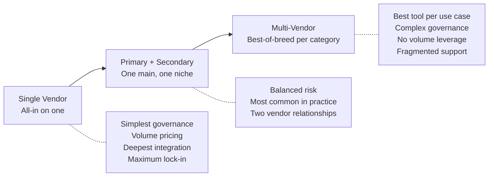

# Vendor Strategy

> Single-vendor vs. multi-vendor, lock-in mitigation, contract management, and exit planning.

## Why Vendor Strategy Matters

AI tools are sticky. Once 200 developers build muscle memory with a tool, switching is expensive — not just in license cost but in lost productivity during transition, retraining, and context rebuilding. Make intentional choices upfront.

---

## The Spectrum

> **Our take:** **Primary + Secondary** is the right model for most orgs. Pick one platform tool (Copilot, Q, or Cursor) as your primary — handles 80% of daily use. Keep one secondary option available (typically CLI-based like Claude Code or Aider) for power users and specific use cases the primary doesn't cover well. This gives you flexibility without governance chaos.

---

## Lock-In Risks by Category

| Lock-in type | What traps you | Mitigation |
|-------------|---------------|-----------|
| **Data lock-in** | Custom fine-tuning, proprietary model on your data | Ensure you can export/delete data; avoid fine-tuning unless critical |
| **Workflow lock-in** | Tool-specific automation, hooks, integrations | Use standards where possible (MCP vs. proprietary plugins) |
| **Skill lock-in** | Team builds muscle memory with one tool | Most skills transfer (prompting is similar across tools) |
| **Context lock-in** | Project instructions in tool-specific format | Keep instructions in universal Markdown; tool-specific files are thin wrappers |
| **Contract lock-in** | Multi-year agreements with penalties | Start with annual; only commit multi-year after 12+ months of proven value |
| **Ecosystem lock-in** | Tool tightly coupled to platform (Copilot ↔ GitHub) | Acceptable if you're committed to the platform; risky if you might migrate |

---

## Contract Negotiation Principles

| Principle | Why | What to negotiate |
|-----------|-----|-------------------|
| **Annual, not multi-year** (initially) | You've used this tool for 6 months. Don't lock in for 3 years. | 1-year initial term with renewal option |
| **Volume discount without lock-in** | Get pricing benefit without commitment trap | Discount based on current seats, not future commitment |
| **Exit clause** | What happens if you need to leave? | Data export within 30 days, no penalty for non-renewal |
| **No training on code** | Non-negotiable | Written in DPA, not just marketing claims |
| **Price protection** | Vendors raise prices | Cap annual increase (max 5–10%) or price lock for term |
| **Usage flexibility** | Team composition changes | Ability to reassign seats, not just add |

---

## Exit Planning

Even if you're happy with your vendor today, plan for the possibility of leaving:

### Keep Portable

| Asset | Keep portable | How |
|-------|:------------:|-----|
| Project instructions | ✅ | Write in generic Markdown. Tool-specific files (CLAUDE.md, .cursorrules) share 90% of content — the concepts transfer. |
| Prompts library | ✅ | Store in repo as Markdown, not in tool-specific format |
| Skills and hooks | ⚠️ | Concepts transfer; implementation may be tool-specific |
| MCP servers | ✅ | MCP is an open standard — works across tools |
| Training materials | ✅ | Teach concepts (prompting, decomposition, review) not tool-specific button clicks |
| Metrics | ✅ | Track via git/CI analytics, not tool-specific dashboards alone |

### Switching Cost Estimate

| Factor | Typical cost | How to minimize |
|--------|-------------|-----------------|
| License migration | $0 (cancel old, start new) | Overlap 1 month for transition |
| Developer retraining | 2–4 hours per developer | Focus on concepts that transfer; tool-specific is just UI |
| Context rebuilding | 1–2 hours per project (converting instruction files) | Keep instructions in portable Markdown |
| Productivity dip | 1–2 weeks of reduced output | Stagger transition; don't switch everyone simultaneously |
| Integration rebuild | Days to weeks (for CI/CD hooks, custom automation) | Use standards (MCP, generic APIs) over proprietary plugins |

---

## Vendor Evaluation Cadence

Don't evaluate once and forget. The landscape moves quarterly.

| Frequency | Activity | Who |
|-----------|----------|-----|
| **Quarterly** | Scan landscape for significant new entrants or feature changes | Platform team (30 min) |
| **Semi-annually** | Review current vendor satisfaction, pricing, roadmap | Platform team + developers |
| **Annually** | Full re-evaluation: does our current choice still win? Should we switch? | Engineering leadership |
| **On trigger** | Major vendor change (pricing, terms, acquisition, quality drop) | Immediate review |

> **Our take:** Re-evaluate annually but switch rarely. Switching costs are real and compound with team size. Only switch if: (1) quality has genuinely degraded, (2) pricing became unreasonable, (3) security posture changed, or (4) a dramatically better option emerged that justifies transition cost. "Slightly better" is not worth switching for.

---

## Next

- How much to invest? → [Investment Strategy](./investment-strategy.md)
- Who owns this? → [Organizational Models](./org-models.md)
- Keeping executives aligned → [Executive Alignment](./executive-alignment.md)
