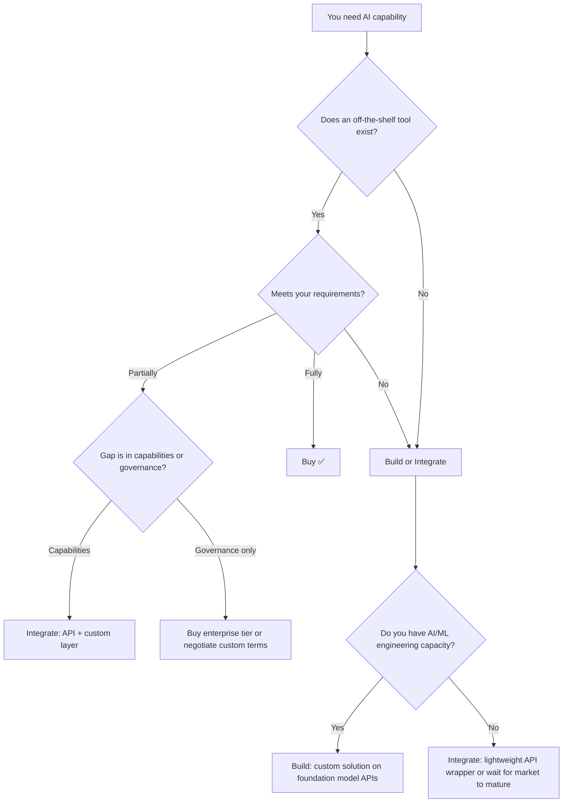
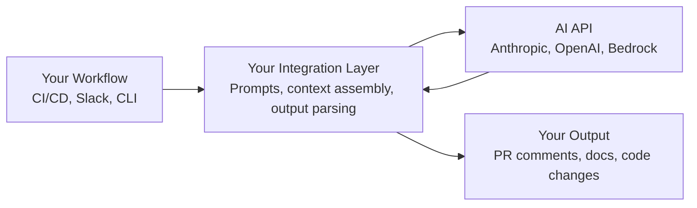

# Build vs. Buy vs. Integrate

> When to use off-the-shelf AI tools, when to build custom, and when to integrate APIs into bespoke workflows.

## The Three Paths

---

## When to Buy (Off-the-Shelf)

**Choose this when:**
- A tool exists that fits 80%+ of your needs
- You don't have unique requirements beyond what the market offers
- Speed of adoption matters more than customization
- You want vendor support, updates, and roadmap investment

**Examples:**
- GitHub Copilot for a GitHub-native org
- Amazon Q for an AWS-heavy shop
- CodeRabbit for automated code review

**Cost profile:** 💰 Predictable per-seat monthly cost. Scales linearly with headcount.

**Risk:** Vendor dependency, limited customization, terms may change.

---

## When to Integrate (API + Custom Layer)

**Choose this when:**
- You need AI augmenting a custom workflow unique to your org
- Off-the-shelf tools are close but don't fit your process
- You have engineering capacity to build and maintain a thin integration layer
- You want to control the prompt, context, and output format

**Examples:**
- Custom PR review bot using Claude/GPT API with your team's review standards
- Internal CLI tool that generates boilerplate following your exact architecture patterns
- Automated documentation pipeline triggered by CI using AI APIs
- Internal Slack bot that answers codebase questions using RAG + your docs

**Cost profile:** 💰 API costs (variable) + engineering time to build/maintain. Often cheaper per-unit than per-seat tools if usage is moderate.

**Risk:** Maintenance burden, API changes, you own the quality.

### Integration Architecture Pattern

**What your layer does:**
- Assembles context from your systems (git history, code, docs, project conventions)
- Constructs prompts that encode your team's standards
- Parses and validates AI output before acting on it
- Handles errors, retries, and cost tracking

---

## When to Build (Custom Solution)

**Choose this when:**
- You have extreme data sensitivity (code cannot leave your network)
- You need AI behavior customized at the model level (fine-tuning)
- Off-the-shelf tools are fundamentally wrong for your domain
- You have a dedicated ML/AI team who can own this

**Examples:**
- Self-hosted coding assistant for classified/regulated code
- Fine-tuned model on your specific codebase and conventions
- Custom AI system for a highly specialized domain (e.g., EDA tools, medical devices)

**Cost profile:** 🏢 High upfront (infrastructure, GPU costs, engineering time). Ongoing operational cost. Requires specialized talent.

**Risk:** Highest total cost, requires ML expertise, you own everything including model quality.

---

## Decision Matrix

| Factor | Buy | Integrate | Build |
|--------|-----|-----------|-------|
| Time to value | Fast (days–weeks) | Medium (weeks–months) | Slow (months) |
| Upfront cost | Low | Medium | High |
| Ongoing cost | Predictable (seats) | Variable (API + maintenance) | High (infra + people) |
| Customization | Low | Medium-High | Maximum |
| Maintenance burden | Vendor handles | You maintain integration | You maintain everything |
| Data control | Vendor terms | API terms (better) | Full control |
| Expertise needed | None | Software engineering | ML engineering + infra |
| Vendor risk | High | Medium (API dependency) | None |

---

## The Hybrid Approach (Most Common in Practice)

Most mature organizations end up with a hybrid:

1. **Buy** a primary coding tool (Copilot, Q, Cursor) for daily developer use
2. **Integrate** AI APIs for custom workflows unique to your org (custom review bots, documentation pipelines, internal tools)
3. **Build** only if you have a genuine self-hosting requirement or unique domain need

This gives you:
- Fast adoption for the 80% common case (buy)
- Custom value for your unique workflows (integrate)
- Full control where regulatory/security demands it (build, rare)

---

## Cost Comparison at Scale (50 developers, annual)

| Approach | Estimated annual cost | What you get |
|----------|----------------------|-------------|
| Buy (Copilot Business) | ~$11,400 | Full-featured coding assistant for everyone |
| Integrate (custom PR reviewer) | ~$3,000–8,000 (API) + $15,000 (eng time) | Custom review bot matching your exact standards |
| Build (self-hosted assistant) | $100,000–300,000+ (infra + talent) | Full control, likely lower quality than vendor tools |

> ✅ **Our take: For AI coding assistants in 2025, **buy unless you have a regulatory reason not to**. The market is competitive, tools are good, and building your own is almost never worth it. Save your "build" capacity for integrations unique to your workflow.

---

## When to Reconsider

| Signal | Current path | Consider switching to |
|--------|-------------|---------------------|
| Vendor raises prices 50%+ | Buy | Integrate (API-based alternative) |
| Your custom integration is brittle and expensive to maintain | Integrate | Buy (market caught up) |
| Vendor tool doesn't support a critical workflow | Buy | Integrate (add custom layer) |
| Self-hosted model quality falls far behind cloud | Build | Buy or Integrate |
| New regulation requires data sovereignty | Buy (cloud) | Build (self-hosted) or Buy (self-hosted tier) |

---

## Next

- Need the full tool evaluation process? → [Evaluation Framework](./evaluation-framework.md)
- Want to understand categories first? → [Tool Categories](./tool-categories.md)
- Ready to look at coding agents specifically? → [AI Coding Agents](../ai-coding-agents/)
