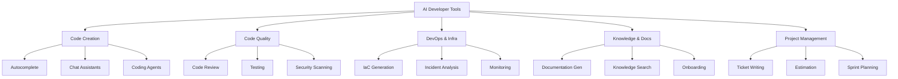

# AI Developer Tool Categories

> A taxonomy of AI tools for engineering teams — beyond just coding assistants.

## The Full Landscape

Most conversations about "AI developer tools" focus on code generation. But the landscape is broader. Here's the complete map:

---

## Category 1: Code Creation Tools

### Autocomplete / Inline Suggestions

**What it does:** Predicts and suggests code as you type. The "tab completion on steroids" experience.

| Tool | Cost | Key differentiator |
|------|------|-------------------|
| GitHub Copilot | 🆓 Free tier / 💰 $10–39/mo | Broadest language support, GitHub integration |
| Amazon Q Developer | 🆓 Generous free tier / 💰 $19/mo | AWS-aware, strong Java/Python |
| Cursor | 🆓 Limited / 💰 $20/mo | Deep codebase indexing, fast |
| Codeium / Windsurf | 🆓 Free tier / 💰 $15–30/mo | Good free tier, enterprise options |
| Tabnine | 💰 $12/mo / 🏢 Enterprise | On-premise deployment, privacy focus |
| Supermaven | 🆓 Free / 💰 $10/mo | Speed-optimized, large context |

**Our take:** This category is a commodity. All major options are good enough. Choose based on your ecosystem (GitHub → Copilot, AWS → Q), security requirements (on-prem → Tabnine), or IDE preference (Cursor-specific → Cursor).

> **Note:** These same tools also offer agent/chat capabilities at their paid tiers. For a detailed comparison of agent-mode features, enterprise readiness, and cost-at-scale projections, see [Agent Landscape](../ai-coding-agents/agent-landscape.md).

### Chat Assistants (IDE-integrated)

**What it does:** Conversational AI within your development environment. Ask questions, generate code, explain existing code.

Every major coding tool now includes this. The differentiation is in context awareness (how well it knows your codebase) and model quality.

### Coding Agents

**What it does:** Autonomous multi-step task execution. See [AI Coding Agents](../ai-coding-agents/) for comprehensive coverage.

---

## Category 2: Code Quality Tools

### AI Code Review

**What it does:** Reviews pull requests for bugs, security issues, style violations, and potential improvements.

| Tool | Cost | What it catches |
|------|------|----------------|
| GitHub Copilot (PR review) | 💰 Included in Copilot plans | General issues, summaries |
| CodeRabbit | 🆓 Free for OSS / 💰 $15/user/mo | Comprehensive review, security, style |
| Amazon CodeGuru | 💰 Pay-per-line-reviewed | Performance issues, AWS best practices |
| Sourcery | 🆓 Free for OSS / 💰 $14/user/mo | Python-focused, refactoring suggestions |
| Qodo (CodiumAI) | 🆓 Free tier / 💰 Paid plans | Test-focused review, PR suggestions |

**Our take:** AI code review is best as a *complement* to human review, not a replacement. Use it to catch the mechanical issues (unused variables, common bugs, security patterns) so human reviewers can focus on design, intent, and correctness.

**🆓 Getting started free:** CodeRabbit and Sourcery both offer free tiers for open-source. Try them on a public repo to evaluate quality before paying.

### AI Testing Tools

**What it does:** Generates tests, finds edge cases, identifies untested paths.

| Tool | Cost | Approach |
|------|------|---------|
| Built-in agent test gen | 🆓/💰 Included in coding tools | General test generation from code |
| Diffblue Cover | 🏢 Enterprise pricing | Java-specific, AI-generated unit tests at scale |
| CodiumAI / Qodo | 🆓 Free tier / 💰 Paid | Test suggestions during development |
| Ponicode (CircleCI) | 💰 Paid | Unit test generation, coverage expansion |

**Our take:** Test generation from coding agents (Copilot, Claude Code, etc.) is usually good enough. Specialized testing tools make sense only for large Java codebases (Diffblue) or if you need CI-integrated coverage expansion.

### AI Security Scanning

**What it does:** Finds vulnerabilities in code using AI-augmented analysis.

| Tool | Cost | Focus |
|------|------|-------|
| Amazon Q (security scans) | 🆓 Included free | Vulnerabilities in application code |
| GitHub Advanced Security + Copilot | 🏢 Enterprise | Autofix for security alerts |
| Snyk + AI | 💰 Per-project pricing | Dependencies + code, AI-assisted fix suggestions |
| Semgrep + AI rules | 🆓 OSS / 💰 Teams | Custom rules, AI-generated fixes |

**Our take:** Layer AI security on top of existing SAST/SCA. It's not a replacement for your security toolchain — it's an enhancement that reduces noise and suggests fixes.

---

## Category 3: DevOps & Infrastructure Tools

### IaC Generation

**What it does:** Generates infrastructure-as-code (Terraform, CloudFormation, CDK, Pulumi) from natural language descriptions.

| Tool | Cost | Platform |
|------|------|---------|
| Amazon Q (IaC) | 🆓 Free tier | CloudFormation, CDK |
| Pulumi AI | 🆓 Free | Pulumi (multi-cloud) |
| Coding agents (general) | 💰 Various | Any IaC language |

**Our take:** Good for scaffolding. Dangerous for complex infrastructure without expert review. IaC mistakes have high blast radius — a misconfigured security group or an overly permissive IAM role can expose your entire environment.

**⚠️ Caution:** Always review AI-generated infrastructure code with the same rigor as production application code. Preferably more.

### Incident Analysis & Observability

**What it does:** Interprets logs, suggests root causes, summarizes incidents.

| Tool | Cost | Approach |
|------|------|---------|
| Amazon Q (AWS Console) | 🆓 Free | AWS-specific troubleshooting |
| Datadog AI | 💰 Included in plans | Log analysis, anomaly explanation |
| PagerDuty AI | 💰 Included in plans | Incident summarization, runbook suggestions |

**Our take:** Helpful but supplementary. Good for reducing mean-time-to-understand during incidents. Not a replacement for operational expertise.

---

## Category 4: Knowledge & Documentation Tools

### Documentation Generation

| Tool | Cost | Approach |
|------|------|---------|
| Coding agents (general) | 💰 Various | Generate docs from code in context |
| Mintlify | 🆓 Free tier / 💰 Paid | AI-powered doc sites |
| Swimm | 💰 Per-user pricing | Auto-maintained docs linked to code |
| Readme.ai | 🆓 Free | README generation from repos |

### Knowledge Search / Internal Q&A

| Tool | Cost | Approach |
|------|------|---------|
| Glean | 🏢 Enterprise | Cross-tool knowledge search |
| Guru | 💰 Per-user | Team knowledge base with AI |
| Coding tool chat | 💰 Various | Ask about your codebase directly |

---

## Category 5: Project Management AI

| Tool | Cost | What it does |
|------|------|-------------|
| Linear + AI | 💰 Included | Issue writing, triage suggestions |
| Jira AI | 💰 Included in Premium | Summarization, smart suggestions |
| GitHub Copilot Workspace | 💰 Copilot plan | Issue → code plan → implementation |

**Our take:** These are early-stage. Useful for drafting and summarization, not yet reliable for autonomous planning or estimation.

---

## Choosing Across Categories

Most teams don't need a tool in every category. Prioritize based on pain:

| Your biggest pain | Start with |
|------------------|-----------|
| Developers write code slowly | Code creation (autocomplete + agents) |
| Code review is a bottleneck | AI code review + agent-generated PR summaries |
| Test coverage is low | Agent test generation (built into coding tools) |
| Documentation is always stale | Agent documentation generation in CI |
| Incidents take too long to resolve | Observability AI features |
| Infrastructure changes are slow | IaC generation (with expert review) |

---

## The Consolidation Trend

In 2025, the trend is toward **platform consolidation**. Rather than a different AI tool for each category, major platforms are expanding:

- **GitHub Copilot** → Autocomplete + Chat + Agent + Code Review + Security
- **Amazon Q** → Autocomplete + Chat + Agent + Security + IaC + AWS Operations
- **Cursor/Windsurf** → Autocomplete + Chat + Agent (IDE-focused)

**Implication:** You may not need 6 different AI tools. One or two platform choices might cover most needs. Evaluate whether a platform approach (fewer vendors, simpler governance) beats best-of-breed (better tool per category, more governance overhead).

---

## Next

- Need a structured evaluation process? → [Evaluation Framework](./evaluation-framework.md)
- Deciding between building custom vs. buying? → [Build vs. Buy](./build-vs-buy.md)
- Deep dive on coding agents specifically? → [AI Coding Agents](../ai-coding-agents/)
