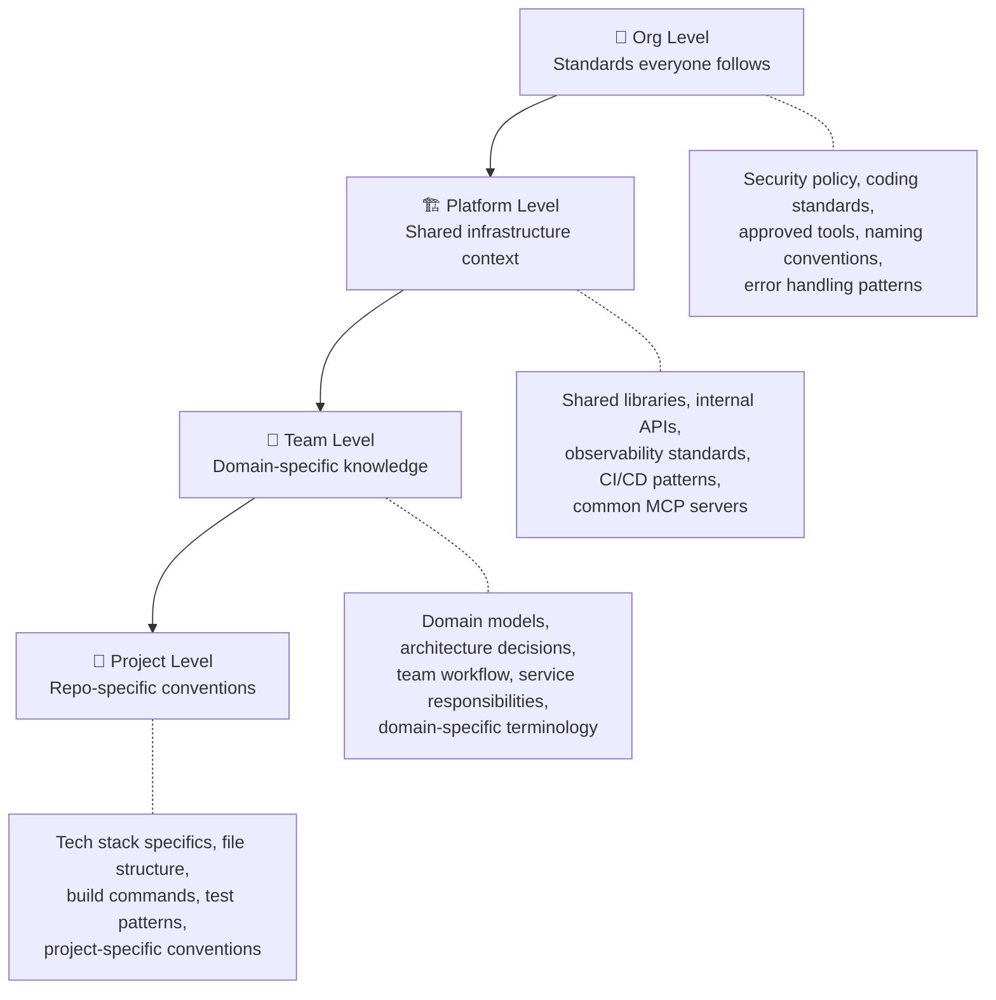
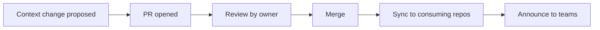
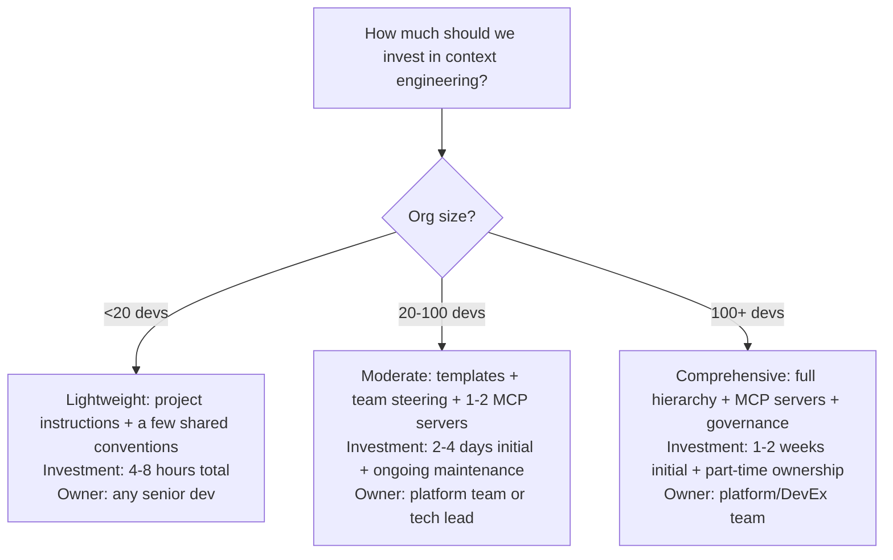

# Org-Wide Context Strategy

> Scaling context engineering across teams — consistency without rigidity, governance without bottlenecks.

## The Challenge at Scale

A single team with great project instructions is a local win. Twenty teams with inconsistent, duplicated, or conflicting context is organizational chaos.

At org scale, you need answers to:
- What's shared across all teams vs. what's team-specific?
- Who maintains shared context? How is it updated?
- How do new teams get started without reinventing?
- How do you ensure consistency without killing team autonomy?

---

## The Context Hierarchy



### What Belongs at Each Level

| Level | Owned by | Update cadence | Examples |
|-------|----------|----------------|---------|
| **Org** | Engineering leadership + platform team | Quarterly | Security rules, coding standards, tool policy |
| **Platform** | Platform/infra team | Monthly or as services change | Internal API schemas, shared library docs, CI patterns |
| **Team** | Tech lead / team architect | Sprint-level or as architecture evolves | Domain models, ADRs, service interaction patterns |
| **Project** | Any developer on the team | With code changes | Build commands, file structure, test patterns |

---

## Implementation Patterns

### Pattern 1: Inherited Steering (Top-Down Distribution)

**How it works:** Org-level context files live in a central repository. Teams inherit them automatically or by reference.

```
company-ai-context/           # Central repo
├── org-standards.md          # Security, naming, error handling
├── platform-services.md      # Internal API catalog
├── approved-tools.md         # What tools are sanctioned
└── hooks/
    └── security-gate.json    # Org-wide security hooks

team-repo/
├── .kiro/steering/
│   ├── org-standards.md      # Symlinked or copied from central
│   └── team-domain.md        # Team-specific additions
├── CLAUDE.md                 # Project-specific (references org + team)
└── src/
```

**Distribution mechanisms:**
- Git submodules (automatic, but adds complexity)
- Symlinks (simple but requires setup)
- Copy + automated sync (GitHub Action that PRs updates)
- Tool-native inheritance (Kiro user-level steering at `~/.kiro/steering/`)

**Tradeoff:** Consistent but adds maintenance. Best for large orgs (100+ devs) where consistency matters more than agility.

---

### Pattern 2: Template + Customize (Starter Kits)

**How it works:** Central team provides templates. Teams fork and customize.

```
# ai-context-starter-kit (template repo)

README.md                     # "How to use this template"
CLAUDE.md.template            # Starting point for CLAUDE.md
.cursorrules.template         # Starting point for .cursorrules
.kiro/
├── steering/
│   ├── org-standards.md      # Required (don't change)
│   └── team-template.md     # Customize for your team
├── hooks/
│   └── quality-gates.json    # Recommended hooks
└── skills/
    └── new-endpoint/         # Common skill
```

**Team workflow:**
1. New project → copy template
2. Customize team-specific and project-specific files
3. Keep org-standards.md untouched (or receive updates via automation)
4. Add team/project knowledge as it develops

**Tradeoff:** More team autonomy, less central control. Best for medium orgs (20–100 devs) who want consistency with flexibility.

---

### Pattern 3: Community-Driven (Bottom-Up Emergence)

**How it works:** No central mandate. Teams share what works. Best practices emerge and get promoted.

```
# Process:
1. Team A writes a great CLAUDE.md
2. They share it in #ai-tools channel
3. Other teams adopt and adapt
4. Platform team notices convergence
5. Common patterns get promoted to "recommended" template
6. Eventually some become "required" (org-level)
```

**Tradeoff:** Maximum autonomy, slowest convergence. Best for small/medium orgs (<50 devs) or orgs where mandate resistance is high.

> ✅ ✅ **Our take: Start with **Pattern 2 (Template + Customize)** regardless of org size. It gives you consistency without control-freakery. Central team provides the template and the non-negotiable org-level rules; teams own everything else. Pattern 1 (inherited) adds too much coupling too early. Pattern 3 (community) is too slow to converge in orgs that need consistency now. You can always evolve from Pattern 2 toward Pattern 1 later if governance demands tighten.

---

## Governance of Context

### Who Can Change What

| Context level | Who can update | Review required? | Enforcement |
|---------------|---------------|:----------------:|-------------|
| Org standards | Platform team / engineering leadership | ✅ Cross-functional review | Automated sync to repos |
| Platform context | Platform team | ✅ Platform team review | PR to central repo |
| Team context | Any team member | ✅ Tech lead review | PR to team repo |
| Project context | Any developer | Recommended | Normal code review |

### Context as Code

Treat context files like code:
- Version controlled (git)
- Reviewed before merge (PRs)
- Tested (does the AI behave correctly with these instructions?)
- Released (announce changes to affected teams)



### Testing Context Changes

Before merging a context change, verify:
- [ ] AI produces expected output with the new instructions (try 3–5 common tasks)
- [ ] No regression on existing behavior (tasks that worked before still work)
- [ ] Instructions aren't contradictory with other levels
- [ ] Length is still reasonable (not exceeding effective context limits)

---

## The Context Engineering Team

At scale (100+ developers), someone needs to own this:

### Option A: Part of Platform/DevEx Team

**What they do:**
- Maintain org-level context assets
- Build and operate MCP servers
- Create and update starter templates
- Consult with teams on their context engineering
- Track metrics (AI quality, consistency across teams)

**Effort:** 20–50% of one person's time (rarely needs a full FTE)

### Option B: Distributed Ownership with Coordination

**How it works:**
- Each team owns their context
- One person (rotating quarterly) coordinates org-level consistency
- Monthly 30-min sync: "What's changed? What should be shared?"

**Best for:** Orgs that don't have a dedicated platform team.

---

## Measuring Context Engineering Effectiveness

| Signal | What it indicates | How to measure |
|--------|-------------------|----------------|
| AI output consistency across developers | Context is working — same task, same quality regardless of who asks | Review variance in AI-generated PR quality |
| Reduced "how do I..." questions | Context is covering knowledge gaps | Support channel message volume trending down |
| New hire AI effectiveness ramp time | Context accelerates onboarding | Time from hire to first effective AI-generated PR |
| Context coverage | What % of projects have instructions files | Automated scan of repos |
| Instruction freshness | Are context files current | Last-modified date vs. code change date |

### Dashboard Metrics (for platform team)

```
Context Engineering Health — Monthly

Coverage:
  - Projects with instructions files: 34/42 (81%)
  - Teams with domain steering: 8/12 (67%)
  - MCP servers active: 4 (Jira, Wiki, API registry, DB schema)

Quality signals:
  - AI output consistency score (survey): 3.8/5
  - "AI didn't know our convention" complaints: 6 (down from 14 last month)
  - Context files updated this month: 12

Cost:
  - Platform team time on context eng: ~15 hrs/month
  - MCP server infrastructure: $120/month
```

---

## ⚠️ Common Org-Wide Mistakes

| Mistake | Consequence | Instead |
|---------|------------|---------|
| Mandating one giant shared context file | Too long, dilutes signal, nobody maintains it | Layer: small org file + team file + project file |
| Org context contradicts project context | AI confused, inconsistent output | Clear hierarchy: project overrides team overrides org |
| No one owns org-level context | Drift, staleness, inconsistency | Assign owner (even part-time) |
| Over-governing (change committee for every update) | Too slow, teams route around it | Light review for org-level, self-serve for team/project |
| Not measuring | Don't know if it's working | Track coverage + quality signals |
| Trying to codify everything at once | Overwhelm, perfectionism paralysis | Start with 3 highest-value things, expand gradually |

---

## Getting Started at Org Level

### Month 1: Foundation
1. Write org-level security rules (10 lines, non-negotiable things)
2. Document your coding standards that apply everywhere (naming, error handling)
3. Put in a shared location (central repo or template)
4. Announce: "If you're using AI tools, include these in your project instructions"

### Month 2: Templates
1. Create a starter template (CLAUDE.md + .cursorrules + .kiro/steering)
2. Include org standards + placeholder sections for team/project customization
3. Offer to help 2–3 teams set up their project-level context
4. Collect feedback on what's missing

### Month 3: Measure and Expand
1. Scan repos for context file coverage
2. Survey: "Is AI output consistent with our team standards?"
3. Identify gaps: what do teams still need to tell AI manually?
4. Build first MCP server for highest-value gap

### Ongoing (Quarterly)
1. Review org-level context: still accurate?
2. Promote common team patterns to org level
3. Retire stale context
4. Share wins ("Team X improved AI consistency by adding Y to their context")

---

## Decision Framework: How Much Investment?



---

## Next

- Start with project instructions → [Project Instructions](./project-instructions.md)
- Build skills and automation → [Skills and Hooks](./skills-and-hooks.md)
- Connect to knowledge → [Knowledge Architecture](./knowledge-architecture.md)
- Return to section overview → [README](./README.md)
