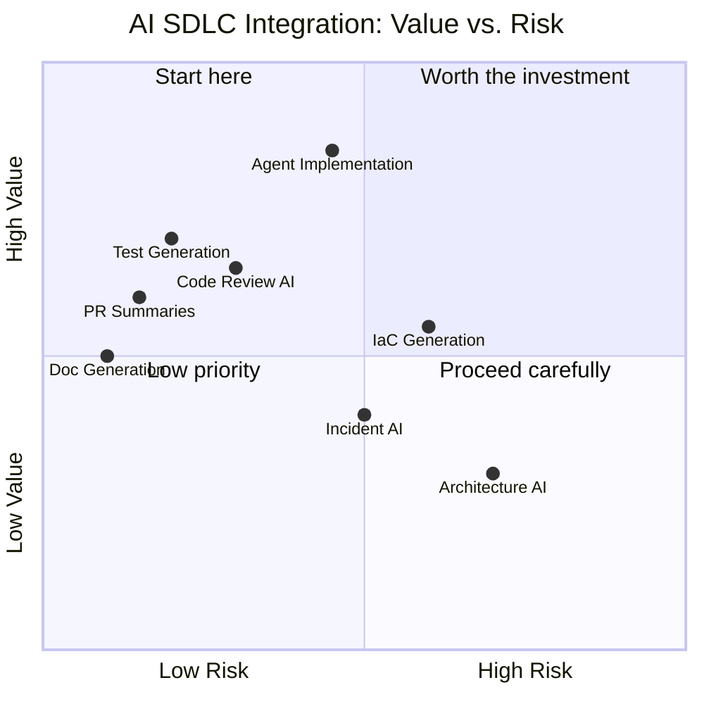

# AI Across the SDLC

> Where AI provides genuine value at each development phase — and where it doesn't.

## Phase-by-Phase Integration

### Planning & Requirements

**What AI can do:**
- Draft user stories from feature descriptions
- Identify edge cases and acceptance criteria you might miss
- Summarize research findings and prior art
- Generate RFC/design doc templates from rough notes

**What AI can't do:**
- Understand your business context and user needs
- Prioritize work based on organizational strategy
- Make product decisions

**Practical approach:**
- Use chat assistants to draft stories — human refines and validates
- Use agents to generate acceptance criteria checklists — human confirms completeness
- Never treat AI-generated requirements as final without stakeholder review

**Cost:** 🆓 Built into existing chat tools. No additional cost.

---

### Design & Architecture

**What AI can do:**
- Generate initial API designs from requirements
- Suggest design patterns relevant to your problem
- Draft sequence diagrams and data flow diagrams (Mermaid)
- Compare architectural approaches with tradeoff analysis

**What AI can't do:**
- Understand your team's operational maturity
- Account for organizational constraints (team size, skill distribution)
- Make architecture decisions that balance technical and business concerns

**Practical approach:**
- Use AI as a thinking partner — "Here's my problem, here's my constraints, what patterns fit?"
- Let AI draft diagrams you refine
- Architectural decisions remain human-owned

**Cost:** 🆓 Built into chat assistants.

---

### Implementation

**What AI can do:**
- Generate code following established patterns (see [AI Coding Agents](../ai-coding-agents/))
- Scaffold features, services, and endpoints
- Handle boilerplate and repetitive code
- Refactor at scale (rename, migrate patterns, update APIs)

**What AI can't do:**
- Write code that accounts for undocumented edge cases
- Produce optimized code for performance-critical paths without guidance
- Maintain architectural coherence across a large codebase without direction

**Practical approach:**
- Agents for well-defined, pattern-following implementation
- Human designs, agent implements, human reviews
- Greatest ROI: boilerplate, tests, migrations, documentation

**Cost:** 💰 Coding tool licenses ($10–40/user/month) + potential API costs for agents.

---

### Code Review

**What AI can do:**
- Generate PR summaries and descriptions
- Identify common bugs, security issues, style violations
- Flag potential performance problems
- Suggest improvements (but not always good ones)

**What AI can't do:**
- Understand the "why" behind a change
- Evaluate design decisions in business context
- Replace the mentoring aspect of human code review
- Reliably catch logical errors in business logic

**Practical approach:** See [Code Review with AI](./code-review.md) for detailed patterns.

**Cost:** 🆓 to 💰 Built into Copilot/Q, or dedicated tools ($15–30/user/month).

---

### Testing

**What AI can do:**
- Generate unit tests for untested code
- Identify untested paths and edge cases
- Create integration test scaffolding
- Generate test data

**What AI can't do:**
- Write tests that validate business requirements (only code behavior)
- Replace thoughtful test design for critical paths
- Know which tests actually matter for confidence

**Practical approach:** See [Testing Workflows](./testing.md) for detailed patterns.

**Cost:** 🆓 Built into coding agents. Specialized tools 💰 extra.

---

### Deployment & Infrastructure

**What AI can do:**
- Generate IaC (Terraform, CDK, CloudFormation) from descriptions
- Draft deployment scripts and pipeline configurations
- Suggest monitoring and alerting configurations
- Help troubleshoot deployment failures

**What AI can't do:**
- Understand your production topology and dependencies
- Account for blast radius and rollback requirements
- Replace infrastructure expertise for complex systems

**Practical approach:** See [CI/CD Integration](./cicd-integration.md) for detailed patterns.

**Cost:** 🆓 Built into cloud provider tools (Q in AWS Console).

---

### Monitoring & Incident Response

**What AI can do:**
- Summarize log patterns during incidents
- Suggest potential root causes based on error signatures
- Draft incident postmortems from timeline data
- Generate runbook entries from resolved incidents

**What AI can't do:**
- Replace operational expertise during critical incidents
- Understand the full system context during novel failures
- Make decisions about customer impact and communication

**Practical approach:**
- AI assists during incidents — summarizing, suggesting, drafting
- Human leads the response, makes decisions, communicates
- Post-incident: AI drafts postmortem, human validates and adds context

**Cost:** 💰 Usually included in observability tool AI features.

---

## Integration Priority Matrix

Start with what gives most value for least risk:

**Recommended order of adoption:**
1. PR summaries and documentation (low risk, immediate value)
2. Test generation (low risk, high value)
3. Code review AI augmentation (low-medium risk, high value)
4. Agent-assisted implementation (medium risk, highest value)
5. CI/CD and infrastructure (medium risk, medium value)
6. Monitoring and incident response (medium risk, context-dependent value)

> **Our take:** Do NOT skip to step 4 (agents) before you have steps 1–3 working. Agents get all the attention because they're exciting, but PR summaries and test generation deliver faster ROI with near-zero risk. Teams that jump straight to agents without AI-augmented review and testing have no safety net when agent output is wrong. Build the safety net first, then let agents loose.

---

## Next

- Deep dive on code review → [Code Review with AI](./code-review.md)
- Testing patterns → [Testing Workflows](./testing.md)
- Pipeline integration → [CI/CD Integration](./cicd-integration.md)
