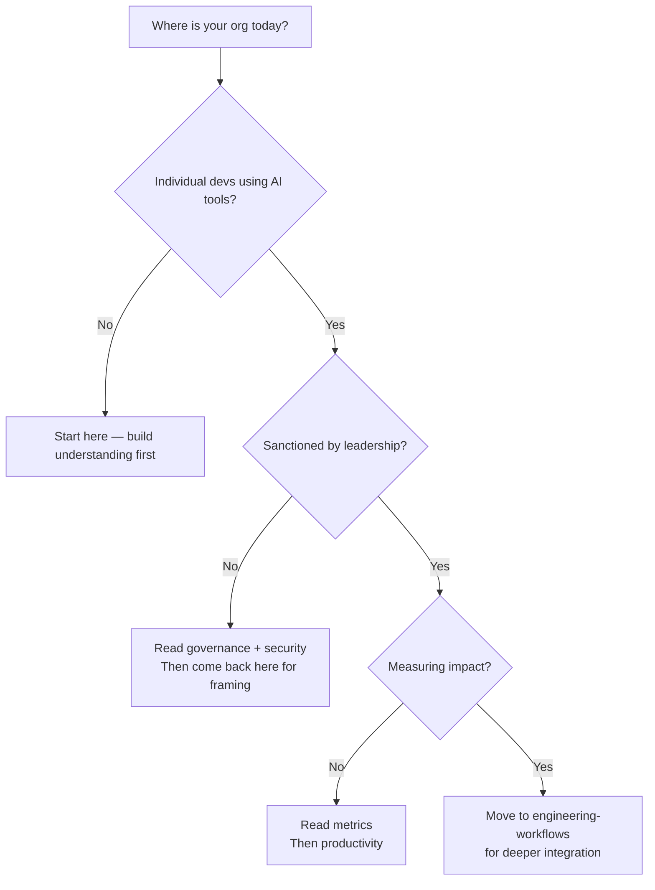

# 01 — Foundations

> Mental models, landscape overview, and organizational readiness for AI adoption in engineering.

## Why Start Here

Without shared mental models, AI adoption devolves into:
- **Decisions driven by hype** — adopting tools because of blog posts, not fit
- **Executives and engineers talking past each other** — one thinks "AI replaces developers," the other thinks "it's just autocomplete"
- **False starts that waste quarters** — jumping to tools before understanding readiness, then blaming the tool when it fails
- **Repeated mistakes** — every team rediscovering the same lessons independently

This section gives leaders a common vocabulary and framework so that conversations about AI are productive, decisions are grounded, and the organization doesn't spend 6 months learning what could be understood in 6 hours.

## In This Section

| Page | What you'll learn |
|------|-------------------|
| [AI Landscape for Leaders](./ai-landscape.md) | Taxonomy of AI in engineering — what exists, what matters |
| [Mental Models](./mental-models.md) | Frameworks for thinking about AI adoption decisions |
| [Organizational Readiness](./org-readiness.md) | Assessing where your org is and what's needed to start |
| [The Business Case](./business-case.md) | Framing AI investment for executive audiences |

## The POC-to-Production Gap

A recurring theme in this playbook: **what works for one developer experimenting on a weekend is not the same as what works for 200 developers on production code.**

| | POC / Exploration | Production / At Scale |
|---|---|---|
| **Cost** | 🆓 Free tier or personal API key | 🏢 Enterprise license, token budgets |
| **Security** | Acceptable to use cloud with non-sensitive code | Data residency, DLP, audit trails required |
| **Governance** | None needed | Policy enforcement, approved tool list |
| **Support** | Community/self-serve | Vendor SLA, dedicated support |
| **Evaluation criteria** | "Does this feel useful?" | Measurable impact on velocity/quality |

> This playbook uses 🆓 💰 🏢 labels throughout to signal cost context. See the [top-level README](../README.md#cost-context) for the full legend.

## AI Engineering Maturity: Foundations & Readiness

| Level | What it looks like | What to do |
|:-----:|-------------------|-----------|
| **0** | No awareness of AI tooling landscape | Read this section front-to-back |
| **1** | Individuals aware, no shared understanding | Run a leadership session on [AI Landscape](./ai-landscape.md) and [Mental Models](./mental-models.md) |
| **2** | Shared vocabulary, readiness assessed | Complete [Organizational Readiness](./org-readiness.md) assessment, build [Business Case](./business-case.md) |
| **3** | Executives aligned, budget secured, strategy documented | Move to tool evaluation and pilot planning |
| **4** | AI strategy integrated into engineering strategy, reviewed quarterly | Continuous: landscape monitoring, strategy refinement |

## Quick Orientation

## Status

🟢 Active — content being written and refined.

> **Engineering Manager Note**
>
> Your job isn't to have all the answers about AI.
>
> Block two hours. Try a tool yourself. You can't lead adoption of something you haven't touched.
