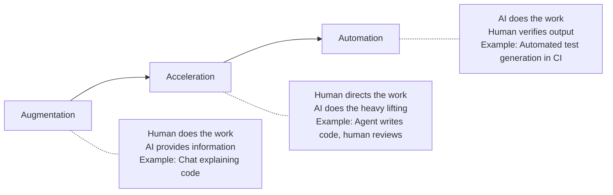
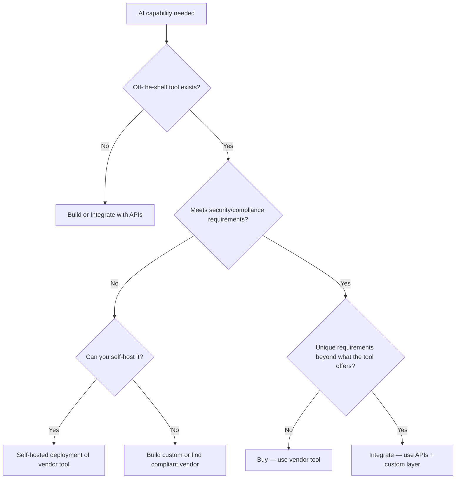
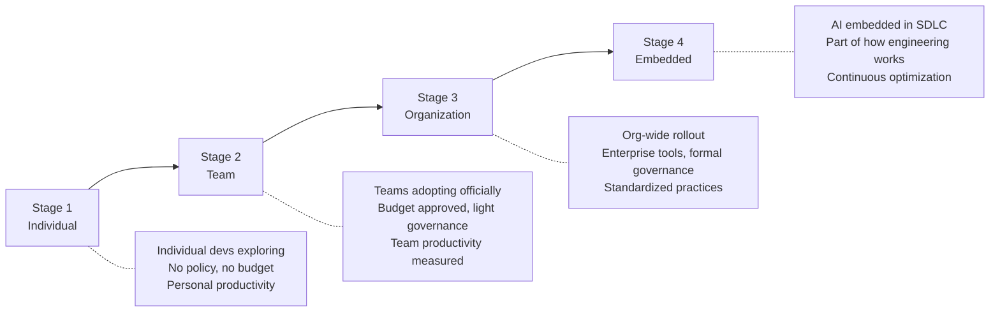

# Mental Models for AI Adoption Decisions

> Frameworks for thinking clearly about AI adoption — beyond hype and fear.

## Why Mental Models Matter

Without clear mental models, AI decisions devolve into opinion battles ("I read that AI will replace all developers" vs. "AI is just hype"). Leaders need shared frameworks that structure thinking and enable productive discussion.

---

## Model 1: The Automation Spectrum

Not all AI usage is the same. Position each AI capability on this spectrum:

**How to use this model:** For each AI capability you're considering, identify where it sits. Different positions require different governance:
- **Augmentation:** Low risk, minimal governance needed
- **Acceleration:** Medium risk, review processes needed
- **Automation:** Higher risk, needs monitoring, fallbacks, and quality gates

---

## Model 2: Build vs. Buy vs. Integrate

When AI capabilities are needed, you have three paths:

| Path | When to choose | Cost profile | Risk profile |
|------|---------------|-------------|-------------|
| **Buy** (use vendor tool as-is) | Capability is commoditized, vendor is trustworthy, no unique requirements | 💰 Predictable per-seat | Vendor dependency, data handling trust |
| **Integrate** (use APIs to build custom workflows) | Need customization, have engineering capacity, unique requirements | 💰 Variable (API costs + engineering time) | Maintenance burden, API changes |
| **Build** (train/host own models) | Extreme data sensitivity, unique domain, regulatory requirement for self-hosting | 🏢 High upfront, ongoing infra | Highest control, highest cost and expertise required |

**For most engineering organizations in 2025:** Buy (for coding assistants, code review). Integrate (for custom workflows, internal tools). Build is rarely justified unless you're a large enterprise with extreme data sensitivity.

---

## Model 3: The Maturity Curve

Organizations progress through predictable stages. Skipping stages creates problems.

**Common mistake:** Trying to jump from Stage 1 to Stage 3. You need the learning from Stage 2 (what works for your context, what governance is needed) before standardizing org-wide.

**Time between stages:** Typically 2–4 months per stage. Faster is possible but risky. Slower is fine — better to be stable than fast.

---

## Model 4: Cost Model Mental Map

AI tools have fundamentally different cost structures. Understanding these prevents budget surprise.

### Per-Seat (Predictable)
- **How it works:** Fixed price per developer per month, regardless of usage
- **Examples:** GitHub Copilot ($10–39/user/month), Amazon Q ($0–19/user/month)
- **Advantage:** Budgetable, no surprises
- **Disadvantage:** Paying for inactive users; heavy users subsidized by light users
- **Budget as:** Developer tooling line item (like IDE licenses)

### Per-Token (Variable)
- **How it works:** Pay for actual AI compute consumed (input + output tokens)
- **Examples:** Claude Code via API, Aider + OpenAI/Anthropic API
- **Advantage:** Pay only for what you use; zero cost when idle
- **Disadvantage:** Unpredictable monthly spend; power users can be expensive
- **Budget as:** Cloud compute (like AWS usage — variable but trackable)

### Hybrid (Mixed)
- **How it works:** Seat fee includes a usage quota; overages charged additionally or throttled
- **Examples:** Cursor (seat + "fast" request limits), Windsurf (seat + flow limits)
- **Advantage:** Predictable base, flexibility for heavy use
- **Disadvantage:** Confusing pricing, "slow" fallback can frustrate power users
- **Budget as:** Seat fee + contingency buffer

### The Real Cost (Often Missed)

| Visible costs | Hidden costs |
|--------------|-------------|
| Tool licenses | Developer time learning the tool |
| API tokens | Time lost to poor AI suggestions that need fixing |
| Infrastructure | Governance and policy development time |
| | Security review and ongoing monitoring |
| | Training and support infrastructure |
| | Context switching during adoption period |

---

## Model 5: Risk vs. Reversibility

Not all AI adoption decisions carry equal weight. Prioritize based on reversibility:

| | Easy to reverse | Hard to reverse |
|---|---|---|
| **Low risk** | ✅ Try freely (individual tool exploration) | ✅ Proceed with light governance (IDE extensions) |
| **High risk** | ⚠️ Pilot first (team adoption of a tool) | 🛑 Full evaluation required (enterprise agreement, process change) |

**Examples:**
- Installing a free code assistant → Easy to reverse, low risk → Just do it
- Signing a 3-year enterprise contract → Hard to reverse, medium risk → Full evaluation
- Making AI-generated code the default in your SDLC → Hard to reverse, high risk → Staged rollout with measurement
- Letting developers use personal API keys → Easy to reverse, medium risk → OK for learning, not for production code

---

## Model 6: The 80/20 of AI Coding Value

Based on practitioner experience, the value distribution of AI coding tools is heavily skewed:

| Value tier | % of total value | What it covers |
|-----------|-----------------|----------------|
| **First 20% of effort** | ~60% of value | Autocomplete, basic chat, boilerplate generation |
| **Next 30% of effort** | ~25% of value | Agent-assisted feature implementation, test generation |
| **Remaining 50% of effort** | ~15% of value | Custom workflows, deep integration, advanced use cases |

**Implication for leaders:** You get most of the value from simple adoption (turning on Copilot). The next tier requires agents and governance. The final tier requires significant organizational investment. Decide how far up the curve is worth it for your context.

---

## Applying These Models

When making a decision about AI adoption, run through:

1. **Automation Spectrum** — Where does this sit? What governance does that level require?
2. **Build/Buy/Integrate** — What's the right procurement model?
3. **Maturity Curve** — Are we at the right stage for this decision?
4. **Cost Model** — Do we understand the real cost (visible + hidden)?
5. **Risk/Reversibility** — How much diligence is appropriate?
6. **80/20** — Are we pursuing the high-value or diminishing-returns part of the curve?

> ✅ ✅ **Our take: If you only use one model, use **Risk/Reversibility**. It tells you how much process to apply. Low risk + easy to reverse → just do it. High risk + hard to reverse → full evaluation. This single lens prevents both over-analysis of safe decisions and under-analysis of dangerous ones.

---

## Next

- Want to assess your org's specific readiness? → [Organizational Readiness](./org-readiness.md)
- Need to frame this for executives? → [The Business Case](./business-case.md)
