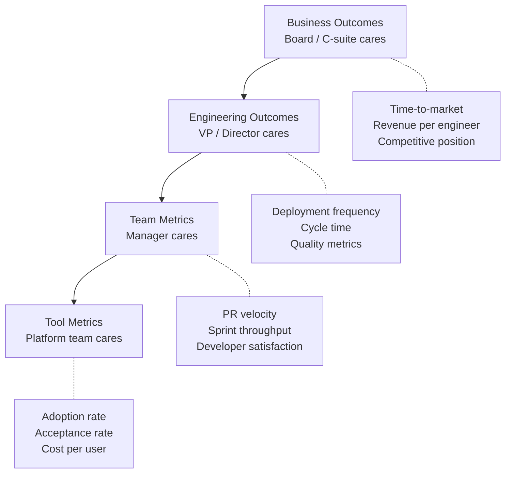

# 08 — Metrics

> Defining success metrics, measuring ROI, and reporting AI adoption impact to leadership.

## Why This Section Matters

"Is AI working for us?" is the question you will be asked — by your VP, by the CFO, by the board. Without a data-driven answer, here's what happens:

- **Budget disappears** — a successful pilot dies because nobody measured it, and next quarter's budget goes elsewhere
- **Executive support evaporates** — "I don't see the ROI" kills an initiative faster than any technical failure
- **You can't course-correct** — without metrics, you don't know if adoption is stalling, quality is regressing, or certain teams are struggling
- **Anecdotes replace evidence** — one loud skeptic's "it doesn't work for me" outweighs 50 quiet successes because there's no data to counter it
- **Vendor negotiations have no leverage** — "our developers like it" is not a negotiating position; "3.2x ROI with 22% cycle time reduction" is

This section provides the metrics framework, dashboard design, and reporting strategies to answer "Is AI working?" for every audience in your organization — with data, not vibes.

## In This Section

| Page | What you'll learn |
|------|-------------------|
| [Metrics Framework](./metrics-framework.md) | What to measure, organized by leading/lagging indicators |
| [Dashboard Design](./dashboard-design.md) | Building dashboards for different audiences |
| [Reporting to Leadership](./reporting.md) | Translating metrics into executive language |

## 💡 Key Insight

> **Measure outcomes, not activity. Report in the language your audience speaks.**
>
> An executive doesn't care about acceptance rate. They care about time-to-market and cost. Translate accordingly.

## The Metrics Hierarchy

**Key insight:** Each level cares about different things. Never report tool metrics to executives or business outcomes to individual developers.

## Status

🟢 Active — content being written and refined.

## AI Engineering Maturity: Metrics

> **Engineering Manager Note**
>
> You will be asked "is AI working?" — by your VP, by finance, by the board.
>
> "The team likes it" is not an answer. Have three numbers ready. That's enough.

| Level | What it looks like | What to do |
|:-----:|-------------------|-----------|
| **0** | No metrics | Can't prove value, can't course-correct |
| **1** | Ad-hoc tracking (spreadsheet, manual) | Define 3 core metrics, start tracking weekly |
| **2** | Core metrics tracked, manual dashboard | Automate collection, add quality guardrails |
| **3** | Dashboards per audience, quarterly reports | Tie metrics to ROI, present to leadership regularly |
| **4** | Automated, real-time, tied to business outcomes | Continuous optimization, predictive signals |
