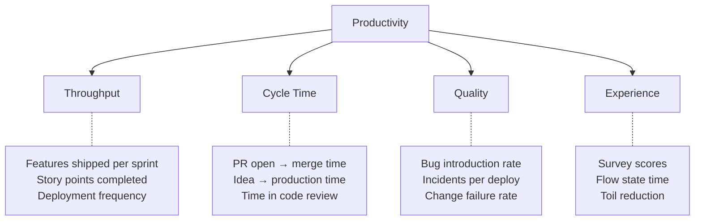

# Defining Productivity in the AI Era

> What developer productivity actually means — and why most definitions fail.

## The Problem with "Productivity"

"Productivity" without qualification is meaningless. More lines of code? More PRs merged? More features shipped? Fewer bugs? These often conflict.

**The wrong question:** "Are our developers more productive with AI?"
**The right question:** "Are we delivering more value to users with fewer delays and without quality regression?"

---

## Framework: SPACE

The SPACE framework (from Microsoft Research/GitHub) provides a multi-dimensional view:

| Dimension | What it measures | AI relevance |
|-----------|-----------------|-------------|
| **S**atisfaction & wellbeing | Developer happiness, reduced frustration | AI should reduce toil, not add confusion |
| **P**erformance | Outcomes, quality, reliability | Code quality should be maintained or improved |
| **A**ctivity | Counts of actions (PRs, commits, deploys) | Activity may increase; ensure it's meaningful |
| **C**ommunication & collaboration | Review turnaround, knowledge sharing | AI can accelerate review and reduce handoff delays |
| **E**fficiency & flow | Uninterrupted work, low friction | AI should reduce context switching |

**Key insight:** Measuring only one dimension (usually Activity) gives a misleading picture. A developer who merges 5 PRs/day but introduces regressions isn't productive.

---

## What Productivity Is NOT

| Common misconception | Why it's wrong |
|---------------------|---------------|
| Lines of code written | More code ≠ better. Less code is often preferable. |
| Hours worked | Input ≠ output. AI should reduce hours for same output. |
| Number of PRs merged | Splitting into tiny PRs games this metric. |
| Commits per day | Commit frequency ≠ value delivered. |
| "Feels faster" | Subjective, not defensible to executives. |

---

## A Working Definition for AI-Augmented Teams

**Productivity = Value delivered per unit of time and effort, at acceptable quality.**

In practice, this means tracking:

1. **Throughput** — Are we shipping more features/fixes in the same time?
2. **Cycle time** — Are individual items moving through the pipeline faster?
3. **Quality** — Are we maintaining (or improving) defect rates?
4. **Developer experience** — Are developers less frustrated, more focused?



---

## The AI Productivity Equation

AI changes the equation, but not all changes are visible:

### Visible Gains
- Faster code writing
- Faster test generation
- Faster boilerplate creation
- Faster code review turnaround

### Hidden Costs (Often Ignored)
- Time reviewing AI-generated code for correctness
- Debugging subtle AI-introduced bugs
- Learning curve for new tools and workflows
- Prompt engineering and iteration
- Rewriting AI output that missed requirements

### Net Productivity

```
Net Productivity = (Visible Gains) - (Hidden Costs) - (Quality Regression)
```

**If hidden costs are high and quality regresses, net productivity can be negative.** This is why measurement matters — you need to know the *net*, not just the gross.

---

## Productivity by Developer Experience Level

AI affects developers at different career stages differently:

| Level | Biggest productivity gain | Biggest risk |
|-------|--------------------------|-------------|
| Junior (0–2 years) | Learning faster, getting unstuck, boilerplate confidence | Over-reliance, not building fundamentals, accepting bad code |
| Mid (3–7 years) | Faster implementation of known patterns, test generation | Reduced deep thinking, autopilot acceptance of suggestions |
| Senior (7+ years) | Exploration, rapid prototyping, delegation of tedious work | Tool doesn't match their mental model, rejection of tool |
| Principal/Staff | Architecture exploration, broad codebase changes | Tool not helpful for their highest-value activities |

**Implication:** Don't expect uniform productivity gains across all levels. Measure by cohort if possible.

> ✅ **Our take on the primary definition:** For reporting to leadership, use **cycle time** (PR open → merge) as your single headline metric for AI productivity. Not lines of code, not PRs merged, not "hours saved." Cycle time is objective, measurable from git data, comparable across teams, and directly maps to "features reach customers faster" — which is what executives actually care about. Supplement with quality (bug rate) and satisfaction (survey) to ensure you're not trading speed for chaos.

---

## Next

- What AI actually speeds up → [What AI Accelerates](./what-ai-accelerates.md)
- How to measure all this → [Measurement Approaches](./measurement-approaches.md)
- Metrics for reporting → [Metrics](../metrics/)
