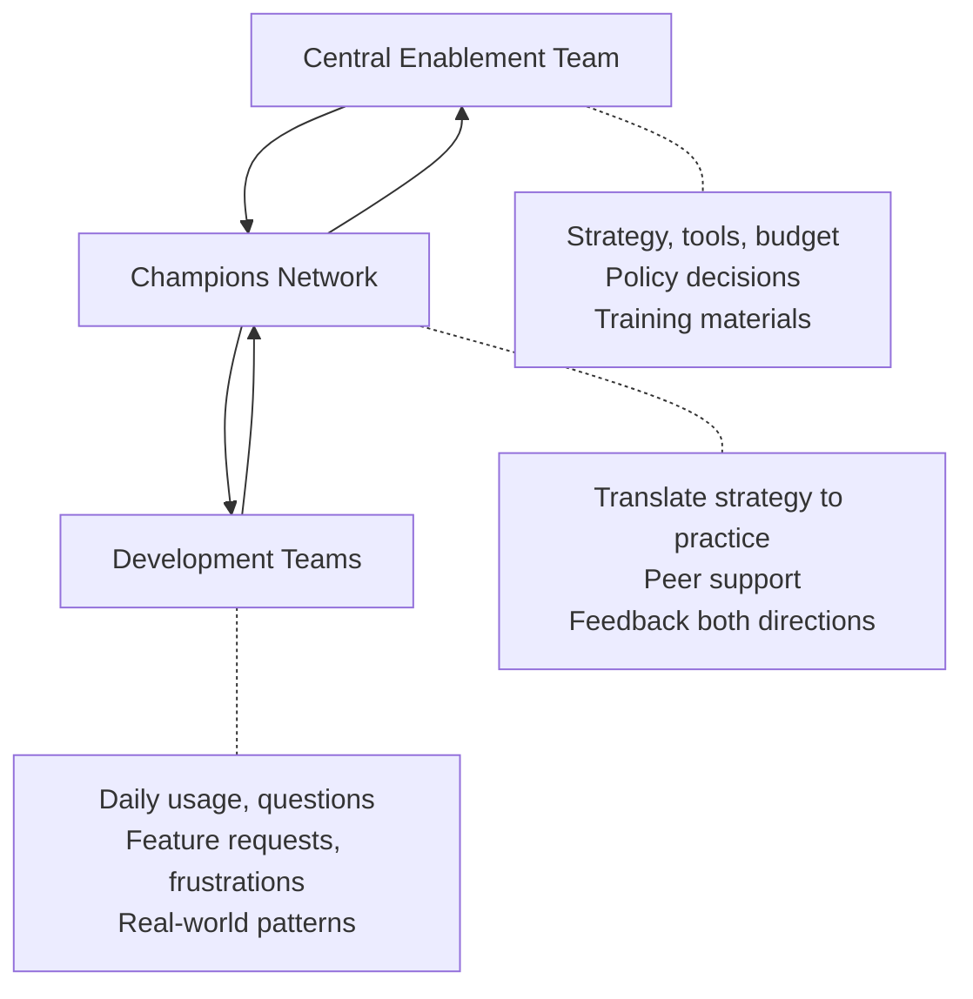

# Champions Model

> Building internal advocacy and peer support that scales — without top-down mandates.

## What Is a Champions Model?

A "champion" is a developer (not a manager) who:
- Uses AI tools effectively and enthusiastically
- Helps teammates get started and overcome obstacles
- Shares tips, patterns, and wins within their team
- Provides feedback to the enablement/platform team
- Acts as a bridge between leadership strategy and developer reality

---

## Why Champions Work Better Than Top-Down

| Top-down mandate | Champions model |
|-----------------|-----------------|
| "Management says use this" | "My teammate says this saved them 2 hours" |
| Compliance-driven | Value-driven |
| Feels forced | Feels chosen |
| One-size-fits-all messaging | Team-specific, contextualized help |
| Support bottleneck on central team | Distributed support network |
| Stops working when mandate relaxes | Self-sustaining through genuine value |

---

## Building a Champions Network

### Step 1: Identify Natural Champions (Don't Appoint)

Look for developers who:
- Already using AI tools enthusiastically
- Naturally share discoveries with teammates
- Respected by peers (not just loud)
- Willing to spend 10% of time on enablement
- Span different teams (not all from one group)

**Target:** 1 champion per 8–15 developers. At 100 devs, that's 7–12 champions.

### Step 2: Empower (Don't Burden)

Provide champions with:
- [ ] Early access to new tools and features
- [ ] Direct channel to engineering leadership (feedback goes up, decisions come down)
- [ ] Monthly champions meetup (share learnings, raise issues)
- [ ] Recognition (mention in all-hands, small perks)
- [ ] Time allocation acknowledged (manager aware and supportive)

Don't burden them with:
- ❌ Mandatory reports or metrics
- ❌ Being the only support channel (they're peers, not help desk)
- ❌ Responsibility for team adoption numbers
- ❌ Additional meetings beyond monthly sync

### Step 3: Activate

**Monthly champions sync (30 min):**
- What's working in your team?
- What's not working?
- Any blockers or requests?
- One tip to share org-wide

**Champion activities (organic, not mandated):**
- Help new tool users get started (pair for 30 min)
- Share weekly "tip of the week" in team channel
- Flag issues or improvement opportunities upward
- Represent developer perspective in tool evaluations

### Step 4: Sustain

- Rotate champions every 6–12 months (prevents burnout, spreads knowledge)
- New champions nominated by existing ones (peer selection)
- Champions who want to step back can without stigma
- Celebrate champions publicly (team all-hands, internal blog)

---

## Champion Engagement Model

---

## What Champions Are NOT

| Champions are | Champions are not |
|--------------|-------------------|
| Peer supporters | Help desk or support team |
| Enthusiasts who share | Mandatory evangelists |
| Feedback channels | Managers or enforcers |
| Role models | Performance standard setters |
| Volunteers | Conscripts |

---

## Measuring Champion Impact

| Signal | Healthy | Unhealthy |
|--------|---------|-----------|
| Champion activity | Sharing tips weekly, helping teammates | Silent, disengaged, overworked |
| Team adoption near champions | Higher than teams without | Same or lower (champion not effective) |
| Champion satisfaction | "I enjoy this role" | "It's a burden" |
| Feedback flow | Regular issues/ideas surfaced | Nothing flows up |
| Peer perception | "Go ask [champion] — they're great" | "They're management's spy" |

---

## Alternative to Champions: Community of Practice

For larger orgs (200+), a community of practice model may work better:

| Model | Structure | Best for |
|-------|-----------|----------|
| **Champions** | 1 per team, identified role | 50–200 developers |
| **Community of Practice** | Open group, regular meetups, shared resources | 200+ developers |
| **Hybrid** | Champions drive, community participates | Any size |

> **Our take:** Use the **Champions model** until it breaks (which happens around 200+ developers). Champions provide directed, accountable support. Communities of practice are complementary but not a substitute — they generate sharing but don't ensure every team has a knowledgeable person available. At 200+ devs, run both: champions for per-team support, community for cross-team knowledge. Below 200 devs, champions alone is sufficient and simpler.

**Community of Practice elements:**
- Open Slack/Teams channel (anyone can join/contribute)
- Bi-weekly demo session ("show and tell" — 5 min demos)
- Shared prompt library and tips wiki
- Monthly deeper-dive session on advanced topics
- No formal membership — participation is organic

---

## Next

- Training and upskilling → [Upskilling](./upskilling.md)
- Managing resistance → [Handling Resistance](./handling-resistance.md)
- Production rollout details → [Production Rollout](../ai-coding-agents/production-rollout.md)
