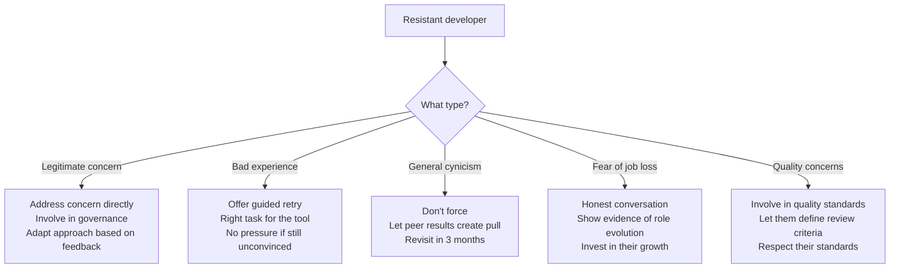

# Handling Resistance

> Common objections to AI adoption, honest responses, and strategies for engagement — without dismissing valid concerns.

## The First Rule: Resistance Is Information

Resistance isn't a problem to solve — it's a signal to investigate. Behind every objection is either:
- A legitimate concern that should shape your approach
- A misunderstanding that can be addressed with information
- A preference that should be respected

---

## Common Objections and Honest Responses

### "AI will replace my job"

**The concern:** Existential fear. Often unspoken but drives behavior.

**Honest response:**
> "AI tools don't replace developers — they shift what developers do. Less boilerplate, more design and review. The skill floor rises, but the need for skilled engineers doesn't disappear. Our roadmap ambition grows with our capacity — we ship more, not hire less."

**Evidence you can point to:** No major company has reduced engineering headcount because of AI coding tools (as of 2025). Most are hiring more to take advantage of increased capacity.

**What NOT to say:** "Don't worry, your job is safe forever." You don't know that, and empty reassurance insults intelligence.

---

### "AI code quality isn't good enough"

**The concern:** Quality craftsmanship. Often from senior engineers who take pride in clean code.

**Honest response:**
> "You're right that AI output needs review — it's not a replacement for engineering judgment. But it's good enough for 60–70% of routine tasks (boilerplate, tests, standard patterns). The craft shifts from writing every line to directing and reviewing. Your standards apply to the output regardless of who/what wrote the first draft."

**Engagement strategy:** Ask them to define "good enough" criteria. Let them review AI output against their standards. They often find it acceptable for routine work, even if not for their most complex challenges.

---

### "It's a security risk"

**The concern:** Data exposure, code leaving the network, vendor trust.

**Honest response:**
> "This is a legitimate concern and we're addressing it specifically. [Explain your data classification + enterprise DPA + content exclusion approach.] We're not asking you to send sensitive code to AI services. We've drawn clear boundaries. Want to be involved in the security review?"

**Engagement strategy:** Invite security-conscious skeptics into the governance process. Their concerns improve your security posture. Make them allies, not adversaries.

---

### "I tried it and it was wrong / useless"

**The concern:** Bad first experience creating lasting negative impression.

**Honest response:**
> "First experiences vary a lot based on what you try. AI tools are genuinely bad at some things (architecture, complex business logic) and genuinely good at others (tests, boilerplate, refactoring). Would you be open to trying a specific task where we've seen consistent value? If it's still not useful for your work, that's valid — not every role benefits equally."

**Engagement strategy:** Offer a guided "second chance" with a task that's in the tool's sweet spot. Often a bad first experience was the wrong task type, not a bad tool.

---

### "This is just a fad"

**The concern:** Technology cynicism from seeing many trends come and go.

**Honest response:**
> "I understand the skepticism — we've all seen technologies overhyped and underdeliver. AI coding tools might be overhyped in scale of impact, but they're not disappearing. Every major development platform has integrated them. The question isn't whether they'll exist in 3 years (they will) but how much value they provide for our specific work."

**Engagement strategy:** Don't force. Let results from adopting teams create pull. Cynics often come around when peers (not management) report genuine value.

---

### "It makes junior developers worse"

**The concern:** AI as a crutch that prevents learning fundamentals.

**Honest response:**
> "This is a real concern worth managing deliberately. We should ensure juniors still understand fundamentals — AI should accelerate learning, not replace it. Practical approach: juniors use AI as a learning tool (explain code, suggest approaches) but still write core implementations themselves for skill building. Code review ensures they understand what they submit."

**Engagement strategy:** Involve this person in defining guidelines for junior developer AI usage. Their concern is valid and should shape policy.

---

## Engagement Strategies by Persona

---

## ⚠️ What Never Works

| Tactic | Why it backfires |
|--------|-----------------|
| Mandating usage in performance reviews | Resentment, gaming metrics, underground resistance |
| Dismissing concerns ("you'll see") | Insults intelligence, loses trust |
| Comparing to adopters ("Team X loves it") | Creates antagonism between teams |
| Removing choice entirely | Pushes resistance underground |
| Framing skeptics as "behind" | Alienates experienced engineers whose input you need |
| Ignoring quietly non-adopting developers | Issues fester, may influence others |

## What Works

| Tactic | Why it succeeds |
|--------|----------------|
| Involving skeptics in governance | Their concerns improve quality; involvement creates ownership |
| Results from peers (not mandate from management) | Peer influence > top-down pressure |
| Acknowledging limitations honestly | Builds trust; "we know it's not perfect" is credible |
| Making adoption easy and reversal easy | Low commitment = low resistance |
| Giving it time (3–6 months minimum) | Habits form slowly; novelty effect fades; real value emerges |
| Celebrating diverse approaches | "Some use it heavily, some lightly — both valid" |

---

## The 70/20/10 Reality

In most organizations:
- **70%** will adopt with adequate support and evidence
- **20%** will remain light users (occasional, specific tasks)
- **10%** will never meaningfully adopt (and that's OK)

**Focus your energy on the 70%, not the 10%.** The 10% who don't adopt are not your problem to solve — they're a reality to accept, as long as they're still effective in their role.

> ✅ **Our take on mandates vs. opt-in:** Never mandate AI tool *usage*. Always mandate AI tool *availability*. Meaning: every developer should have access, training, and support available. Nobody should be required to use it, and nobody should be measured on how often they use it. Mandating usage creates gaming, resentment, and meaningless metrics. Making it available and easy creates genuine adoption driven by actual value. The 70% will adopt because it helps them. The 10% who don't are still productive — let them be.

---

## Next

- Training strategies → [Upskilling](./upskilling.md)
- Building internal advocacy → [Champions Model](./champions-model.md)
- Return to section overview → [README](./README.md)
